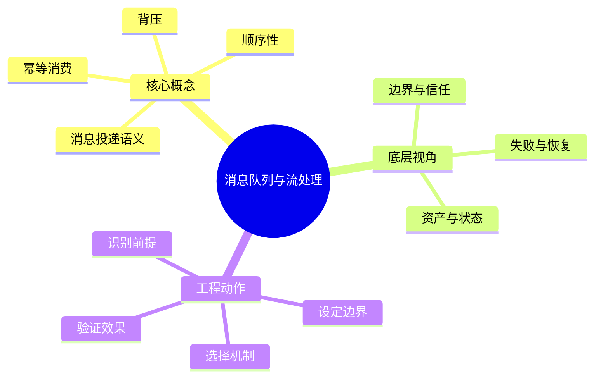

# 分布式系统：消息队列与流处理

## 学习目标
- 理解消息投递语义、幂等消费、顺序性和背压。
- 能从底层机制、适用边界、工程实践和面试表达四个角度解释本章概念。
- 能画出本章核心流程图，并能用自己的话解释每个节点。
- 能说出至少一个不适用场景、一个常见误区和一个纠正方式。

## 一句话总纲
消息系统用异步解耦换来削峰和弹性，但需要处理重复、乱序和延迟。

## 记忆口诀
> 异步解耦，幂等兜底，背压保稳

## 思维导图

## Mermaid 图解：核心流程

## 分章节讲解
### 1. 消息投递语义
**核心定义：** 消息投递语义描述消息在故障和重试下被处理的次数，常见为至多一次、至少一次和恰好一次。

**底层原理 / 机制拆解：**
- 至多一次可能丢消息但不重复；至少一次不丢但可能重复；恰好一次通常依赖事务日志、幂等写入和受限边界。
- Broker 确认、消费者提交 offset、处理结果持久化三者的顺序决定丢失或重复窗口。
- 端到端恰好一次很难跨外部系统保证，工程上常用至少一次 + 幂等消费。

**适用场景：** 适用于订单事件、异步任务、日志流、缓存失效、数据同步和削峰填谷。

**不适用场景 / 失败边界：** 不适合在未设计幂等的情况下盲目选择至少一次，也不适合声称跨 DB/HTTP 的绝对恰好一次。

**工程实践或做题/面试理解：** 工程上把消费结果和 offset/去重记录放在同一事务边界；面试中画出“处理成功但提交 offset 失败”导致重复。

**常见误区与纠正方式：** 恰好一次是所有场景默认能力；纠正方式是说明系统边界、事务资源和外部副作用。

**速记：** 不丢常会重，去重要自己做。

### 2. 幂等消费
**核心定义：** 幂等消费保证同一消息被处理多次时，最终业务效果与处理一次相同。

**底层原理 / 机制拆解：**
- 幂等可通过业务唯一键、去重表、状态机版本、CAS、天然覆盖写和外部请求幂等键实现。
- 去重记录必须与业务副作用同事务提交，否则会出现记录成功但业务失败或反之。
- 幂等还要考虑消息乱序和过期重放，不能只比较消息 ID。

**适用场景：** 适用于支付回调、订单状态推进、库存预占、邮件短信任务、数据同步和事件驱动架构。

**不适用场景 / 失败边界：** 不适合对非确定性副作用无保护地重试，例如重复扣款、重复发券、重复发货。

**工程实践或做题/面试理解：** 工程上设计状态机只允许合法单向迁移，使用唯一约束拦截重复；面试中说明“重试必然要求幂等”。

**常见误区与纠正方式：** 认为消费者不崩溃就不会重复；纠正方式是考虑网络 ACK 丢失、rebalance、超时和手动重放。

**速记：** 消息会重来，副作用只能算一次。

### 3. 顺序性
**核心定义：** 顺序性指消息按某个范围内的先后关系被消费，工程上通常只能保证单分区或同一 Key 内有序。

**底层原理 / 机制拆解：**
- 全局顺序需要单队列或全局串行化，吞吐和可用性成本高。
- 按 Key 分区可保证同一业务对象顺序，但不同 Key 之间无序。
- 重试、死信队列、并发消费和 rebalance 都可能破坏局部顺序，需要设计阻塞或补偿方案。

**适用场景：** 适用于订单状态流转、账户流水、同一设备事件、CDC 日志和需要因果处理的业务对象。

**不适用场景 / 失败边界：** 不适合为所有消息追求全局顺序；多数统计和通知场景只需最终收敛。

**工程实践或做题/面试理解：** 工程上选择稳定业务 Key 分区，单 Key 单线程或按版本校验；面试中说明“顺序是范围承诺，不是全局默认”。

**常见误区与纠正方式：** 增加消费者并发不影响顺序；纠正方式是区分分区级并发和同 Key 串行处理。

**速记：** 顺序问范围：全局贵，按 Key 常用。

### 4. 背压
**核心定义：** 背压是在下游处理不过来时向上游反馈压力，限制生产、拉取或并发，避免延迟、队列和内存无限增长。

**底层原理 / 机制拆解：**
- 压力信号来自队列长度、消费 lag、处理延迟、错误率、内存水位和下游限流。
- 控制手段包括限速、暂停拉取、动态并发、批量大小调整、丢弃低优先级、降级和扩容。
- 背压需要端到端传递；只在某一层排队会把故障隐藏到更晚爆发。

**适用场景：** 适用于流处理、日志采集、异步任务、网关转发、数据库写入和大促削峰。

**不适用场景 / 失败边界：** 不适合只靠无限队列吸收压力；积压会转化为延迟、过期任务和恢复风暴。

**工程实践或做题/面试理解：** 工程上设置最大队列、lag 告警、消费者自动扩缩容和降级方案；面试中说明“背压是稳定性反馈闭环”。

**常见误区与纠正方式：** 只扩容不治理峰值；纠正方式是限流、削峰、优先级和容量预算一起设计。

**速记：** 下游喘不过气，上游就慢下来。

## 关键对比表
| 知识点 | 解决的核心问题 | 适用边界 | 不适用/风险边界 | 面试抓手 |
|---|---|---|---|---|
| 消息投递语义 | 消息投递语义描述消息在故障和重试下被处理的次数，常见为至多一次、至少一次和恰好一次。 | 适用于订单事件、异步任务、日志流、缓存失效、数据同步和削峰填谷。 | 不适合在未设计幂等的情况下盲目选择至少一次，也不适合声称跨 DB/HTTP 的绝对恰好一次。 | 不丢常会重，去重要自己做。 |
| 幂等消费 | 幂等消费保证同一消息被处理多次时，最终业务效果与处理一次相同。 | 适用于支付回调、订单状态推进、库存预占、邮件短信任务、数据同步和事件驱动架构。 | 不适合对非确定性副作用无保护地重试，例如重复扣款、重复发券、重复发货。 | 消息会重来，副作用只能算一次。 |
| 顺序性 | 顺序性指消息按某个范围内的先后关系被消费，工程上通常只能保证单分区或同一 Key 内有序。 | 适用于订单状态流转、账户流水、同一设备事件、CDC 日志和需要因果处理的业务对象。 | 不适合为所有消息追求全局顺序；多数统计和通知场景只需最终收敛。 | 顺序问范围：全局贵，按 Key 常用。 |
| 背压 | 背压是在下游处理不过来时向上游反馈压力，限制生产、拉取或并发，避免延迟、队列和内存无限增长。 | 适用于流处理、日志采集、异步任务、网关转发、数据库写入和大促削峰。 | 不适合只靠无限队列吸收压力；积压会转化为延迟、过期任务和恢复风暴。 | 下游喘不过气，上游就慢下来。 |

## 边界条件表
| 边界条件 | 应优先检查什么 | 如果忽视会怎样 | 推荐纠正方式 |
|---|---|---|---|
| 输入跨信任边界 | 身份、来源、格式、权限 | 被伪造、篡改或越权利用 | 边界处重新认证、授权、校验和审计 |
| 控制依赖人工流程 | owner、时限、证据 | 例外长期存在，风险不可追踪 | 自动化门禁 + 风险接受有效期 |
| 机制带来额外复杂度 | 性能、可用性、维护成本 | 安全控制被绕过或误伤业务 | 用威胁和资产价值决定控制强度 |
| 运行环境会变化 | 配置、依赖、权限漂移 | 文档正确但系统实际暴露 | 持续扫描、基线检测和复盘更新 |

## 常见误区总结
- **消息投递语义：** 恰好一次是所有场景默认能力；纠正方式是说明系统边界、事务资源和外部副作用。
- **幂等消费：** 认为消费者不崩溃就不会重复；纠正方式是考虑网络 ACK 丢失、rebalance、超时和手动重放。
- **顺序性：** 增加消费者并发不影响顺序；纠正方式是区分分区级并发和同 Key 串行处理。
- **背压：** 只扩容不治理峰值；纠正方式是限流、削峰、优先级和容量预算一起设计。

## 自检题
1. 本章的核心问题是什么？请用一句话回答：消息系统用异步解耦换来削峰和弹性，但需要处理重复、乱序和延迟。
2. 任选两个概念，说出它们的适用场景和不适用场景。
3. 如果机制失效，最可能先出现在哪个边界？如何验证？
4. 面试中如何用“定义 → 机制 → 场景 → 权衡 → 误区”回答本章任一概念？
5. 给一个真实系统例子，说明你会怎样落地本章控制或设计。

## 速记卡片
- 章节口诀：异步解耦，幂等兜底，背压保稳
- 答题结构：定义 → 机制 → 场景 → 权衡 → 误区 → 记忆点。
- 工程落地：先列前提，再定机制，最后用日志、测试或演练验证。
- 消息投递语义：不丢常会重，去重要自己做。
- 幂等消费：消息会重来，副作用只能算一次。
- 顺序性：顺序问范围：全局贵，按 Key 常用。
- 背压：下游喘不过气，上游就慢下来。

## 深度扩展：底层原理与应用边界

### 1. 本章在「分布式系统」中的位置
- **核心定位：** 在网络不可靠、节点会失败、时钟不一致的条件下组织多节点协同。
- **本章作用：** 「分布式系统：消息队列与流处理」负责把总纲落到可操作的判断框架：先确认问题边界，再拆解机制，最后根据代价和风险选择方法。
- **主要风险：** 最大风险是把远程调用当本地调用，忽视超时、重试、幂等、分区和一致性语义。
- **实践抓手：** 设计时先声明系统模型和一致性要求，再选择复制、分片、共识或异步补偿方案。

### 2. 小流程图：从概念到应用

### 3. 概念深化：逐个击破
#### 3.1 消息投递语义
- **先问它解决什么：** 消息投递语义 不是孤立名词，而是用来解决本章某类约束、关系、代价或风险判断的问题。
- **底层机制：** 学习时要拆成“输入条件 → 中间结构 → 处理规则 → 输出结果”四步；如果任何一步说不清，说明只是记住了结论。
- **适用条件：** 当前提满足、边界清楚、代价可接受时使用；如果输入分布、规模、时序、权限或一致性假设变化，就要重新评估。
- **不适用信号：** 需要违反前提才能套用、只能靠特殊样例解释、复杂度或维护成本明显失控时，应换方案。
- **面试表达：** “我会先定义 消息投递语义，再说明它依赖的前提，最后用一个反例说明边界。”

#### 3.2 幂等消费
- **先问它解决什么：** 幂等消费 不是孤立名词，而是用来解决本章某类约束、关系、代价或风险判断的问题。
- **底层机制：** 学习时要拆成“输入条件 → 中间结构 → 处理规则 → 输出结果”四步；如果任何一步说不清，说明只是记住了结论。
- **适用条件：** 当前提满足、边界清楚、代价可接受时使用；如果输入分布、规模、时序、权限或一致性假设变化，就要重新评估。
- **不适用信号：** 需要违反前提才能套用、只能靠特殊样例解释、复杂度或维护成本明显失控时，应换方案。
- **面试表达：** “我会先定义 幂等消费，再说明它依赖的前提，最后用一个反例说明边界。”

#### 3.3 顺序性
- **先问它解决什么：** 顺序性 不是孤立名词，而是用来解决本章某类约束、关系、代价或风险判断的问题。
- **底层机制：** 学习时要拆成“输入条件 → 中间结构 → 处理规则 → 输出结果”四步；如果任何一步说不清，说明只是记住了结论。
- **适用条件：** 当前提满足、边界清楚、代价可接受时使用；如果输入分布、规模、时序、权限或一致性假设变化，就要重新评估。
- **不适用信号：** 需要违反前提才能套用、只能靠特殊样例解释、复杂度或维护成本明显失控时，应换方案。
- **面试表达：** “我会先定义 顺序性，再说明它依赖的前提，最后用一个反例说明边界。”

#### 3.4 背压
- **先问它解决什么：** 背压 不是孤立名词，而是用来解决本章某类约束、关系、代价或风险判断的问题。
- **底层机制：** 学习时要拆成“输入条件 → 中间结构 → 处理规则 → 输出结果”四步；如果任何一步说不清，说明只是记住了结论。
- **适用条件：** 当前提满足、边界清楚、代价可接受时使用；如果输入分布、规模、时序、权限或一致性假设变化，就要重新评估。
- **不适用信号：** 需要违反前提才能套用、只能靠特殊样例解释、复杂度或维护成本明显失控时，应换方案。
- **面试表达：** “我会先定义 背压，再说明它依赖的前提，最后用一个反例说明边界。”

### 4. 适用边界对比表
| 判断维度 | 应该怎么想 | 典型错误 | 记忆提示 |
|---|---|---|---|
| 前提条件 | 先列出输入规模、数据分布、系统假设或业务约束 | 不看条件直接套模板 | 先问“凭什么能用” |
| 正确性 | 需要能说明为什么结果保持不变或为什么局部选择成立 | 只给经验结论 | 用不变量、反例或交换论证检查 |
| 复杂度/成本 | 同时估算时间、空间、延迟、吞吐、人力和维护成本 | 只看理论最优 | 工程里还要看常数和可观测性 |
| 失败模式 | 主动说明边界外会怎样失败 | 面试中只讲优点 | 能说失败边界才算真理解 |

### 5. 记忆强化：三层复述法
1. **概念层：** 用一句话定义本章每个核心概念。
2. **机制层：** 不看原文画出输入到输出的流程。
3. **边界层：** 为每个概念准备一个“不能这样用”的反例。

### 6. 工程/做题/面试迁移
- **工程迁移：** 设计时先声明系统模型和一致性要求，再选择复制、分片、共识或异步补偿方案。
- **做题迁移：** 先把题目中的对象、关系、约束和目标函数圈出来，再映射到本章概念。
- **面试迁移：** 回答时不要只报名词，要说清“为什么需要它、它如何工作、它何时失效”。

### 7. 深度自检题
1. 你能否把本章概念按“前提 → 机制 → 结果 → 代价”重新组织？
2. 如果输入规模、并发量、数据分布或安全边界变化，原结论是否仍成立？
3. 本章哪个概念最容易被误用？请给出一个反例。
4. 如果让你设计一道面试题，你会怎样考察候选人是否真的理解？

### 8. 深度速记卡片
- **总抓手：** 在网络不可靠、节点会失败、时钟不一致的条件下组织多节点协同。
- **答题模板：** 定义边界 → 拆底层机制 → 说适用条件 → 讲权衡 → 给反例。
- **复习动作：** 每次复习只看图和表，尝试口述 3 分钟；卡住处再回正文。

## 专题深化：具体机制、案例与追问

### 1. 具体案例：把「消息队列与流处理」放进真实问题
例如下单链路要考虑请求超时、重复提交、消息至少一次投递、库存扣减幂等、读写一致性和补偿任务。

### 2. 本章关键机制细化
- 至少一次投递要求消费者幂等。
- 顺序性通常只能在分区或业务 Key 内保证。
- 背压是保护系统稳定的反馈机制。

### 3. 概念到判断的检查清单
| 概念/动作 | 你要检查什么 | 如果检查失败会怎样 |
|---|---|---|
| 消息投递语义 | 前提、输入、输出、代价、失败边界是否都说清 | 可能套错模型、复杂度失控或得到不可验证结论 |
| 幂等消费 | 前提、输入、输出、代价、失败边界是否都说清 | 可能套错模型、复杂度失控或得到不可验证结论 |
| 顺序性 | 前提、输入、输出、代价、失败边界是否都说清 | 可能套错模型、复杂度失控或得到不可验证结论 |
| 背压 | 前提、输入、输出、代价、失败边界是否都说清 | 可能套错模型、复杂度失控或得到不可验证结论 |
| 本章在「分布式系统」中的位置 | 前提、输入、输出、代价、失败边界是否都说清 | 可能套错模型、复杂度失控或得到不可验证结论 |

### 4. 面试追问路径

- 网络分区时选择什么语义？
- 重试是否幂等？
- 副本之间如何收敛或提交？

### 5. 验证与复盘
- **验证方式：** 用故障注入、超时重试测试、乱序重复消息测试和一致性检查验证。
- **复盘方式：** 每次做题或设计后，记录“我使用了哪个前提、哪个前提最容易被破坏、如果破坏如何调整”。
- **记忆方式：** 不背孤立结论，只背“问题 → 机制 → 边界 → 验证”的链路。
