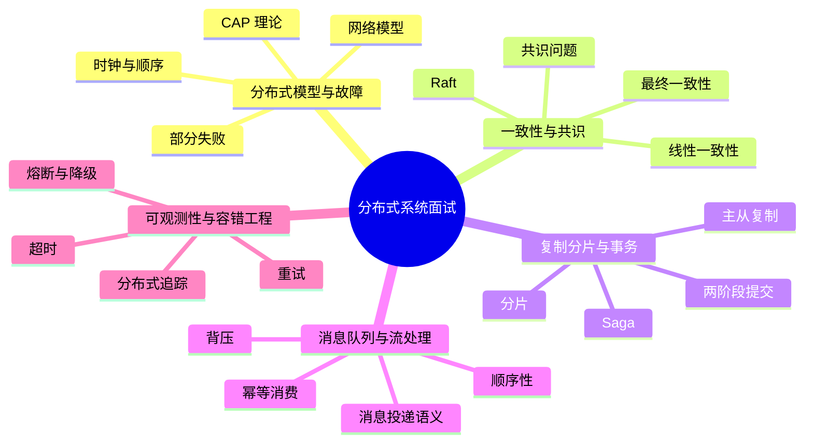

# 分布式系统面试20问

## 学习目标
- 用 20 个高频问题串起 分布式系统 的核心知识。
- 每个答案都按“定义 → 机制 → 场景 → 权衡 → 误区 → 记忆点”组织，便于面试复述。
- 通过小型 Mermaid 图辅助记忆，避免超大图难以阅读。

## 一句话总纲
分布式系统把多个节点组织成一个逻辑系统，核心挑战来自部分失败、网络不可靠、时钟不一致和状态复制。

## 记忆口诀
> 网络会丢，节点会挂，时钟会偏，复制要权衡，一致性要定义。

## 思维导图

## 答题总流程

## 第 1-5 问：小图记忆

## 深度面试答题框架

- **总主线：** 在网络不可靠、节点会失败、时钟不一致的条件下组织多节点协同。
- **风险提醒：** 最大风险是把远程调用当本地调用，忽视超时、重试、幂等、分区和一致性语义。
- **实践抓手：** 设计时先声明系统模型和一致性要求，再选择复制、分片、共识或异步补偿方案。

## 面试答案强化版：逐题深答

> 回答每题都按：定义 → 机制 → 场景 → 权衡 → 误区 → 验证。

### Q1：请解释“部分失败”的核心思想、适用场景和常见误区。

**答：**
1. **定义：** 部分失败指分布式系统中一部分节点、链路或依赖异常，而其他部分仍在运行；调用方常无法立即区分慢、丢包、暂停和宕机。
2. **机制：** 先确认前提，再说明它处理的数据、状态、边界或资源，最后说明输出结果为什么可信。结合本学科主线看，例如下单链路要考虑请求超时、重复提交、消息至少一次投递、库存扣减幂等、读写一致性和补偿任务。
3. **适用场景：** 当问题与 部分失败 的前提一致，并且需要在正确性、性能、可靠性或可维护性之间做判断时使用。
4. **权衡：** 要主动比较收益和代价：它可能提升表达力、效率或可靠性，但也可能增加复杂度、资源消耗或维护成本。
5. **误区：** 不检查前提就套用；只讲结论不讲失败边界；无法说明如何验证。
6. **验证：** 用故障注入、超时重试测试、乱序重复消息测试和一致性检查验证。
**追问回答模板：** 如果面试官继续问“为什么不用别的方案”，从前提差异、失败模式和验证成本三个角度回答。

### Q2：请解释“网络模型”的核心思想、适用场景和常见误区。

**答：**
1. **定义：** 网络模型描述消息延迟、丢失、重复、乱序和分区等假设，算法正确性必须建立在明确的同步、异步或部分同步模型上。
2. **机制：** 先确认前提，再说明它处理的数据、状态、边界或资源，最后说明输出结果为什么可信。结合本学科主线看，例如下单链路要考虑请求超时、重复提交、消息至少一次投递、库存扣减幂等、读写一致性和补偿任务。
3. **适用场景：** 当问题与 网络模型 的前提一致，并且需要在正确性、性能、可靠性或可维护性之间做判断时使用。
4. **权衡：** 要主动比较收益和代价：它可能提升表达力、效率或可靠性，但也可能增加复杂度、资源消耗或维护成本。
5. **误区：** 不检查前提就套用；只讲结论不讲失败边界；无法说明如何验证。
6. **验证：** 用故障注入、超时重试测试、乱序重复消息测试和一致性检查验证。
**追问回答模板：** 如果面试官继续问“为什么不用别的方案”，从前提差异、失败模式和验证成本三个角度回答。

### Q3：请解释“时钟与顺序”的核心思想、适用场景和常见误区。

**答：**
1. **定义：** 分布式系统中物理时钟会漂移，逻辑时钟用于表达事件先后，向量时钟可识别并发与因果关系。
2. **机制：** 先确认前提，再说明它处理的数据、状态、边界或资源，最后说明输出结果为什么可信。结合本学科主线看，例如下单链路要考虑请求超时、重复提交、消息至少一次投递、库存扣减幂等、读写一致性和补偿任务。
3. **适用场景：** 当问题与 时钟与顺序 的前提一致，并且需要在正确性、性能、可靠性或可维护性之间做判断时使用。
4. **权衡：** 要主动比较收益和代价：它可能提升表达力、效率或可靠性，但也可能增加复杂度、资源消耗或维护成本。
5. **误区：** 不检查前提就套用；只讲结论不讲失败边界；无法说明如何验证。
6. **验证：** 用故障注入、超时重试测试、乱序重复消息测试和一致性检查验证。
**追问回答模板：** 如果面试官继续问“为什么不用别的方案”，从前提差异、失败模式和验证成本三个角度回答。

### Q4：请解释“CAP 理论”的核心思想、适用场景和常见误区。

**答：**
1. **定义：** CAP 指在网络分区发生时，系统无法同时保证线性一致性意义下的一致性和每个非故障节点都响应的可用性。
2. **机制：** 先确认前提，再说明它处理的数据、状态、边界或资源，最后说明输出结果为什么可信。结合本学科主线看，例如下单链路要考虑请求超时、重复提交、消息至少一次投递、库存扣减幂等、读写一致性和补偿任务。
3. **适用场景：** 当问题与 CAP 理论 的前提一致，并且需要在正确性、性能、可靠性或可维护性之间做判断时使用。
4. **权衡：** 要主动比较收益和代价：它可能提升表达力、效率或可靠性，但也可能增加复杂度、资源消耗或维护成本。
5. **误区：** 不检查前提就套用；只讲结论不讲失败边界；无法说明如何验证。
6. **验证：** 用故障注入、超时重试测试、乱序重复消息测试和一致性检查验证。
**追问回答模板：** 如果面试官继续问“为什么不用别的方案”，从前提差异、失败模式和验证成本三个角度回答。

### Q5：请解释“线性一致性”的核心思想、适用场景和常见误区。

**答：**
1. **定义：** 线性一致性要求每个操作看起来在调用开始与返回结束之间某个瞬间原子生效，所有客户端观察到同一个实时顺序。
2. **机制：** 先确认前提，再说明它处理的数据、状态、边界或资源，最后说明输出结果为什么可信。结合本学科主线看，例如下单链路要考虑请求超时、重复提交、消息至少一次投递、库存扣减幂等、读写一致性和补偿任务。
3. **适用场景：** 当问题与 线性一致性 的前提一致，并且需要在正确性、性能、可靠性或可维护性之间做判断时使用。
4. **权衡：** 要主动比较收益和代价：它可能提升表达力、效率或可靠性，但也可能增加复杂度、资源消耗或维护成本。
5. **误区：** 不检查前提就套用；只讲结论不讲失败边界；无法说明如何验证。
6. **验证：** 用故障注入、超时重试测试、乱序重复消息测试和一致性检查验证。
**追问回答模板：** 如果面试官继续问“为什么不用别的方案”，从前提差异、失败模式和验证成本三个角度回答。

### Q6：请解释“最终一致性”的核心思想、适用场景和常见误区。

**答：**
1. **定义：** 最终一致性保证在没有新写入且副本通信恢复后，多个副本最终收敛到一致状态。
2. **机制：** 先确认前提，再说明它处理的数据、状态、边界或资源，最后说明输出结果为什么可信。结合本学科主线看，例如下单链路要考虑请求超时、重复提交、消息至少一次投递、库存扣减幂等、读写一致性和补偿任务。
3. **适用场景：** 当问题与 最终一致性 的前提一致，并且需要在正确性、性能、可靠性或可维护性之间做判断时使用。
4. **权衡：** 要主动比较收益和代价：它可能提升表达力、效率或可靠性，但也可能增加复杂度、资源消耗或维护成本。
5. **误区：** 不检查前提就套用；只讲结论不讲失败边界；无法说明如何验证。
6. **验证：** 用故障注入、超时重试测试、乱序重复消息测试和一致性检查验证。
**追问回答模板：** 如果面试官继续问“为什么不用别的方案”，从前提差异、失败模式和验证成本三个角度回答。

### Q7：请解释“共识问题”的核心思想、适用场景和常见误区。

**答：**
1. **定义：** 共识要求多个节点在可能失败的情况下对同一个值达成一致，满足一致性、有效性和终止性等性质。
2. **机制：** 先确认前提，再说明它处理的数据、状态、边界或资源，最后说明输出结果为什么可信。结合本学科主线看，例如下单链路要考虑请求超时、重复提交、消息至少一次投递、库存扣减幂等、读写一致性和补偿任务。
3. **适用场景：** 当问题与 共识问题 的前提一致，并且需要在正确性、性能、可靠性或可维护性之间做判断时使用。
4. **权衡：** 要主动比较收益和代价：它可能提升表达力、效率或可靠性，但也可能增加复杂度、资源消耗或维护成本。
5. **误区：** 不检查前提就套用；只讲结论不讲失败边界；无法说明如何验证。
6. **验证：** 用故障注入、超时重试测试、乱序重复消息测试和一致性检查验证。
**追问回答模板：** 如果面试官继续问“为什么不用别的方案”，从前提差异、失败模式和验证成本三个角度回答。

### Q8：请解释“Raft”的核心思想、适用场景和常见误区。

**答：**
1. **定义：** Raft 是一种易理解的共识算法，通过领导者、任期、选举、日志复制和安全提交维护复制状态机。
2. **机制：** 先确认前提，再说明它处理的数据、状态、边界或资源，最后说明输出结果为什么可信。结合本学科主线看，例如下单链路要考虑请求超时、重复提交、消息至少一次投递、库存扣减幂等、读写一致性和补偿任务。
3. **适用场景：** 当问题与 Raft 的前提一致，并且需要在正确性、性能、可靠性或可维护性之间做判断时使用。
4. **权衡：** 要主动比较收益和代价：它可能提升表达力、效率或可靠性，但也可能增加复杂度、资源消耗或维护成本。
5. **误区：** 不检查前提就套用；只讲结论不讲失败边界；无法说明如何验证。
6. **验证：** 用故障注入、超时重试测试、乱序重复消息测试和一致性检查验证。
**追问回答模板：** 如果面试官继续问“为什么不用别的方案”，从前提差异、失败模式和验证成本三个角度回答。

### Q9：请解释“主从复制”的核心思想、适用场景和常见误区。

**答：**
1. **定义：** 主从复制由主节点处理写入并把变更传播给从节点，从节点提供冗余、读扩展或故障接管。
2. **机制：** 先确认前提，再说明它处理的数据、状态、边界或资源，最后说明输出结果为什么可信。结合本学科主线看，例如下单链路要考虑请求超时、重复提交、消息至少一次投递、库存扣减幂等、读写一致性和补偿任务。
3. **适用场景：** 当问题与 主从复制 的前提一致，并且需要在正确性、性能、可靠性或可维护性之间做判断时使用。
4. **权衡：** 要主动比较收益和代价：它可能提升表达力、效率或可靠性，但也可能增加复杂度、资源消耗或维护成本。
5. **误区：** 不检查前提就套用；只讲结论不讲失败边界；无法说明如何验证。
6. **验证：** 用故障注入、超时重试测试、乱序重复消息测试和一致性检查验证。
**追问回答模板：** 如果面试官继续问“为什么不用别的方案”，从前提差异、失败模式和验证成本三个角度回答。

### Q10：请解释“分片”的核心思想、适用场景和常见误区。

**答：**
1. **定义：** 分片把数据按范围、哈希或业务维度分布到多个节点，以提升容量、吞吐和故障隔离。
2. **机制：** 先确认前提，再说明它处理的数据、状态、边界或资源，最后说明输出结果为什么可信。结合本学科主线看，例如下单链路要考虑请求超时、重复提交、消息至少一次投递、库存扣减幂等、读写一致性和补偿任务。
3. **适用场景：** 当问题与 分片 的前提一致，并且需要在正确性、性能、可靠性或可维护性之间做判断时使用。
4. **权衡：** 要主动比较收益和代价：它可能提升表达力、效率或可靠性，但也可能增加复杂度、资源消耗或维护成本。
5. **误区：** 不检查前提就套用；只讲结论不讲失败边界；无法说明如何验证。
6. **验证：** 用故障注入、超时重试测试、乱序重复消息测试和一致性检查验证。
**追问回答模板：** 如果面试官继续问“为什么不用别的方案”，从前提差异、失败模式和验证成本三个角度回答。

### Q11：请解释“两阶段提交”的核心思想、适用场景和常见误区。

**答：**
1. **定义：** 两阶段提交通过准备阶段和提交阶段协调多个参与者，使分布式事务要么全部提交要么全部回滚。
2. **机制：** 先确认前提，再说明它处理的数据、状态、边界或资源，最后说明输出结果为什么可信。结合本学科主线看，例如下单链路要考虑请求超时、重复提交、消息至少一次投递、库存扣减幂等、读写一致性和补偿任务。
3. **适用场景：** 当问题与 两阶段提交 的前提一致，并且需要在正确性、性能、可靠性或可维护性之间做判断时使用。
4. **权衡：** 要主动比较收益和代价：它可能提升表达力、效率或可靠性，但也可能增加复杂度、资源消耗或维护成本。
5. **误区：** 不检查前提就套用；只讲结论不讲失败边界；无法说明如何验证。
6. **验证：** 用故障注入、超时重试测试、乱序重复消息测试和一致性检查验证。
**追问回答模板：** 如果面试官继续问“为什么不用别的方案”，从前提差异、失败模式和验证成本三个角度回答。

### Q12：请解释“Saga”的核心思想、适用场景和常见误区。

**答：**
1. **定义：** Saga 把长事务拆成一系列本地事务，每步成功后推进，失败时通过补偿动作尽量恢复业务一致。
2. **机制：** 先确认前提，再说明它处理的数据、状态、边界或资源，最后说明输出结果为什么可信。结合本学科主线看，例如下单链路要考虑请求超时、重复提交、消息至少一次投递、库存扣减幂等、读写一致性和补偿任务。
3. **适用场景：** 当问题与 Saga 的前提一致，并且需要在正确性、性能、可靠性或可维护性之间做判断时使用。
4. **权衡：** 要主动比较收益和代价：它可能提升表达力、效率或可靠性，但也可能增加复杂度、资源消耗或维护成本。
5. **误区：** 不检查前提就套用；只讲结论不讲失败边界；无法说明如何验证。
6. **验证：** 用故障注入、超时重试测试、乱序重复消息测试和一致性检查验证。
**追问回答模板：** 如果面试官继续问“为什么不用别的方案”，从前提差异、失败模式和验证成本三个角度回答。

### Q13：请解释“消息投递语义”的核心思想、适用场景和常见误区。

**答：**
1. **定义：** 消息投递语义描述消息在故障和重试下被处理的次数，常见为至多一次、至少一次和恰好一次。
2. **机制：** 先确认前提，再说明它处理的数据、状态、边界或资源，最后说明输出结果为什么可信。结合本学科主线看，例如下单链路要考虑请求超时、重复提交、消息至少一次投递、库存扣减幂等、读写一致性和补偿任务。
3. **适用场景：** 当问题与 消息投递语义 的前提一致，并且需要在正确性、性能、可靠性或可维护性之间做判断时使用。
4. **权衡：** 要主动比较收益和代价：它可能提升表达力、效率或可靠性，但也可能增加复杂度、资源消耗或维护成本。
5. **误区：** 不检查前提就套用；只讲结论不讲失败边界；无法说明如何验证。
6. **验证：** 用故障注入、超时重试测试、乱序重复消息测试和一致性检查验证。
**追问回答模板：** 如果面试官继续问“为什么不用别的方案”，从前提差异、失败模式和验证成本三个角度回答。

### Q14：请解释“幂等消费”的核心思想、适用场景和常见误区。

**答：**
1. **定义：** 幂等消费保证同一消息被处理多次时，最终业务效果与处理一次相同。
2. **机制：** 先确认前提，再说明它处理的数据、状态、边界或资源，最后说明输出结果为什么可信。结合本学科主线看，例如下单链路要考虑请求超时、重复提交、消息至少一次投递、库存扣减幂等、读写一致性和补偿任务。
3. **适用场景：** 当问题与 幂等消费 的前提一致，并且需要在正确性、性能、可靠性或可维护性之间做判断时使用。
4. **权衡：** 要主动比较收益和代价：它可能提升表达力、效率或可靠性，但也可能增加复杂度、资源消耗或维护成本。
5. **误区：** 不检查前提就套用；只讲结论不讲失败边界；无法说明如何验证。
6. **验证：** 用故障注入、超时重试测试、乱序重复消息测试和一致性检查验证。
**追问回答模板：** 如果面试官继续问“为什么不用别的方案”，从前提差异、失败模式和验证成本三个角度回答。

### Q15：请解释“顺序性”的核心思想、适用场景和常见误区。

**答：**
1. **定义：** 顺序性指消息按某个范围内的先后关系被消费，工程上通常只能保证单分区或同一 Key 内有序。
2. **机制：** 先确认前提，再说明它处理的数据、状态、边界或资源，最后说明输出结果为什么可信。结合本学科主线看，例如下单链路要考虑请求超时、重复提交、消息至少一次投递、库存扣减幂等、读写一致性和补偿任务。
3. **适用场景：** 当问题与 顺序性 的前提一致，并且需要在正确性、性能、可靠性或可维护性之间做判断时使用。
4. **权衡：** 要主动比较收益和代价：它可能提升表达力、效率或可靠性，但也可能增加复杂度、资源消耗或维护成本。
5. **误区：** 不检查前提就套用；只讲结论不讲失败边界；无法说明如何验证。
6. **验证：** 用故障注入、超时重试测试、乱序重复消息测试和一致性检查验证。
**追问回答模板：** 如果面试官继续问“为什么不用别的方案”，从前提差异、失败模式和验证成本三个角度回答。

### Q16：请解释“背压”的核心思想、适用场景和常见误区。

**答：**
1. **定义：** 背压是在下游处理不过来时向上游反馈压力，限制生产、拉取或并发，避免延迟、队列和内存无限增长。
2. **机制：** 先确认前提，再说明它处理的数据、状态、边界或资源，最后说明输出结果为什么可信。结合本学科主线看，例如下单链路要考虑请求超时、重复提交、消息至少一次投递、库存扣减幂等、读写一致性和补偿任务。
3. **适用场景：** 当问题与 背压 的前提一致，并且需要在正确性、性能、可靠性或可维护性之间做判断时使用。
4. **权衡：** 要主动比较收益和代价：它可能提升表达力、效率或可靠性，但也可能增加复杂度、资源消耗或维护成本。
5. **误区：** 不检查前提就套用；只讲结论不讲失败边界；无法说明如何验证。
6. **验证：** 用故障注入、超时重试测试、乱序重复消息测试和一致性检查验证。
**追问回答模板：** 如果面试官继续问“为什么不用别的方案”，从前提差异、失败模式和验证成本三个角度回答。

### Q17：请解释“超时”的核心思想、适用场景和常见误区。

**答：**
1. **定义：** 超时为远程调用设置等待上限，使调用方在依赖异常时释放资源并进入失败处理路径。
2. **机制：** 先确认前提，再说明它处理的数据、状态、边界或资源，最后说明输出结果为什么可信。结合本学科主线看，例如下单链路要考虑请求超时、重复提交、消息至少一次投递、库存扣减幂等、读写一致性和补偿任务。
3. **适用场景：** 当问题与 超时 的前提一致，并且需要在正确性、性能、可靠性或可维护性之间做判断时使用。
4. **权衡：** 要主动比较收益和代价：它可能提升表达力、效率或可靠性，但也可能增加复杂度、资源消耗或维护成本。
5. **误区：** 不检查前提就套用；只讲结论不讲失败边界；无法说明如何验证。
6. **验证：** 用故障注入、超时重试测试、乱序重复消息测试和一致性检查验证。
**追问回答模板：** 如果面试官继续问“为什么不用别的方案”，从前提差异、失败模式和验证成本三个角度回答。

### Q18：请解释“重试”的核心思想、适用场景和常见误区。

**答：**
1. **定义：** 重试是在瞬时故障后再次尝试操作，以提高成功率，但会引入重复副作用和流量放大。
2. **机制：** 先确认前提，再说明它处理的数据、状态、边界或资源，最后说明输出结果为什么可信。结合本学科主线看，例如下单链路要考虑请求超时、重复提交、消息至少一次投递、库存扣减幂等、读写一致性和补偿任务。
3. **适用场景：** 当问题与 重试 的前提一致，并且需要在正确性、性能、可靠性或可维护性之间做判断时使用。
4. **权衡：** 要主动比较收益和代价：它可能提升表达力、效率或可靠性，但也可能增加复杂度、资源消耗或维护成本。
5. **误区：** 不检查前提就套用；只讲结论不讲失败边界；无法说明如何验证。
6. **验证：** 用故障注入、超时重试测试、乱序重复消息测试和一致性检查验证。
**追问回答模板：** 如果面试官继续问“为什么不用别的方案”，从前提差异、失败模式和验证成本三个角度回答。

### Q19：请解释“熔断与降级”的核心思想、适用场景和常见误区。

**答：**
1. **定义：** 熔断在下游持续异常时快速失败，降级提供缓存、默认值或弱功能，防止故障扩散成雪崩。
2. **机制：** 先确认前提，再说明它处理的数据、状态、边界或资源，最后说明输出结果为什么可信。结合本学科主线看，例如下单链路要考虑请求超时、重复提交、消息至少一次投递、库存扣减幂等、读写一致性和补偿任务。
3. **适用场景：** 当问题与 熔断与降级 的前提一致，并且需要在正确性、性能、可靠性或可维护性之间做判断时使用。
4. **权衡：** 要主动比较收益和代价：它可能提升表达力、效率或可靠性，但也可能增加复杂度、资源消耗或维护成本。
5. **误区：** 不检查前提就套用；只讲结论不讲失败边界；无法说明如何验证。
6. **验证：** 用故障注入、超时重试测试、乱序重复消息测试和一致性检查验证。
**追问回答模板：** 如果面试官继续问“为什么不用别的方案”，从前提差异、失败模式和验证成本三个角度回答。

### Q20：请解释“分布式追踪”的核心思想、适用场景和常见误区。

**答：**
1. **定义：** 分布式追踪用 Trace、Span 和上下文传播还原一次请求跨服务的调用路径、耗时和错误位置。
2. **机制：** 先确认前提，再说明它处理的数据、状态、边界或资源，最后说明输出结果为什么可信。结合本学科主线看，例如下单链路要考虑请求超时、重复提交、消息至少一次投递、库存扣减幂等、读写一致性和补偿任务。
3. **适用场景：** 当问题与 分布式追踪 的前提一致，并且需要在正确性、性能、可靠性或可维护性之间做判断时使用。
4. **权衡：** 要主动比较收益和代价：它可能提升表达力、效率或可靠性，但也可能增加复杂度、资源消耗或维护成本。
5. **误区：** 不检查前提就套用；只讲结论不讲失败边界；无法说明如何验证。
6. **验证：** 用故障注入、超时重试测试、乱序重复消息测试和一致性检查验证。
**追问回答模板：** 如果面试官继续问“为什么不用别的方案”，从前提差异、失败模式和验证成本三个角度回答。

## 面试终局复盘
| 能力 | 合格表现 | 优秀表现 |
|---|---|---|
| 概念 | 说清定义 | 还能说清边界和反例 |
| 机制 | 说清流程 | 能画图解释不变量或控制点 |
| 工程 | 能给场景 | 能给验证和回滚方式 |
| 表达 | 结构完整 | 能应对追问和对比 |

## 本轮扩写：Q1-Q20 追问速查表

| 题号 | 高频追问 | 回答抓手 |
|---|---|---|
| Q1 | 部分失败和单机异常有什么区别？ | 调用方无法区分慢、丢、挂，必须用超时和幂等设计。 |
| Q2 | 同步、异步、部分同步模型怎么影响算法？ | 正确性证明依赖网络假设，工程中常按部分同步处理。 |
| Q3 | 物理时钟为什么危险？ | 时钟漂移会破坏全局顺序，逻辑时钟表达因果更可靠。 |
| Q4 | CAP 为什么不是三选二？ | 分区不可避免，分区时在 C/A 取舍，平时还要看延迟。 |
| Q5 | 线性一致代价是什么？ | 需要协调和多数派确认，延迟与可用性成本更高。 |
| Q6 | 最终一致如何证明可控？ | 要有收敛机制、冲突解决、最大延迟和对账补偿。 |
| Q7 | 共识解决什么？ | 在故障下让多个节点对同一日志顺序达成一致。 |
| Q8 | Raft 如何防脑裂？ | 任期、投票、多数派交集和提交规则。 |
| Q9 | 主从复制延迟怎么处理？ | 读主、会话一致、延迟监控、读路由和补偿刷新。 |
| Q10 | 分片后最难的是什么？ | 热点、扩容、跨分片查询和跨分片事务。 |
| Q11 | 2PC 为什么会阻塞？ | 协调者或参与者故障时资源可能长期锁定。 |
| Q12 | Saga 的补偿一定能成功吗？ | 不一定，要设计可逆动作、冻结和人工兜底。 |
| Q13 | 至少一次投递有什么风险？ | 重复消费，必须幂等。 |
| Q14 | 幂等键怎么设计？ | 绑定业务动作、参数摘要、主体和有效期。 |
| Q15 | 全局顺序为什么贵？ | 需要集中协调或单分区，限制吞吐。 |
| Q16 | 背压和限流区别？ | 背压是下游处理不过来的反馈，限流是入口控制。 |
| Q17 | 超时如何设置？ | 从入口 SLO 分配预算，并给重试留空间。 |
| Q18 | 重试什么时候有害？ | 非幂等、确定性失败、无退避或预算外重试。 |
| Q19 | 熔断如何恢复？ | 半开探测、小流量验证、成功阈值和失败回退。 |
| Q20 | Trace 断链怎么办？ | 在 RPC 和消息 header 中传播 trace context。 |
