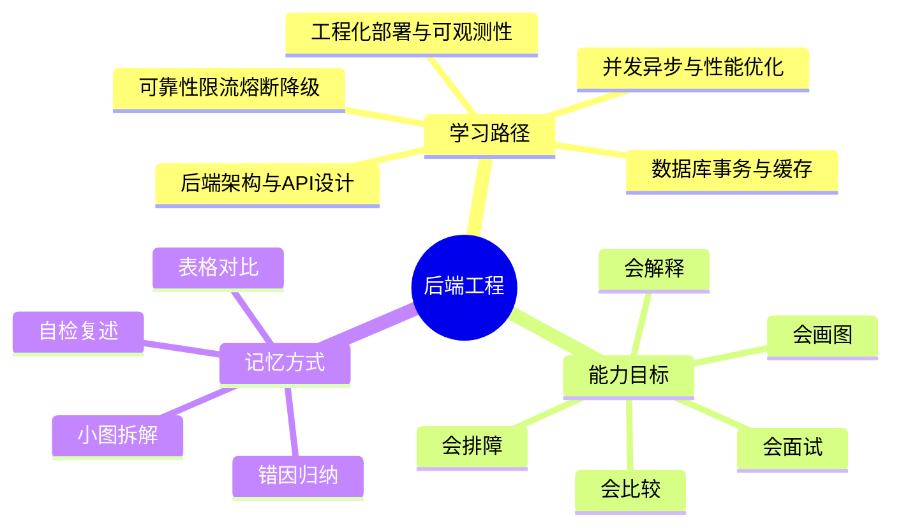
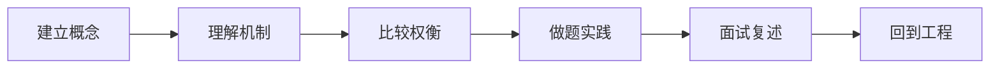
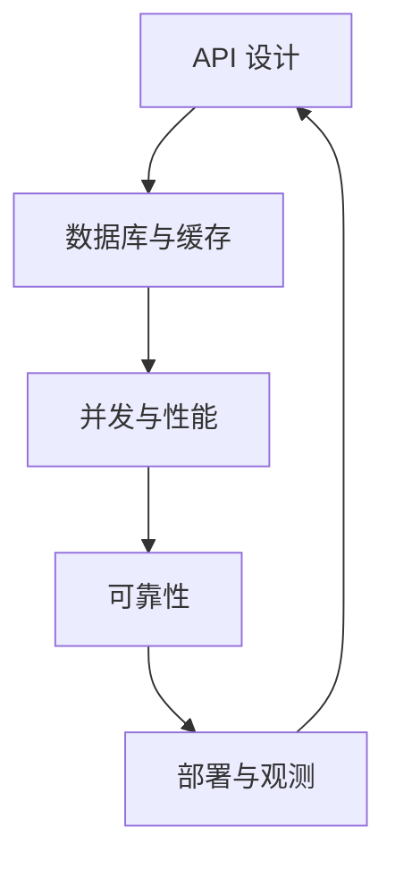
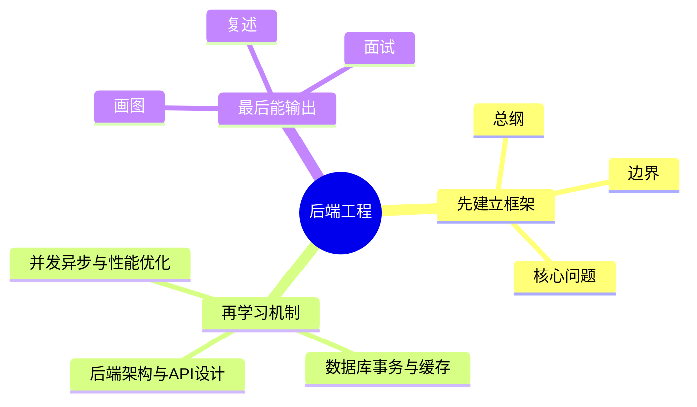
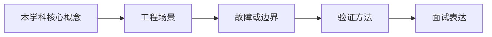

# 后端工程学习路线与知识地图

## 学习目标
- 建立 后端工程 的整体知识框架。
- 明确每个章节解决什么问题、需要记住什么、如何用于工程或面试。
- 用多张小图和表格降低记忆负担，避免单张巨大思维导图。
- 能把“API、数据、并发、可靠性、部署、可观测”串成一条完整服务链。

## 一句话总纲
后端工程把业务能力变成稳定可演进的服务，核心是 API、数据、并发、可靠性、部署和可观测。

## 记忆口诀
> 接口定契约，数据保一致，缓存提性能，限流保稳定，监控促闭环。

## 思维导图

## Mermaid 图解：学习路线

## 章节地图与知识主线
| 顺序 | 文件 | 学习重点 | 关键主线 |
|---|---|---|---|
| 第 1 章 | [[01-后端架构与API设计]] | 资源建模、接口契约、输入校验、版本演进。 | 服务如何对外承诺 |
| 第 2 章 | [[02-数据库事务与缓存]] | 事务隔离、索引设计、缓存模式、一致性治理。 | 数据如何保证正确 |
| 第 3 章 | [[03-并发异步与性能优化]] | 线程、协程、异步 IO、连接池、性能剖析。 | 系统如何跑得快 |
| 第 4 章 | [[04-可靠性限流熔断降级]] | 幂等、重试、限流、熔断、降级、容灾。 | 故障如何被控制 |
| 第 5 章 | [[05-工程化部署与可观测性]] | 配置、日志、指标、追踪、发布、回滚。 | 线上如何被看见 |
| 面试 | [[20-后端工程面试20问]] | 高频问答、表达模板、易错点、图解。 | 知识如何被说清 |

## 分层理解法
### 1. 基础层
先弄清概念是什么、边界在哪里、要解决什么问题。

### 2. 机制层
再理解它靠什么实现、关键链路是什么、为什么能工作。

### 3. 权衡层
最后比较它和替代方案的优缺点、成本、风险、适用前提。

### 4. 落地层
把它放进真实系统：高并发、灰度发布、故障恢复、观测告警、面试表达。

## 章节之间的依赖关系

## 推荐学习方法
1. 先读本路线，知道每章在全局中的位置。
2. 每章先看思维导图，再看概念解释，最后用自检题复述。
3. 面试题不要死背，按“定义 → 机制 → 适用场景 → 权衡 → 误区”回答。
4. 复杂图拆成小图，每次只记一个因果链或流程链。
5. 看到一个新概念时，优先问它属于“正确性、性能、可靠性还是可观测”哪一类问题。

## 关键对比表
| 维度 | 先问什么 | 常见答案方向 |
|---|---|---|
| API 设计 | 资源是什么、契约是什么 | 资源建模和兼容性 |
| 数据层 | 哪些操作必须强一致 | 事务、索引、缓存一致性 |
| 性能层 | 瓶颈在 CPU、IO 还是锁 | 并发、异步、池化、剖析 |
| 可靠性层 | 失败会不会扩散 | 幂等、限流、熔断、降级 |
| 运维层 | 出问题能不能看见 | 日志、指标、追踪、回滚 |

## 常见误区总结
- 只背概念，不知道它属于哪一层问题。
- 只讲原理，不讲代价和边界。
- 只会画大图，不会画小图和因果链。
- 只会面试背诵，不会放回真实系统场景。

## 自检题
- 你能用 1 分钟说清 后端工程 的核心问题吗？
- 你能指出每章最容易混淆的两个概念吗？
- 你能把章节图不看原文复画出来吗？
- 你能把“正确性、性能、可靠性、可观测”四类问题快速归类吗？

## 速记卡片
- 总纲：后端工程把业务能力变成稳定可演进的服务，核心是 API、数据、并发、可靠性、部署和可观测。
- 口诀：接口定契约，数据保一致，缓存提性能，限流保稳定，监控促闭环。
- 面试表达：先定义边界，再解释机制，最后讲权衡和误区。

## 深度扩展：如何把本学科学到可迁移

### 1. 学科主线
把业务能力封装成稳定的 API、数据访问、并发处理、可靠性和可观测运行体系。

这意味着学习时不要把章节看成离散文件，而要形成一条稳定链路：**问题从哪里来 → 需要哪些抽象 → 底层机制如何保证结果 → 代价和风险在哪里 → 如何验证理解是否正确**。

### 2. 小思维导图：三阶段学习法

### 3. 分阶段学习重点
| 阶段 | 目标 | 学习动作 | 产出物 |
|---|---|---|---|
| 入门 | 建立全局地图 | 先读路线，再快速浏览每章思维导图 | 能说清本学科解决什么问题 |
| 理解 | 掌握机制和边界 | 对每章画流程图、列前提条件 | 能解释为什么这样设计 |
| 应用 | 做题或工程迁移 | 用案例检查概念是否能落地 | 能选择方案并说出权衡 |
| 面试 | 形成表达模板 | 按 Q-A-图-误区复述 | 能稳定回答 20 个核心问题 |

### 4. 章节之间的关系
- **第 1 层：后端架构与API设计** —— 学习时要问：它承接了前一章什么问题，又为后一章提供什么工具？
- **第 2 层：数据库事务与缓存** —— 学习时要问：它承接了前一章什么问题，又为后一章提供什么工具？
- **第 3 层：并发异步与性能优化** —— 学习时要问：它承接了前一章什么问题，又为后一章提供什么工具？
- **第 4 层：可靠性限流熔断降级** —— 学习时要问：它承接了前一章什么问题，又为后一章提供什么工具？
- **第 5 层：工程化部署与可观测性** —— 学习时要问：它承接了前一章什么问题，又为后一章提供什么工具？

### 5. 复习闭环
- **风险提醒：** 最大风险是接口能跑但缺少契约、幂等、限流、监控、回滚和容量边界。
- **实践抓手：** 后端设计应从接口契约、数据一致性、性能瓶颈、故障模式和运维证据五条线展开。
- **闭环方式：** 每学完一章，必须能完成“三件事”：复画图、讲反例、做迁移。

### 6. 总自检
1. 你能否不看目录，按依赖关系重新排列所有章节？
2. 你能否为每章说出一个工程场景或面试场景？
3. 你能否说明本学科与操作系统、网络、数据库、LLM 或后端工程的连接点？

## 专题深化：与其他学科的连接

- **本学科核心连接点：** 例如订单 API 要明确资源模型、请求校验、事务边界、缓存失效、限流、监控指标、错误码和回滚路径。
- **向上连接：** 可以支撑系统设计、工程实践、AI Agent 开发和面试表达。
- **向下连接：** 依赖数据结构、操作系统、计算机网络、数据库和数学基础中的概念。

### 学习产出标准
| 层次 | 能力表现 | 自检方式 |
|---|---|---|
| 记住 | 能说出核心名词 | 不看目录复述章节 |
| 理解 | 能画出机制图 | 给别人讲清流程 |
| 应用 | 能解决案例问题 | 用真实约束做方案选择 |
| 迁移 | 能跨学科解释 | 连接 OS/网络/数据库/LLM 场景 |
