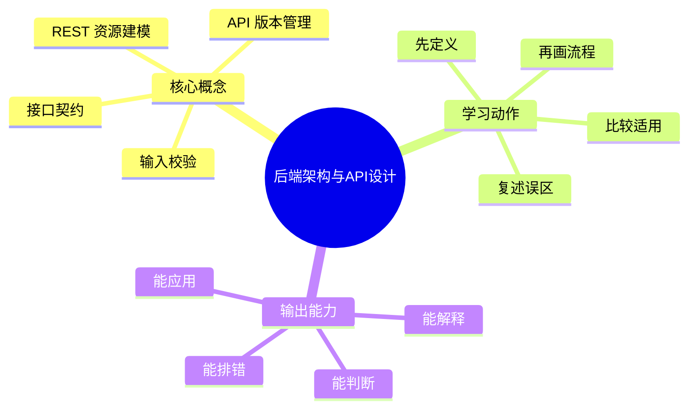
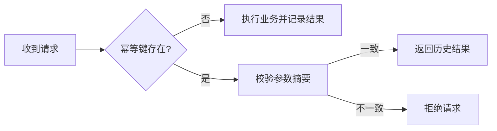

# 后端工程：后端架构与API设计

## 学习目标
- 理解资源建模、接口契约、分层架构和版本管理。
- 能画出本章核心流程图，并能用自己的话解释每个节点。
- 能说出适用场景、边界条件和常见误区。
- 能区分“设计得像 REST”和“真正可维护的 API”。

## 一句话总纲
API 是服务对外承诺，好的后端先把边界和契约设计清楚。

## 记忆口诀
> 资源建模，契约先行，版本可演

## 思维导图

## Mermaid 图解：核心流程

## 分章节讲解
### 1. REST 资源建模
**核心定义：** REST 强调用资源和统一接口表达业务对象，HTTP 方法表示操作语义。

**底层原理：**
- 资源是业务对象的抽象，例如用户、订单、库存。
- 统一接口减少“每个接口都像一个小程序”的混乱，便于理解和扩展。
- 方法语义帮助调用方预期行为：GET 读、POST 创建、PUT/PATCH 修改、DELETE 删除。

**工程理解：**
- 资源命名要稳定，动词少一点，名词清晰一点。
- 面向聚合根建模，比面向页面按钮建模更耐久。
- 复杂动作可以通过子资源、命令资源或工作流接口表达，但不要把所有动作都塞进一个万能接口。

**适用场景：**
- 面向外部调用方的 Web API。
- 移动端、前端、第三方系统共同调用的标准服务层。
- 需要长期维护和逐步演进的业务服务。

**常见误区：** 把动词塞进 URL 会削弱资源模型；但复杂业务动作可用子资源表达。

### 2. 接口契约
**核心定义：** 接口契约包括请求响应结构、状态码、错误码、幂等性和兼容性规则。

**底层原理：**
- 契约本质上是调用方与服务端的“共同约定”。
- 约定越明确，联调、测试、重构、灰度越容易。
- 状态码解决“请求层结果”，错误码解决“业务层结果”，两者不能混为一谈。

**工程理解：**
- 契约文档不是装饰品，而是协作边界。
- 字段可空、默认值、枚举扩展、错误码新增，都要提前约束兼容性。
- 幂等接口要在契约里说明重复请求行为，避免重试把系统打穿。

**适用场景：**
- 前后端协作。
- 多语言、多团队、第三方接入。
- 微服务中需要长期稳定的服务边界。

**常见误区：** 只写代码不写契约会让前后端和调用方难以协作。

### 3. 输入校验
**核心定义：** 后端必须校验类型、范围、权限和业务规则，不能依赖前端校验。

**底层原理：**
- 校验分为语法校验、语义校验和权限校验。
- 前端校验解决体验，后端校验解决安全与一致性。
- 校验失败要返回明确、可定位的错误信息。

**工程理解：**
- 先拦住非法输入，再进入业务逻辑。
- 对高频请求，校验路径要短且确定，避免过度耦合数据库。
- 对复杂业务规则，可把规则抽成独立校验器或领域对象。

**适用场景：**
- 表单提交、批量导入、开放平台调用、管理后台操作。
- 涉及权限、金额、数量、状态流转等关键操作。

**常见误区：** 前端校验只提升体验，不能作为安全边界。

### 4. API 版本管理
**核心定义：** 版本管理通过兼容演进、废弃方案和迁移窗口减少调用方破坏。

**底层原理：**
- 接口演进有三种常见方式：新增字段、增加可选参数、引入新版本。
- 破坏性变更要被显式管理，不能“顺手改掉”。
- 版本控制的核心不是“版本号多”，而是“变更可控、迁移可预期”。

**工程理解：**
- 优先向后兼容，尽量避免修改字段语义。
- 废弃要有公告、监控、迁移期和回退方案。
- 版本不是失败的证明，而是长期维护的正常成本。

**适用场景：**
- 对外 API、SDK、公共平台、老系统改造。
- 客户端升级周期长、调用方数量多的场景。

**常见误区：** 直接修改字段含义比新增字段更危险；破坏性变更要显式版本化。

## 工程视角：一套可维护 API 的判断标准
- 资源命名能否看出业务对象。
- 契约是否明确成功、失败、重试和幂等语义。
- 输入校验是否在服务端闭环。
- 版本升级是否可灰度、可回滚、可追踪。

## 关键对比表
| 知识点 | 正确理解 | 常见误区 |
|---|---|---|
| REST 资源建模 | REST 强调用资源和统一接口表达业务对象，HTTP 方法表示操作语义。 | 把动词塞进 URL 会削弱资源模型；但复杂业务动作可用子资源表达。 |
| 接口契约 | 接口契约包括请求响应结构、状态码、错误码、幂等性和兼容性规则。 | 只写代码不写契约会让前后端和调用方难以协作。 |
| 输入校验 | 后端必须校验类型、范围、权限和业务规则，不能依赖前端校验。 | 前端校验只提升体验，不能作为安全边界。 |
| API 版本管理 | 版本管理通过兼容演进、废弃方案和迁移窗口减少调用方破坏。 | 直接修改字段含义比新增字段更危险；破坏性变更要显式版本化。 |

## 常见误区总结
- **REST 资源建模：** 把动词塞进 URL 会削弱资源模型；但复杂业务动作可用子资源表达。
- **接口契约：** 只写代码不写契约会让前后端和调用方难以协作。
- **输入校验：** 前端校验只提升体验，不能作为安全边界。
- **API 版本管理：** 直接修改字段含义比新增字段更危险；破坏性变更要显式版本化。

## 自检题
1. 本章的核心问题是什么？请用一句话回答：API 是服务对外承诺，好的后端先把边界和契约设计清楚。
2. 本章每个概念的适用前提分别是什么？
3. 哪个误区最容易在面试或工程实践中出现？为什么？
4. 如果一个接口已经被十个系统调用，你会优先考虑哪种演进方式？为什么？

## 速记卡片
- 章节口诀：资源建模，契约先行，版本可演
- 答题结构：定义 → 机制 → 场景 → 权衡 → 误区。
- 复习动作：遮住正文，只根据思维导图复述一遍。

## 深度扩展：底层原理与应用边界

### 1. 本章在「后端工程」中的位置
- **核心定位：** 把业务能力封装成稳定的 API、数据访问、并发处理、可靠性和可观测运行体系。
- **本章作用：** 「后端工程：后端架构与API设计」负责把总纲落到可操作的判断框架：先确认问题边界，再拆解机制，最后根据代价和风险选择方法。
- **主要风险：** 最大风险是接口能跑但缺少契约、幂等、限流、监控、回滚和容量边界。
- **实践抓手：** 后端设计应从接口契约、数据一致性、性能瓶颈、故障模式和运维证据五条线展开。

### 2. 小流程图：从概念到应用

### 3. 概念深化：逐个击破
#### 3.1 REST 资源建模
- **先问它解决什么：** REST 资源建模 不是孤立名词，而是用来解决本章某类约束、关系、代价或风险判断的问题。
- **底层机制：** 学习时要拆成“输入条件 → 中间结构 → 处理规则 → 输出结果”四步；如果任何一步说不清，说明只是记住了结论。
- **适用条件：** 当前提满足、边界清楚、代价可接受时使用；如果输入分布、规模、时序、权限或一致性假设变化，就要重新评估。
- **不适用信号：** 需要违反前提才能套用、只能靠特殊样例解释、复杂度或维护成本明显失控时，应换方案。
- **面试表达：** “我会先定义 REST 资源建模，再说明它依赖的前提，最后用一个反例说明边界。”

#### 3.2 接口契约
- **先问它解决什么：** 接口契约 不是孤立名词，而是用来解决本章某类约束、关系、代价或风险判断的问题。
- **底层机制：** 学习时要拆成“输入条件 → 中间结构 → 处理规则 → 输出结果”四步；如果任何一步说不清，说明只是记住了结论。
- **适用条件：** 当前提满足、边界清楚、代价可接受时使用；如果输入分布、规模、时序、权限或一致性假设变化，就要重新评估。
- **不适用信号：** 需要违反前提才能套用、只能靠特殊样例解释、复杂度或维护成本明显失控时，应换方案。
- **面试表达：** “我会先定义 接口契约，再说明它依赖的前提，最后用一个反例说明边界。”

#### 3.3 输入校验
- **先问它解决什么：** 输入校验 不是孤立名词，而是用来解决本章某类约束、关系、代价或风险判断的问题。
- **底层机制：** 学习时要拆成“输入条件 → 中间结构 → 处理规则 → 输出结果”四步；如果任何一步说不清，说明只是记住了结论。
- **适用条件：** 当前提满足、边界清楚、代价可接受时使用；如果输入分布、规模、时序、权限或一致性假设变化，就要重新评估。
- **不适用信号：** 需要违反前提才能套用、只能靠特殊样例解释、复杂度或维护成本明显失控时，应换方案。
- **面试表达：** “我会先定义 输入校验，再说明它依赖的前提，最后用一个反例说明边界。”

#### 3.4 API 版本管理
- **先问它解决什么：** API 版本管理 不是孤立名词，而是用来解决本章某类约束、关系、代价或风险判断的问题。
- **底层机制：** 学习时要拆成“输入条件 → 中间结构 → 处理规则 → 输出结果”四步；如果任何一步说不清，说明只是记住了结论。
- **适用条件：** 当前提满足、边界清楚、代价可接受时使用；如果输入分布、规模、时序、权限或一致性假设变化，就要重新评估。
- **不适用信号：** 需要违反前提才能套用、只能靠特殊样例解释、复杂度或维护成本明显失控时，应换方案。
- **面试表达：** “我会先定义 API 版本管理，再说明它依赖的前提，最后用一个反例说明边界。”

### 4. 适用边界对比表
| 判断维度 | 应该怎么想 | 典型错误 | 记忆提示 |
|---|---|---|---|
| 前提条件 | 先列出输入规模、数据分布、系统假设或业务约束 | 不看条件直接套模板 | 先问“凭什么能用” |
| 正确性 | 需要能说明为什么结果保持不变或为什么局部选择成立 | 只给经验结论 | 用不变量、反例或交换论证检查 |
| 复杂度/成本 | 同时估算时间、空间、延迟、吞吐、人力和维护成本 | 只看理论最优 | 工程里还要看常数和可观测性 |
| 失败模式 | 主动说明边界外会怎样失败 | 面试中只讲优点 | 能说失败边界才算真理解 |

### 5. 记忆强化：三层复述法
1. **概念层：** 用一句话定义本章每个核心概念。
2. **机制层：** 不看原文画出输入到输出的流程。
3. **边界层：** 为每个概念准备一个“不能这样用”的反例。

### 6. 工程/做题/面试迁移
- **工程迁移：** 后端设计应从接口契约、数据一致性、性能瓶颈、故障模式和运维证据五条线展开。
- **做题迁移：** 先把题目中的对象、关系、约束和目标函数圈出来，再映射到本章概念。
- **面试迁移：** 回答时不要只报名词，要说清“为什么需要它、它如何工作、它何时失效”。

### 7. 深度自检题
1. 你能否把本章概念按“前提 → 机制 → 结果 → 代价”重新组织？
2. 如果输入规模、并发量、数据分布或安全边界变化，原结论是否仍成立？
3. 本章哪个概念最容易被误用？请给出一个反例。
4. 如果让你设计一道面试题，你会怎样考察候选人是否真的理解？

### 8. 深度速记卡片
- **总抓手：** 把业务能力封装成稳定的 API、数据访问、并发处理、可靠性和可观测运行体系。
- **答题模板：** 定义边界 → 拆底层机制 → 说适用条件 → 讲权衡 → 给反例。
- **复习动作：** 每次复习只看图和表，尝试口述 3 分钟；卡住处再回正文。

## 专题深化：具体机制、案例与追问

### 1. 具体案例：把「后端架构与API设计」放进真实问题
例如订单 API 要明确资源模型、请求校验、事务边界、缓存失效、限流、监控指标、错误码和回滚路径。

### 2. 本章关键机制细化
- API 契约包括状态码、错误码、幂等性、兼容性和权限语义。
- 资源建模不是简单 CRUD，要表达业务边界。
- 后端校验是安全边界，前端校验只是体验优化。

### 3. 概念到判断的检查清单
| 概念/动作 | 你要检查什么 | 如果检查失败会怎样 |
|---|---|---|
| REST 资源建模 | 前提、输入、输出、代价、失败边界是否都说清 | 可能套错模型、复杂度失控或得到不可验证结论 |
| 接口契约 | 前提、输入、输出、代价、失败边界是否都说清 | 可能套错模型、复杂度失控或得到不可验证结论 |
| 输入校验 | 前提、输入、输出、代价、失败边界是否都说清 | 可能套错模型、复杂度失控或得到不可验证结论 |
| API 版本管理 | 前提、输入、输出、代价、失败边界是否都说清 | 可能套错模型、复杂度失控或得到不可验证结论 |
| 本章在「后端工程」中的位置 | 前提、输入、输出、代价、失败边界是否都说清 | 可能套错模型、复杂度失控或得到不可验证结论 |

### 4. 面试追问路径

- 接口契约是否清晰且兼容？
- 数据一致性和缓存新鲜度如何保证？
- 容量达到上限时如何保护系统？

### 5. 验证与复盘
- **验证方式：** 用契约测试、压测、慢查询分析、链路追踪和灰度监控验证。
- **复盘方式：** 每次做题或设计后，记录“我使用了哪个前提、哪个前提最容易被破坏、如果破坏如何调整”。
- **记忆方式：** 不背孤立结论，只背“问题 → 机制 → 边界 → 验证”的链路。

## 本轮扩写：契约演进、幂等键与错误模型

### 1. API 契约不是 URL，而是长期承诺
一个可维护 API 要同时约束资源、字段、状态码、错误格式、分页、幂等和兼容策略。

| 契约项 | 要回答的问题 | 常见误区 | 推荐做法 |
|---|---|---|---|
| 资源模型 | URL 表达名词还是动作 | 把所有接口写成 `/doXxx` | 用资源和子资源表达领域对象 |
| 字段兼容 | 新旧客户端如何共存 | 删除字段或改变含义 | 新增可选字段，弃用而非突删 |
| 错误模型 | 客户端如何判断可重试 | 只返回 “fail” | 统一 error code、message、trace id |
| 分页模型 | 大列表如何稳定遍历 | offset 深分页拖垮数据库 | cursor/keyset 分页优先 |
| 幂等模型 | 重复提交如何处理 | 只靠前端禁用按钮 | 服务端幂等键和状态机兜底 |

### 2. 幂等键的边界
- 幂等键应绑定用户、业务动作、请求参数摘要和有效期。
- 同一个幂等键重复提交时，应返回第一次请求的业务结果，而不是重新执行副作用。
- 幂等记录要有过期策略；否则会变成无界存储。
- 幂等不能替代事务：它防重复，不自动保证多个资源的不变量。

### 3. 版本演进策略
1. **兼容新增：** 新字段默认可选，旧客户端忽略。
2. **语义变更：** 不直接复用旧字段，新增字段或新版本。
3. **废弃字段：** 先标记 deprecated，再观察调用量，最后下线。
4. **破坏性变更：** 用版本、灰度、迁移文档和双写/双读过渡。

### 4. 面试追问路径
- “为什么不用统一返回 200？”——说明 HTTP 状态码承载通用语义，业务错误码承载领域语义，两者不能互相替代。
- “如何设计分页？”——从数据量、排序稳定性、跳页需求和索引条件选择 offset 或 cursor。
- “如何保证重复下单不出问题？”——回答幂等键、唯一约束、状态机和支付回调幂等。
