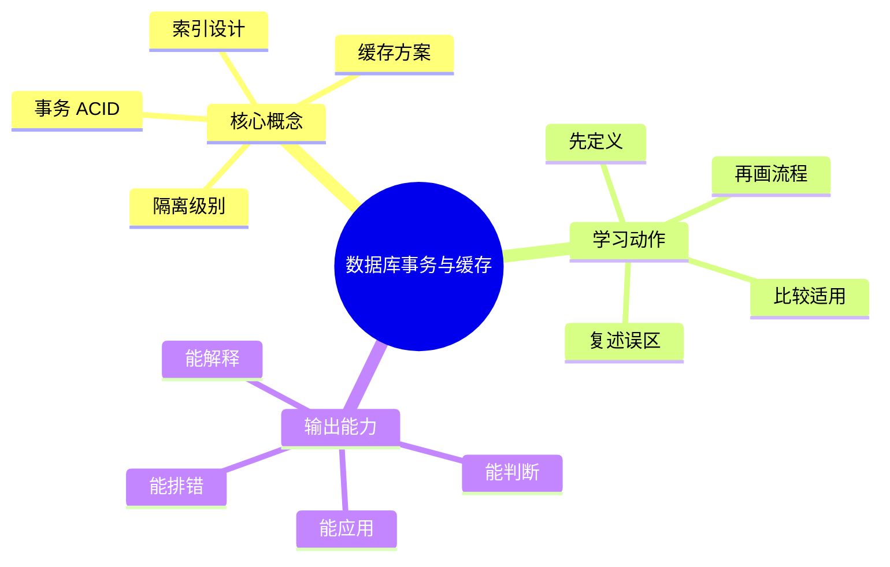
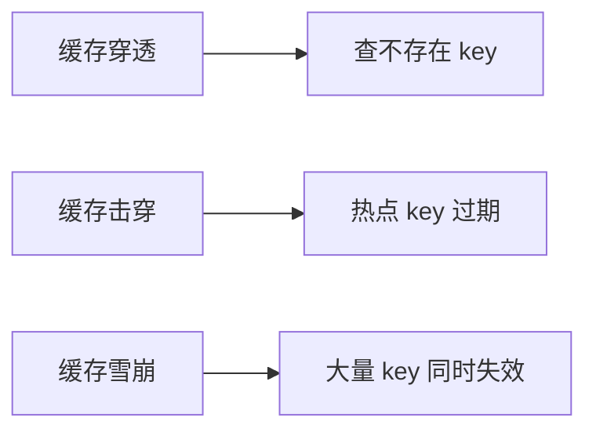

# 后端工程：数据库事务与缓存

## 学习目标
- 掌握事务隔离、索引、缓存模式和一致性权衡。
- 能画出本章核心流程图，并能用自己的话解释每个节点。
- 能说出适用场景、边界条件和常见误区。
- 能判断“该加事务、该加索引、还是该加缓存”。

## 一句话总纲
数据库保证正确性，缓存提升性能，但缓存必须服从一致性方案。

## 记忆口诀
> 事务管正确，索引管查询，缓存管热点

## 思维导图

## Mermaid 图解：核心流程

## 分章节讲解
### 1. 事务 ACID
**核心定义：** ACID 分别是原子性、一致性、隔离性和持久性，保障数据库操作可靠提交。

**底层原理：**
- 原子性依赖回滚能力，把一组操作视为一个整体。
- 一致性要求事务前后满足业务和约束条件。
- 隔离性处理并发事务之间的可见性问题。
- 持久性确保提交后结果不会轻易丢失。

**工程理解：**
- 事务不是越大越好，过大的事务会增加锁等待和回滚成本。
- 跨服务事务通常不建议直接依赖本地事务幻想“一把锁全搞定”。
- 先问自己：这是数据库内一致性问题，还是业务编排问题。

**适用场景：**
- 订单创建、账户扣款、库存扣减等必须整体成功或失败的操作。
- 需要在并发条件下维持关键约束的写操作。

**常见误区：** 一致性是业务约束被维护，不是分布式一致性的同一概念。

### 2. 隔离级别
**核心定义：** 隔离级别控制并发事务可见性，涉及脏读、不可重复读、幻读等现象。

**底层原理：**
- 隔离级别本质上是“并发可见性”的控制方案。
- 低隔离提升并发，但会让读到的状态更不稳定。
- 高隔离减少并发异常，但会增加锁和等待成本。

**工程理解：**
- 不同数据库对隔离级别的实现不同，不能只记名字。
- 面试时最好讲“你看到的问题是什么异常，再选什么隔离级别”。
- 业务读写模式不同，最优隔离级别也不同。

**适用场景：**
- 金额、库存、配额、抢购、排名等需要严格一致性的场景。
- 高并发读写混合系统，需要在一致性和吞吐间折中。

**常见误区：** 隔离越高通常并发代价越大；具体行为还与数据库实现有关。

### 3. 索引设计
**核心定义：** 索引用空间和写入成本换查询速度，联合索引要关注选择性和最左前缀。

**底层原理：**
- 索引通常利用有序结构缩小扫描范围。
- 索引能加速查询，也会增加插入、更新和删除成本。
- 联合索引的顺序决定命中能力，不是字段越多越好。

**工程理解：**
- 先看查询模式，再决定索引结构。
- 低选择性字段、频繁变更字段、超大文本字段，通常不是好索引候选。
- 设计索引时要考虑覆盖索引、回表成本和写放大。

**适用场景：**
- 高频查询、列表筛选、排序分页、关联查询。
- 需要减少全表扫描的读密集场景。

**常见误区：** 索引不是越多越好；低选择性和频繁更新字段可能收益很低。

### 4. 缓存方案
**核心定义：** 常见方案包括 Cache Aside、Write Through、Write Back 和 Refresh Ahead。

**底层原理：**
- 缓存是“用空间和一致性复杂度换响应速度”。
- Cache Aside 由应用负责读写协调，最常见也最容易出一致性问题。
- Write Through 写缓存时同步写后端，Write Back 则先写缓存再异步落库。

**工程理解：**
- 先判断数据是否允许短暂不一致。
- 热点数据适合缓存，但必须准备失效、降级和回源保护。
- 设计缓存时还要考虑穿透、击穿、雪崩和预热。

**适用场景：**
- 读多写少、热点明显、允许一定延迟一致性的业务。
- 外部依赖慢、数据库压力大、列表查询重复率高的场景。

**常见误区：** 缓存穿透、击穿、雪崩需要分别治理；过期时间不是一致性方案的全部。

## 工程视角：选事务、索引还是缓存
- 先看正确性问题：如果会导致错账、错库存、错状态，优先事务和幂等。
- 再看查询瓶颈：如果是慢查询或扫描大，优先索引。
- 再看热点压力：如果读放大明显，再引入缓存。
- 最后看一致性：缓存不是数据库的替身，必须明确失效和回源方案。

## 关键对比表
| 知识点 | 正确理解 | 常见误区 |
|---|---|---|
| 事务 ACID | ACID 分别是原子性、一致性、隔离性和持久性，保障数据库操作可靠提交。 | 一致性是业务约束被维护，不是分布式一致性的同一概念。 |
| 隔离级别 | 隔离级别控制并发事务可见性，涉及脏读、不可重复读、幻读等现象。 | 隔离越高通常并发代价越大；具体行为还与数据库实现有关。 |
| 索引设计 | 索引用空间和写入成本换查询速度，联合索引要关注选择性和最左前缀。 | 索引不是越多越好；低选择性和频繁更新字段可能收益很低。 |
| 缓存方案 | 常见方案包括 Cache Aside、Write Through、Write Back 和 Refresh Ahead。 | 缓存穿透、击穿、雪崩需要分别治理；过期时间不是一致性方案的全部。 |

## 常见误区总结
- **事务 ACID：** 一致性是业务约束被维护，不是分布式一致性的同一概念。
- **隔离级别：** 隔离越高通常并发代价越大；具体行为还与数据库实现有关。
- **索引设计：** 索引不是越多越好；低选择性和频繁更新字段可能收益很低。
- **缓存方案：** 缓存穿透、击穿、雪崩需要分别治理；过期时间不是一致性方案的全部。

## 自检题
1. 本章的核心问题是什么？请用一句话回答：数据库保证正确性，缓存提升性能，但缓存必须服从一致性方案。
2. 本章每个概念的适用前提分别是什么？
3. 哪个误区最容易在面试或工程实践中出现？为什么？
4. 如果缓存和数据库出现短暂不一致，你会先检查哪三个点？

## 速记卡片
- 章节口诀：事务管正确，索引管查询，缓存管热点
- 答题结构：定义 → 机制 → 场景 → 权衡 → 误区。
- 复习动作：遮住正文，只根据思维导图复述一遍。

## 深度扩展：底层原理与应用边界

### 1. 本章在「后端工程」中的位置
- **核心定位：** 把业务能力封装成稳定的 API、数据访问、并发处理、可靠性和可观测运行体系。
- **本章作用：** 「后端工程：数据库事务与缓存」负责把总纲落到可操作的判断框架：先确认问题边界，再拆解机制，最后根据代价和风险选择方法。
- **主要风险：** 最大风险是接口能跑但缺少契约、幂等、限流、监控、回滚和容量边界。
- **实践抓手：** 后端设计应从接口契约、数据一致性、性能瓶颈、故障模式和运维证据五条线展开。

### 2. 小流程图：从概念到应用

### 3. 概念深化：逐个击破
#### 3.1 事务 ACID
- **先问它解决什么：** 事务 ACID 不是孤立名词，而是用来解决本章某类约束、关系、代价或风险判断的问题。
- **底层机制：** 学习时要拆成“输入条件 → 中间结构 → 处理规则 → 输出结果”四步；如果任何一步说不清，说明只是记住了结论。
- **适用条件：** 当前提满足、边界清楚、代价可接受时使用；如果输入分布、规模、时序、权限或一致性假设变化，就要重新评估。
- **不适用信号：** 需要违反前提才能套用、只能靠特殊样例解释、复杂度或维护成本明显失控时，应换方案。
- **面试表达：** “我会先定义 事务 ACID，再说明它依赖的前提，最后用一个反例说明边界。”

#### 3.2 隔离级别
- **先问它解决什么：** 隔离级别 不是孤立名词，而是用来解决本章某类约束、关系、代价或风险判断的问题。
- **底层机制：** 学习时要拆成“输入条件 → 中间结构 → 处理规则 → 输出结果”四步；如果任何一步说不清，说明只是记住了结论。
- **适用条件：** 当前提满足、边界清楚、代价可接受时使用；如果输入分布、规模、时序、权限或一致性假设变化，就要重新评估。
- **不适用信号：** 需要违反前提才能套用、只能靠特殊样例解释、复杂度或维护成本明显失控时，应换方案。
- **面试表达：** “我会先定义 隔离级别，再说明它依赖的前提，最后用一个反例说明边界。”

#### 3.3 索引设计
- **先问它解决什么：** 索引设计 不是孤立名词，而是用来解决本章某类约束、关系、代价或风险判断的问题。
- **底层机制：** 学习时要拆成“输入条件 → 中间结构 → 处理规则 → 输出结果”四步；如果任何一步说不清，说明只是记住了结论。
- **适用条件：** 当前提满足、边界清楚、代价可接受时使用；如果输入分布、规模、时序、权限或一致性假设变化，就要重新评估。
- **不适用信号：** 需要违反前提才能套用、只能靠特殊样例解释、复杂度或维护成本明显失控时，应换方案。
- **面试表达：** “我会先定义 索引设计，再说明它依赖的前提，最后用一个反例说明边界。”

#### 3.4 缓存方案
- **先问它解决什么：** 缓存方案 不是孤立名词，而是用来解决本章某类约束、关系、代价或风险判断的问题。
- **底层机制：** 学习时要拆成“输入条件 → 中间结构 → 处理规则 → 输出结果”四步；如果任何一步说不清，说明只是记住了结论。
- **适用条件：** 当前提满足、边界清楚、代价可接受时使用；如果输入分布、规模、时序、权限或一致性假设变化，就要重新评估。
- **不适用信号：** 需要违反前提才能套用、只能靠特殊样例解释、复杂度或维护成本明显失控时，应换方案。
- **面试表达：** “我会先定义 缓存方案，再说明它依赖的前提，最后用一个反例说明边界。”

### 4. 适用边界对比表
| 判断维度 | 应该怎么想 | 典型错误 | 记忆提示 |
|---|---|---|---|
| 前提条件 | 先列出输入规模、数据分布、系统假设或业务约束 | 不看条件直接套模板 | 先问“凭什么能用” |
| 正确性 | 需要能说明为什么结果保持不变或为什么局部选择成立 | 只给经验结论 | 用不变量、反例或交换论证检查 |
| 复杂度/成本 | 同时估算时间、空间、延迟、吞吐、人力和维护成本 | 只看理论最优 | 工程里还要看常数和可观测性 |
| 失败模式 | 主动说明边界外会怎样失败 | 面试中只讲优点 | 能说失败边界才算真理解 |

### 5. 记忆强化：三层复述法
1. **概念层：** 用一句话定义本章每个核心概念。
2. **机制层：** 不看原文画出输入到输出的流程。
3. **边界层：** 为每个概念准备一个“不能这样用”的反例。

### 6. 工程/做题/面试迁移
- **工程迁移：** 后端设计应从接口契约、数据一致性、性能瓶颈、故障模式和运维证据五条线展开。
- **做题迁移：** 先把题目中的对象、关系、约束和目标函数圈出来，再映射到本章概念。
- **面试迁移：** 回答时不要只报名词，要说清“为什么需要它、它如何工作、它何时失效”。

### 7. 深度自检题
1. 你能否把本章概念按“前提 → 机制 → 结果 → 代价”重新组织？
2. 如果输入规模、并发量、数据分布或安全边界变化，原结论是否仍成立？
3. 本章哪个概念最容易被误用？请给出一个反例。
4. 如果让你设计一道面试题，你会怎样考察候选人是否真的理解？

### 8. 深度速记卡片
- **总抓手：** 把业务能力封装成稳定的 API、数据访问、并发处理、可靠性和可观测运行体系。
- **答题模板：** 定义边界 → 拆底层机制 → 说适用条件 → 讲权衡 → 给反例。
- **复习动作：** 每次复习只看图和表，尝试口述 3 分钟；卡住处再回正文。

## 专题深化：具体机制、案例与追问

### 1. 具体案例：把「数据库事务与缓存」放进真实问题
例如订单 API 要明确资源模型、请求校验、事务边界、缓存失效、限流、监控指标、错误码和回滚路径。

### 2. 本章关键机制细化
- 事务隔离级别控制并发可见性。
- 索引用写入成本和空间换查询效率。
- 缓存一致性要明确失效、更新和降级方案。

### 3. 概念到判断的检查清单
| 概念/动作 | 你要检查什么 | 如果检查失败会怎样 |
|---|---|---|
| 事务 ACID | 前提、输入、输出、代价、失败边界是否都说清 | 可能套错模型、复杂度失控或得到不可验证结论 |
| 隔离级别 | 前提、输入、输出、代价、失败边界是否都说清 | 可能套错模型、复杂度失控或得到不可验证结论 |
| 索引设计 | 前提、输入、输出、代价、失败边界是否都说清 | 可能套错模型、复杂度失控或得到不可验证结论 |
| 缓存方案 | 前提、输入、输出、代价、失败边界是否都说清 | 可能套错模型、复杂度失控或得到不可验证结论 |
| 本章在「后端工程」中的位置 | 前提、输入、输出、代价、失败边界是否都说清 | 可能套错模型、复杂度失控或得到不可验证结论 |

### 4. 面试追问路径

- 接口契约是否清晰且兼容？
- 数据一致性和缓存新鲜度如何保证？
- 容量达到上限时如何保护系统？

### 5. 验证与复盘
- **验证方式：** 用契约测试、压测、慢查询分析、链路追踪和灰度监控验证。
- **复盘方式：** 每次做题或设计后，记录“我使用了哪个前提、哪个前提最容易被破坏、如果破坏如何调整”。
- **记忆方式：** 不背孤立结论，只背“问题 → 机制 → 边界 → 验证”的链路。

## 本轮扩写：缓存一致性、穿透击穿雪崩与事务边界

### 1. 缓存一致性先问“允许多旧”
缓存不是数据库的透明加速层，而是引入了额外副本。设计前要明确允许读到多旧的数据、哪些数据不能旧、旧了如何修复。

| 模式 | 写路径 | 优点 | 风险 | 适用场景 |
|---|---|---|---|---|
| Cache Aside | 先写库，再删缓存 | 简单通用 | 删除失败、并发回填旧值 | 大多数读多写少业务 |
| Write Through | 写缓存同步写库 | 读一致性较好 | 写延迟高，缓存依赖强 | 配置、字典类数据 |
| Write Behind | 先写缓存异步落库 | 写吞吐高 | 丢数据和顺序风险 | 可重放、可补偿日志场景 |
| Refresh Ahead | 提前刷新热点 | 降低过期抖动 | 预测错误浪费资源 | 热点稳定数据 |

### 2. 三类缓存事故

- **穿透：** 用布隆过滤器、空值缓存、参数校验防止不存在 key 打到数据库。
- **击穿：** 用互斥重建、逻辑过期、热点永不过期加异步刷新。
- **雪崩：** 用过期时间随机化、分批预热、多级缓存和限流降级。

### 3. 事务边界与缓存边界不同
数据库事务提交成功，不代表缓存已经同步成功；缓存删除成功，也不代表读路径不会并发回填旧值。

**工程检查清单：**
1. 写库成功后缓存操作失败怎么办？
2. 删除缓存和更新缓存哪个更安全？为什么？
3. 并发读在写库前后如何避免回填旧值？
4. 是否需要 binlog/CDC 做最终一致修复？
5. 是否有缓存命中率、回源 QPS、热点 key 监控？

### 4. 面试追问路径
- “为什么通常删缓存而不是更新缓存？”——回答并发覆盖、复杂对象重建成本和最终一致修复。
- “如何处理缓存和数据库不一致？”——回答可接受旧值窗口、删除重试、消息补偿、CDC 对账。
- “如何发现缓存事故？”——回答命中率下降、回源 QPS 上升、热点 key、数据库慢查询和错误率联动。
