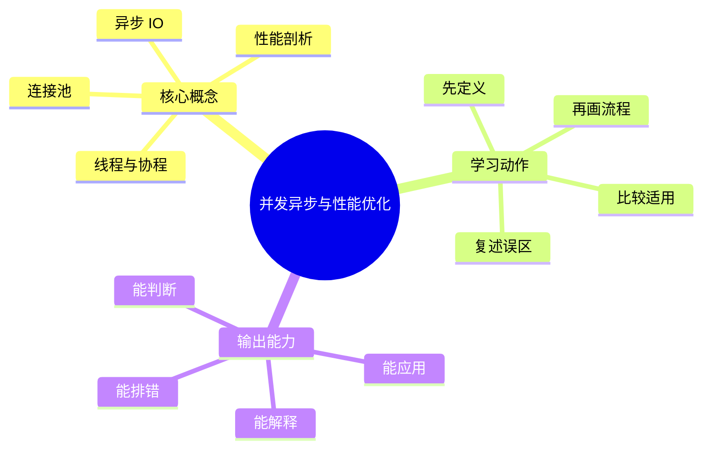
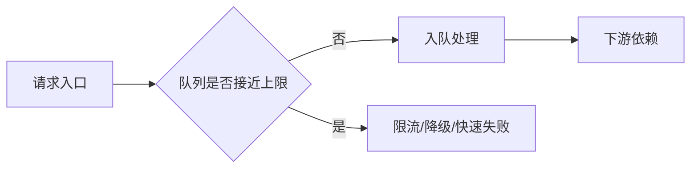

# 后端工程：并发异步与性能优化

## 学习目标
- 理解线程、协程、异步 IO、连接池和性能定位方法。
- 能画出本章核心流程图，并能用自己的话解释每个节点。
- 能说出适用场景、边界条件和常见误区。
- 能从“瓶颈在哪里”出发，而不是从“某个技术很火”出发。

## 一句话总纲
后端性能优化要先定位瓶颈，再选择并发、缓存、批处理或算法优化。

## 记忆口诀
> 先量化，后优化；IO异步，CPU并行

## 思维导图

## Mermaid 图解：核心流程

## 分章节讲解
### 1. 线程与协程
**核心定义：** 线程由操作系统调度，协程更轻量并适合高并发 IO 场景。

**底层原理：**
- 线程切换涉及内核调度和上下文切换，成本相对更高。
- 协程通常在用户态切换，更轻量，但需要运行时支持。
- 两者的关键差异不是“谁更高级”，而是调度成本和编程模型不同。

**工程理解：**
- CPU 密集型任务更看重并行能力，不要误把协程当银弹。
- IO 密集型任务适合大量并发等待，协程常常更省资源。
- 阻塞调用进入协程模型会把优势吃掉，必须特别警惕。

**适用场景：**
- 大量网络请求、RPC 聚合、消息消费、网关转发。
- 需要高并发但单任务逻辑不重的服务。

**常见误区：** 协程不自动提升 CPU 密集任务性能；阻塞调用会拖垮事件循环。

### 2. 异步 IO
**核心定义：** 异步 IO 让线程不在等待网络或磁盘时阻塞，提高吞吐和资源利用率。

**底层原理：**
- 发起 IO 后不等待结果，完成后通过事件通知或回调继续处理。
- 异步并不等于并行，关键是“等待时间不占用执行资源”。
- 背压、超时、取消是异步系统的基础配套能力。

**工程理解：**
- 适合长等待、短计算的请求链路。
- 如果异步链太深但依赖链还在同步阻塞，收益会被稀释。
- 要把超时预算从入口一路传到底层，避免悬挂请求。

**适用场景：**
- 网络 IO、文件 IO、批量查询、第三方接口调用。
- 对吞吐要求高、并发等待多的系统。

**常见误区：** 异步代码仍要处理超时、取消和背压。

### 3. 连接池
**核心定义：** 连接池复用数据库或外部服务连接，减少建立连接成本并限制并发压力。

**底层原理：**
- 连接建立本身有握手、认证、初始化等成本。
- 池化通过复用减少创建销毁开销，并控制同时活跃连接数。
- 连接池不是越大越好，过大时会把压力直接传给下游。

**工程理解：**
- 池大小要结合下游容量、RT、并发量一起调。
- 池耗尽时要区分是流量过高、慢请求堆积还是连接泄漏。
- 常见调优不只看平均值，还要看尾延迟和排队时间。

**适用场景：**
- 数据库、Redis、HTTP 客户端、RPC 客户端。
- 需要稳定控制资源开销的高并发服务。

**常见误区：** 池太大可能压垮下游，池太小会造成排队；要结合下游容量调参。

### 4. 性能剖析
**核心定义：** 性能剖析通过指标、火焰图、慢查询和链路追踪定位真实瓶颈。

**底层原理：**
- 先观察，再假设，再验证，最后优化。
- 常见瓶颈包括 CPU、IO、锁竞争、GC、网络、序列化和数据库。
- 没有测量就没有优化，只有猜测和偏见。

**工程理解：**
- 先看业务指标，再看系统指标，再看代码热点。
- 优化方案要有前后对比数据，避免“优化了但其实更慢”。
- 性能问题常常是系统问题，不是单点问题。

**适用场景：**
- 慢接口、吞吐下降、超时上升、资源飙高、尾延迟恶化。
- 任何需要找真实瓶颈的线上/离线性能问题。

**常见误区：** 凭感觉优化容易误伤；优化前后必须量化对比。

## 工程视角：性能优化的四步法
1. 定量：先看 QPS、RT、错误率、CPU、内存、IO。
2. 定位：确认瓶颈是计算、等待还是竞争。
3. 选择：并发、异步、批处理、缓存、算法改进。
4. 验证：回归测试和灰度指标都要对比。

## 关键对比表
| 知识点 | 正确理解 | 常见误区 |
|---|---|---|
| 线程与协程 | 线程由操作系统调度，协程更轻量并适合高并发 IO 场景。 | 协程不自动提升 CPU 密集任务性能；阻塞调用会拖垮事件循环。 |
| 异步 IO | 异步 IO 让线程不在等待网络或磁盘时阻塞，提高吞吐和资源利用率。 | 异步代码仍要处理超时、取消和背压。 |
| 连接池 | 连接池复用数据库或外部服务连接，减少建立连接成本并限制并发压力。 | 池太大可能压垮下游，池太小会造成排队；要结合下游容量调参。 |
| 性能剖析 | 性能剖析通过指标、火焰图、慢查询和链路追踪定位真实瓶颈。 | 凭感觉优化容易误伤；优化前后必须量化对比。 |

## 常见误区总结
- **线程与协程：** 协程不自动提升 CPU 密集任务性能；阻塞调用会拖垮事件循环。
- **异步 IO：** 异步代码仍要处理超时、取消和背压。
- **连接池：** 池太大可能压垮下游，池太小会造成排队；要结合下游容量调参。
- **性能剖析：** 凭感觉优化容易误伤；优化前后必须量化对比。

## 自检题
1. 本章的核心问题是什么？请用一句话回答：后端性能优化要先定位瓶颈，再选择并发、缓存、批处理或算法优化。
2. 本章每个概念的适用前提分别是什么？
3. 哪个误区最容易在面试或工程实践中出现？为什么？
4. 如果接口变慢但 CPU 不高，你会优先怀疑什么？

## 速记卡片
- 章节口诀：先量化，后优化；IO异步，CPU并行
- 答题结构：定义 → 机制 → 场景 → 权衡 → 误区。
- 复习动作：遮住正文，只根据思维导图复述一遍。

## 深度扩展：底层原理与应用边界

### 1. 本章在「后端工程」中的位置
- **核心定位：** 把业务能力封装成稳定的 API、数据访问、并发处理、可靠性和可观测运行体系。
- **本章作用：** 「后端工程：并发异步与性能优化」负责把总纲落到可操作的判断框架：先确认问题边界，再拆解机制，最后根据代价和风险选择方法。
- **主要风险：** 最大风险是接口能跑但缺少契约、幂等、限流、监控、回滚和容量边界。
- **实践抓手：** 后端设计应从接口契约、数据一致性、性能瓶颈、故障模式和运维证据五条线展开。

### 2. 小流程图：从概念到应用

### 3. 概念深化：逐个击破
#### 3.1 线程与协程
- **先问它解决什么：** 线程与协程 不是孤立名词，而是用来解决本章某类约束、关系、代价或风险判断的问题。
- **底层机制：** 学习时要拆成“输入条件 → 中间结构 → 处理规则 → 输出结果”四步；如果任何一步说不清，说明只是记住了结论。
- **适用条件：** 当前提满足、边界清楚、代价可接受时使用；如果输入分布、规模、时序、权限或一致性假设变化，就要重新评估。
- **不适用信号：** 需要违反前提才能套用、只能靠特殊样例解释、复杂度或维护成本明显失控时，应换方案。
- **面试表达：** “我会先定义 线程与协程，再说明它依赖的前提，最后用一个反例说明边界。”

#### 3.2 异步 IO
- **先问它解决什么：** 异步 IO 不是孤立名词，而是用来解决本章某类约束、关系、代价或风险判断的问题。
- **底层机制：** 学习时要拆成“输入条件 → 中间结构 → 处理规则 → 输出结果”四步；如果任何一步说不清，说明只是记住了结论。
- **适用条件：** 当前提满足、边界清楚、代价可接受时使用；如果输入分布、规模、时序、权限或一致性假设变化，就要重新评估。
- **不适用信号：** 需要违反前提才能套用、只能靠特殊样例解释、复杂度或维护成本明显失控时，应换方案。
- **面试表达：** “我会先定义 异步 IO，再说明它依赖的前提，最后用一个反例说明边界。”

#### 3.3 连接池
- **先问它解决什么：** 连接池 不是孤立名词，而是用来解决本章某类约束、关系、代价或风险判断的问题。
- **底层机制：** 学习时要拆成“输入条件 → 中间结构 → 处理规则 → 输出结果”四步；如果任何一步说不清，说明只是记住了结论。
- **适用条件：** 当前提满足、边界清楚、代价可接受时使用；如果输入分布、规模、时序、权限或一致性假设变化，就要重新评估。
- **不适用信号：** 需要违反前提才能套用、只能靠特殊样例解释、复杂度或维护成本明显失控时，应换方案。
- **面试表达：** “我会先定义 连接池，再说明它依赖的前提，最后用一个反例说明边界。”

#### 3.4 性能剖析
- **先问它解决什么：** 性能剖析 不是孤立名词，而是用来解决本章某类约束、关系、代价或风险判断的问题。
- **底层机制：** 学习时要拆成“输入条件 → 中间结构 → 处理规则 → 输出结果”四步；如果任何一步说不清，说明只是记住了结论。
- **适用条件：** 当前提满足、边界清楚、代价可接受时使用；如果输入分布、规模、时序、权限或一致性假设变化，就要重新评估。
- **不适用信号：** 需要违反前提才能套用、只能靠特殊样例解释、复杂度或维护成本明显失控时，应换方案。
- **面试表达：** “我会先定义 性能剖析，再说明它依赖的前提，最后用一个反例说明边界。”

### 4. 适用边界对比表
| 判断维度 | 应该怎么想 | 典型错误 | 记忆提示 |
|---|---|---|---|
| 前提条件 | 先列出输入规模、数据分布、系统假设或业务约束 | 不看条件直接套模板 | 先问“凭什么能用” |
| 正确性 | 需要能说明为什么结果保持不变或为什么局部选择成立 | 只给经验结论 | 用不变量、反例或交换论证检查 |
| 复杂度/成本 | 同时估算时间、空间、延迟、吞吐、人力和维护成本 | 只看理论最优 | 工程里还要看常数和可观测性 |
| 失败模式 | 主动说明边界外会怎样失败 | 面试中只讲优点 | 能说失败边界才算真理解 |

### 5. 记忆强化：三层复述法
1. **概念层：** 用一句话定义本章每个核心概念。
2. **机制层：** 不看原文画出输入到输出的流程。
3. **边界层：** 为每个概念准备一个“不能这样用”的反例。

### 6. 工程/做题/面试迁移
- **工程迁移：** 后端设计应从接口契约、数据一致性、性能瓶颈、故障模式和运维证据五条线展开。
- **做题迁移：** 先把题目中的对象、关系、约束和目标函数圈出来，再映射到本章概念。
- **面试迁移：** 回答时不要只报名词，要说清“为什么需要它、它如何工作、它何时失效”。

### 7. 深度自检题
1. 你能否把本章概念按“前提 → 机制 → 结果 → 代价”重新组织？
2. 如果输入规模、并发量、数据分布或安全边界变化，原结论是否仍成立？
3. 本章哪个概念最容易被误用？请给出一个反例。
4. 如果让你设计一道面试题，你会怎样考察候选人是否真的理解？

### 8. 深度速记卡片
- **总抓手：** 把业务能力封装成稳定的 API、数据访问、并发处理、可靠性和可观测运行体系。
- **答题模板：** 定义边界 → 拆底层机制 → 说适用条件 → 讲权衡 → 给反例。
- **复习动作：** 每次复习只看图和表，尝试口述 3 分钟；卡住处再回正文。

## 专题深化：具体机制、案例与追问

### 1. 具体案例：把「并发异步与性能优化」放进真实问题
例如订单 API 要明确资源模型、请求校验、事务边界、缓存失效、限流、监控指标、错误码和回滚路径。

### 2. 本章关键机制细化
- IO 密集适合异步和协程，CPU 密集需要并行或算法优化。
- 连接池既复用资源也限制下游压力。
- 优化前必须有指标和剖析证据。

### 3. 概念到判断的检查清单
| 概念/动作 | 你要检查什么 | 如果检查失败会怎样 |
|---|---|---|
| 线程与协程 | 前提、输入、输出、代价、失败边界是否都说清 | 可能套错模型、复杂度失控或得到不可验证结论 |
| 异步 IO | 前提、输入、输出、代价、失败边界是否都说清 | 可能套错模型、复杂度失控或得到不可验证结论 |
| 连接池 | 前提、输入、输出、代价、失败边界是否都说清 | 可能套错模型、复杂度失控或得到不可验证结论 |
| 性能剖析 | 前提、输入、输出、代价、失败边界是否都说清 | 可能套错模型、复杂度失控或得到不可验证结论 |
| 本章在「后端工程」中的位置 | 前提、输入、输出、代价、失败边界是否都说清 | 可能套错模型、复杂度失控或得到不可验证结论 |

### 4. 面试追问路径

- 接口契约是否清晰且兼容？
- 数据一致性和缓存新鲜度如何保证？
- 容量达到上限时如何保护系统？

### 5. 验证与复盘
- **验证方式：** 用契约测试、压测、慢查询分析、链路追踪和灰度监控验证。
- **复盘方式：** 每次做题或设计后，记录“我使用了哪个前提、哪个前提最容易被破坏、如果破坏如何调整”。
- **记忆方式：** 不背孤立结论，只背“问题 → 机制 → 边界 → 验证”的链路。

## 本轮扩写：线程池、背压与性能剖析闭环

### 1. 线程池大小来自资源模型，不来自拍脑袋
线程池要根据任务类型、外部依赖、CPU 核数、阻塞比例和排队上限设计。

| 任务类型 | 主要瓶颈 | 线程数倾向 | 风险 |
|---|---|---|---|
| CPU 密集 | CPU 核心 | 接近核心数 | 过多上下文切换 |
| IO 密集 | 网络/磁盘等待 | 可高于核心数 | 下游被打爆 |
| 混合任务 | CPU + IO | 分池隔离 | 单池互相拖累 |
| 长任务 | 队列等待 | 独立队列 | 占满通用线程池 |

### 2. 背压是“让上游知道下游处理不过来”
没有背压的异步系统只是把同步等待变成队列堆积。

- 队列必须有上限；无限队列会把延迟问题变成内存问题。
- 背压信号可以是队列长度、处理延迟、下游错误率、连接池等待时间。
- 快速失败要返回可理解错误，不能让客户端无限重试。

### 3. 性能剖析四步闭环
1. **定义目标：** P95、P99、吞吐、成本、CPU 或内存，而不是“更快”。
2. **定位瓶颈：** 火焰图、慢查询、trace、线程 dump、GC 日志。
3. **最小改动：** 一次只改一个变量，避免无法归因。
4. **回归验证：** 对比基线，确认没有牺牲正确性和稳定性。

### 4. 常见误区与纠正
- **误区：** 加线程一定提升吞吐。**纠正：** 下游容量固定时，加线程只会增加排队和超时。
- **误区：** 异步一定更快。**纠正：** 异步提升资源利用率，但增加状态管理和失败处理复杂度。
- **误区：** 只看平均延迟。**纠正：** 后端体验通常由 P95/P99 和错误率决定。

### 5. 面试追问路径
- “如何排查接口慢？”——先看是否全局慢，再按入口、应用、DB、缓存、外部依赖逐层切。
- “如何设置连接池？”——回答下游容量、超时、并发、等待队列和隔离。
- “异步任务丢了怎么办？”——回答持久化队列、幂等消费、重试、死信和告警。
