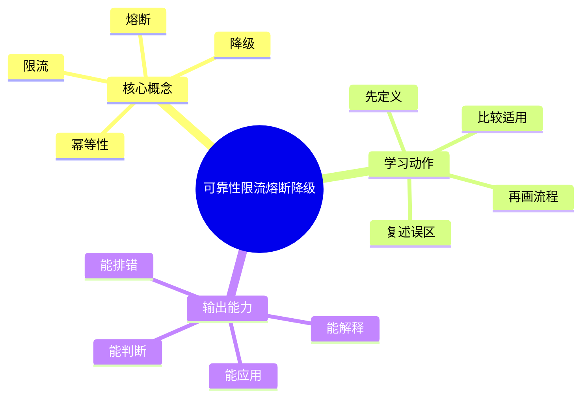

# 后端工程：可靠性限流熔断降级

## 学习目标
- 掌握幂等、重试、限流、熔断、降级和容灾设计。
- 能画出本章核心流程图，并能用自己的话解释每个节点。
- 能说出适用场景、边界条件和常见误区。
- 能把“防止故障发生”和“故障发生后如何收口”分清楚。

## 一句话总纲
可靠性不是永不失败，而是失败时可控、可恢复、可观测。

## 记忆口诀
> 幂等防重复，限流防过载，熔断防扩散

## 思维导图

## Mermaid 图解：核心流程

## 分章节讲解
### 1. 幂等性
**核心定义：** 幂等操作重复执行多次结果与执行一次一致，常用唯一请求号或状态机实现。

**底层原理：**
- 幂等是为了把“网络重试”和“业务副作用”解耦。
- 本质上是让请求具备可重复判断的唯一性。
- 常见实现包括请求去重表、业务状态机、版本号和唯一约束。

**工程理解：**
- 支付、下单、扣库存、发券等操作优先考虑幂等。
- 幂等不等于“永远重复都一样”，而是“对于同一请求语义，结果可重复确认”。
- 设计时要连同重试、超时和回调一起考虑。

**适用场景：**
- 外部调用可能超时、网络不稳定、消息可能重复投递的场景。
- 所有不能承受重复副作用的写操作。

**常见误区：** 支付、下单等操作没有幂等会在重试时产生严重副作用。

### 2. 限流
**核心定义：** 限流控制单位时间请求量，可按用户、IP、接口或全局维度实施。

**底层原理：**
- 限流的核心是把流量控制在系统可承受范围内。
- 常见算法有固定窗口、滑动窗口、令牌桶和漏桶。
- 限流不是拒绝服务，而是保护关键路径和整体稳定性。

**工程理解：**
- 网关限流是第一道门，核心服务内部也要有二次保护。
- 限流方案应该和监控联动，避免把错误流量全部放过去。
- 需要区分“入口过载”和“下游瓶颈”，对应不同限流点。

**适用场景：**
- 大促、秒杀、突发流量、公共接口保护、第三方调用保护。

**常见误区：** 只在网关限流不够；关键资源也需要内部保护。

### 3. 熔断
**核心定义：** 熔断在下游失败率高时快速失败并周期性探测恢复，避免资源耗尽。

**底层原理：**
- 熔断器通常有关闭、打开、半开三种状态。
- 失败率、慢请求和超时都可以作为触发信号。
- 熔断的目标是阻止故障级联，把问题限制在局部范围。

**工程理解：**
- 关键是给系统一个“停下来观察”的机会。
- 不能把所有错误都熔断，否则恢复会过慢。
- 探测窗口和恢复阈值需要根据真实流量调优。

**适用场景：**
- 对外部依赖敏感、超时会连锁放大的服务。
- 下游不稳定、请求堆积严重的系统。

**常见误区：** 熔断阈值和恢复窗口要基于真实流量调优。

### 4. 降级
**核心定义：** 降级在依赖不可用时返回缓存、默认值或缩减功能，保核心链路。

**底层原理：**
- 降级本质是“用有限功能换可用性”。
- 降级可以是静态默认值、缓存兜底、关非核心功能、减少计算量。
- 降级必须明确语义，否则业务侧会误判结果的可信度。

**工程理解：**
- 先保核心链路，例如下单、登录、支付。
- 非核心功能可以关闭、延迟或用历史数据代替。
- 降级不等于掩盖错误，必须可观测、可告警、可恢复。

**适用场景：**
- 依赖不可用但主流程不能停。
- 允许部分功能缺失但不能全站崩溃的场景。

**常见误区：** 降级结果要明确语义；不能悄悄返回错误数据。

## 工程视角：可靠性治理顺序
1. 先做幂等，避免重试放大副作用。
2. 再做限流，避免流量打穿系统。
3. 再做熔断，避免故障扩散到更多依赖。
4. 最后做降级和容灾，保证核心链路不断。

## 关键对比表
| 知识点 | 正确理解 | 常见误区 |
|---|---|---|
| 幂等性 | 幂等操作重复执行多次结果与执行一次一致，常用唯一请求号或状态机实现。 | 支付、下单等操作没有幂等会在重试时产生严重副作用。 |
| 限流 | 限流控制单位时间请求量，可按用户、IP、接口或全局维度实施。 | 只在网关限流不够；关键资源也需要内部保护。 |
| 熔断 | 熔断在下游失败率高时快速失败并周期性探测恢复，避免资源耗尽。 | 熔断阈值和恢复窗口要基于真实流量调优。 |
| 降级 | 降级在依赖不可用时返回缓存、默认值或缩减功能，保核心链路。 | 降级结果要明确语义；不能悄悄返回错误数据。 |

## 常见误区总结
- **幂等性：** 支付、下单等操作没有幂等会在重试时产生严重副作用。
- **限流：** 只在网关限流不够；关键资源也需要内部保护。
- **熔断：** 熔断阈值和恢复窗口要基于真实流量调优。
- **降级：** 降级结果要明确语义；不能悄悄返回错误数据。

## 自检题
1. 本章的核心问题是什么？请用一句话回答：可靠性不是永不失败，而是失败时可控、可恢复、可观测。
2. 本章每个概念的适用前提分别是什么？
3. 哪个误区最容易在面试或工程实践中出现？为什么？
4. 如果下游抖动，你会按什么顺序处理？

## 速记卡片
- 章节口诀：幂等防重复，限流防过载，熔断防扩散
- 答题结构：定义 → 机制 → 场景 → 权衡 → 误区。
- 复习动作：遮住正文，只根据思维导图复述一遍。

## 深度扩展：底层原理与应用边界

### 1. 本章在「后端工程」中的位置
- **核心定位：** 把业务能力封装成稳定的 API、数据访问、并发处理、可靠性和可观测运行体系。
- **本章作用：** 「后端工程：可靠性限流熔断降级」负责把总纲落到可操作的判断框架：先确认问题边界，再拆解机制，最后根据代价和风险选择方法。
- **主要风险：** 最大风险是接口能跑但缺少契约、幂等、限流、监控、回滚和容量边界。
- **实践抓手：** 后端设计应从接口契约、数据一致性、性能瓶颈、故障模式和运维证据五条线展开。

### 2. 小流程图：从概念到应用

### 3. 概念深化：逐个击破
#### 3.1 幂等性
- **先问它解决什么：** 幂等性 不是孤立名词，而是用来解决本章某类约束、关系、代价或风险判断的问题。
- **底层机制：** 学习时要拆成“输入条件 → 中间结构 → 处理规则 → 输出结果”四步；如果任何一步说不清，说明只是记住了结论。
- **适用条件：** 当前提满足、边界清楚、代价可接受时使用；如果输入分布、规模、时序、权限或一致性假设变化，就要重新评估。
- **不适用信号：** 需要违反前提才能套用、只能靠特殊样例解释、复杂度或维护成本明显失控时，应换方案。
- **面试表达：** “我会先定义 幂等性，再说明它依赖的前提，最后用一个反例说明边界。”

#### 3.2 限流
- **先问它解决什么：** 限流 不是孤立名词，而是用来解决本章某类约束、关系、代价或风险判断的问题。
- **底层机制：** 学习时要拆成“输入条件 → 中间结构 → 处理规则 → 输出结果”四步；如果任何一步说不清，说明只是记住了结论。
- **适用条件：** 当前提满足、边界清楚、代价可接受时使用；如果输入分布、规模、时序、权限或一致性假设变化，就要重新评估。
- **不适用信号：** 需要违反前提才能套用、只能靠特殊样例解释、复杂度或维护成本明显失控时，应换方案。
- **面试表达：** “我会先定义 限流，再说明它依赖的前提，最后用一个反例说明边界。”

#### 3.3 熔断
- **先问它解决什么：** 熔断 不是孤立名词，而是用来解决本章某类约束、关系、代价或风险判断的问题。
- **底层机制：** 学习时要拆成“输入条件 → 中间结构 → 处理规则 → 输出结果”四步；如果任何一步说不清，说明只是记住了结论。
- **适用条件：** 当前提满足、边界清楚、代价可接受时使用；如果输入分布、规模、时序、权限或一致性假设变化，就要重新评估。
- **不适用信号：** 需要违反前提才能套用、只能靠特殊样例解释、复杂度或维护成本明显失控时，应换方案。
- **面试表达：** “我会先定义 熔断，再说明它依赖的前提，最后用一个反例说明边界。”

#### 3.4 降级
- **先问它解决什么：** 降级 不是孤立名词，而是用来解决本章某类约束、关系、代价或风险判断的问题。
- **底层机制：** 学习时要拆成“输入条件 → 中间结构 → 处理规则 → 输出结果”四步；如果任何一步说不清，说明只是记住了结论。
- **适用条件：** 当前提满足、边界清楚、代价可接受时使用；如果输入分布、规模、时序、权限或一致性假设变化，就要重新评估。
- **不适用信号：** 需要违反前提才能套用、只能靠特殊样例解释、复杂度或维护成本明显失控时，应换方案。
- **面试表达：** “我会先定义 降级，再说明它依赖的前提，最后用一个反例说明边界。”

### 4. 适用边界对比表
| 判断维度 | 应该怎么想 | 典型错误 | 记忆提示 |
|---|---|---|---|
| 前提条件 | 先列出输入规模、数据分布、系统假设或业务约束 | 不看条件直接套模板 | 先问“凭什么能用” |
| 正确性 | 需要能说明为什么结果保持不变或为什么局部选择成立 | 只给经验结论 | 用不变量、反例或交换论证检查 |
| 复杂度/成本 | 同时估算时间、空间、延迟、吞吐、人力和维护成本 | 只看理论最优 | 工程里还要看常数和可观测性 |
| 失败模式 | 主动说明边界外会怎样失败 | 面试中只讲优点 | 能说失败边界才算真理解 |

### 5. 记忆强化：三层复述法
1. **概念层：** 用一句话定义本章每个核心概念。
2. **机制层：** 不看原文画出输入到输出的流程。
3. **边界层：** 为每个概念准备一个“不能这样用”的反例。

### 6. 工程/做题/面试迁移
- **工程迁移：** 后端设计应从接口契约、数据一致性、性能瓶颈、故障模式和运维证据五条线展开。
- **做题迁移：** 先把题目中的对象、关系、约束和目标函数圈出来，再映射到本章概念。
- **面试迁移：** 回答时不要只报名词，要说清“为什么需要它、它如何工作、它何时失效”。

### 7. 深度自检题
1. 你能否把本章概念按“前提 → 机制 → 结果 → 代价”重新组织？
2. 如果输入规模、并发量、数据分布或安全边界变化，原结论是否仍成立？
3. 本章哪个概念最容易被误用？请给出一个反例。
4. 如果让你设计一道面试题，你会怎样考察候选人是否真的理解？

### 8. 深度速记卡片
- **总抓手：** 把业务能力封装成稳定的 API、数据访问、并发处理、可靠性和可观测运行体系。
- **答题模板：** 定义边界 → 拆底层机制 → 说适用条件 → 讲权衡 → 给反例。
- **复习动作：** 每次复习只看图和表，尝试口述 3 分钟；卡住处再回正文。

## 专题深化：具体机制、案例与追问

### 1. 具体案例：把「可靠性限流熔断降级」放进真实问题
例如订单 API 要明确资源模型、请求校验、事务边界、缓存失效、限流、监控指标、错误码和回滚路径。

### 2. 本章关键机制细化
- 幂等是重试安全的前提。
- 限流保护入口和关键资源。
- 熔断、降级、隔离共同防止雪崩。

### 3. 概念到判断的检查清单
| 概念/动作 | 你要检查什么 | 如果检查失败会怎样 |
|---|---|---|
| 幂等性 | 前提、输入、输出、代价、失败边界是否都说清 | 可能套错模型、复杂度失控或得到不可验证结论 |
| 限流 | 前提、输入、输出、代价、失败边界是否都说清 | 可能套错模型、复杂度失控或得到不可验证结论 |
| 熔断 | 前提、输入、输出、代价、失败边界是否都说清 | 可能套错模型、复杂度失控或得到不可验证结论 |
| 降级 | 前提、输入、输出、代价、失败边界是否都说清 | 可能套错模型、复杂度失控或得到不可验证结论 |
| 本章在「后端工程」中的位置 | 前提、输入、输出、代价、失败边界是否都说清 | 可能套错模型、复杂度失控或得到不可验证结论 |

### 4. 面试追问路径

- 接口契约是否清晰且兼容？
- 数据一致性和缓存新鲜度如何保证？
- 容量达到上限时如何保护系统？

### 5. 验证与复盘
- **验证方式：** 用契约测试、压测、慢查询分析、链路追踪和灰度监控验证。
- **复盘方式：** 每次做题或设计后，记录“我使用了哪个前提、哪个前提最容易被破坏、如果破坏如何调整”。
- **记忆方式：** 不背孤立结论，只背“问题 → 机制 → 边界 → 验证”的链路。

## 本轮扩写：可靠性策略的组合顺序

### 1. 可靠性不是单个组件，而是一组控制回路

- 限流控制进入系统的流量。
- 超时控制单个请求占用资源的时间。
- 重试只处理瞬时失败，且必须受预算约束。
- 熔断阻止坏依赖继续拖垮调用方。
- 降级保核心链路，牺牲非核心体验。

### 2. 限流算法对比
| 算法 | 特点 | 适用 | 不适用 |
|---|---|---|---|
| 固定窗口 | 实现简单 | 粗粒度保护 | 窗口边界突刺明显 |
| 滑动窗口 | 更平滑 | API 网关、租户配额 | 状态维护成本较高 |
| 令牌桶 | 允许短暂突发 | 用户请求、网关入口 | 不能直接反映下游健康 |
| 漏桶 | 平滑输出 | 下游容量稳定 | 突发体验差 |
| 自适应限流 | 根据延迟/错误动态调整 | 下游容量波动 | 参数不当会震荡 |

### 3. 降级要提前定义业务语义
- 推荐列表失败：返回热门兜底或缓存结果。
- 优惠计算失败：可以隐藏非关键优惠，但不能错误扣款。
- 风控不可用：高风险操作应保守拒绝，而不是默认放行。
- 库存服务异常：可以暂停下单，不能盲目承诺可售。

### 4. 面试追问路径
- “限流和熔断有什么区别？”——限流控制入口流量，熔断控制对异常依赖的调用。
- “降级会不会伤害用户？”——会，所以要区分核心与非核心功能，并设计可解释兜底。
- “如何验证可靠性策略？”——压测、故障注入、重试放大检查、降级演练和告警回放。
