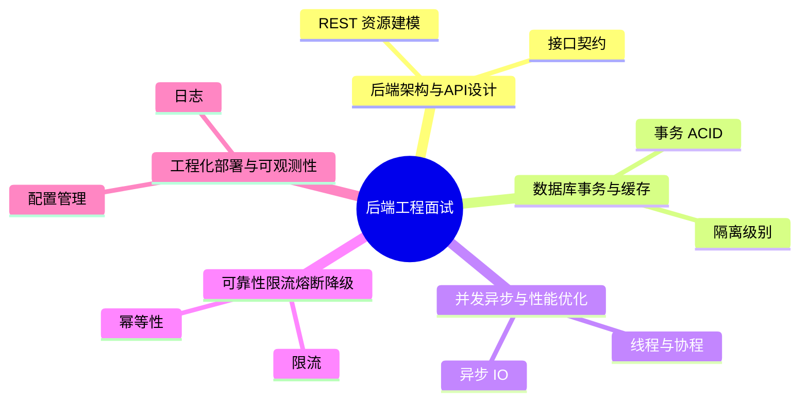
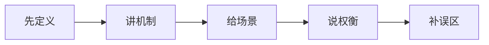
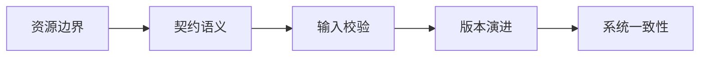
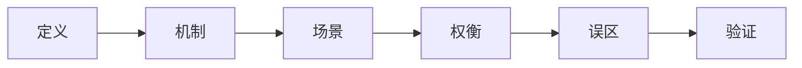
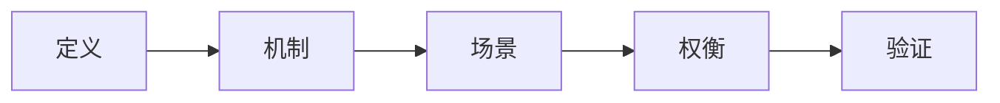

# 后端工程面试20问

## 学习目标
- 用 20 个高频问题串起 后端工程 的核心知识。
- 每个答案都按“定义 → 机制 → 场景 → 权衡 → 误区 → 记忆点”组织，便于面试复述。
- 通过小型 Mermaid 图辅助记忆，避免超大图难以阅读。
- 训练“先分类，再回答，再举例”的答题节奏。

## 一句话总纲
后端工程把业务能力变成稳定可演进的服务，核心是 API、数据、并发、可靠性、部署和可观测。

## 记忆口诀
> 接口定契约，数据保一致，缓存提性能，限流保稳定，监控促闭环。

## 思维导图

## 答题总流程

## 第 1-5 问：基础概念

## 深度面试答题框架

- **总主线：** 把业务能力封装成稳定的 API、数据访问、并发处理、可靠性和可观测运行体系。
- **风险提醒：** 最大风险是接口能跑但缺少契约、幂等、限流、监控、回滚和容量边界。
- **实践抓手：** 后端设计应从接口契约、数据一致性、性能瓶颈、故障模式和运维证据五条线展开。

## 面试答案强化版：逐题深答

> 回答每题都按：定义 → 机制 → 场景 → 权衡 → 误区 → 验证。

### Q1：请解释“REST 资源建模”的核心思想、适用场景和常见误区。

**答：**
1. **定义：** REST 强调用资源和统一接口表达业务对象，HTTP 方法表示操作语义。
2. **机制：** 先确认前提，再说明它处理的数据、状态、边界或资源，最后说明输出结果为什么可信。结合本学科主线看，例如订单 API 要明确资源模型、请求校验、事务边界、缓存失效、限流、监控指标、错误码和回滚路径。
3. **适用场景：** 当问题与 REST 资源建模 的前提一致，并且需要在正确性、性能、可靠性或可维护性之间做判断时使用。
4. **权衡：** 要主动比较收益和代价：它可能提升表达力、效率或可靠性，但也可能增加复杂度、资源消耗或维护成本。
5. **误区：** 不检查前提就套用；只讲结论不讲失败边界；无法说明如何验证。
6. **验证：** 用契约测试、压测、慢查询分析、链路追踪和灰度监控验证。
**追问回答模板：** 如果面试官继续问“为什么不用别的方案”，从前提差异、失败模式和验证成本三个角度回答。

### Q2：请解释“接口契约”的核心思想、适用场景和常见误区。

**答：**
1. **定义：** 接口契约包括请求响应结构、状态码、错误码、幂等性和兼容性规则。
2. **机制：** 先确认前提，再说明它处理的数据、状态、边界或资源，最后说明输出结果为什么可信。结合本学科主线看，例如订单 API 要明确资源模型、请求校验、事务边界、缓存失效、限流、监控指标、错误码和回滚路径。
3. **适用场景：** 当问题与 接口契约 的前提一致，并且需要在正确性、性能、可靠性或可维护性之间做判断时使用。
4. **权衡：** 要主动比较收益和代价：它可能提升表达力、效率或可靠性，但也可能增加复杂度、资源消耗或维护成本。
5. **误区：** 不检查前提就套用；只讲结论不讲失败边界；无法说明如何验证。
6. **验证：** 用契约测试、压测、慢查询分析、链路追踪和灰度监控验证。
**追问回答模板：** 如果面试官继续问“为什么不用别的方案”，从前提差异、失败模式和验证成本三个角度回答。

### Q3：请解释“输入校验”的核心思想、适用场景和常见误区。

**答：**
1. **定义：** 后端必须校验类型、范围、权限和业务规则，不能依赖前端校验。
2. **机制：** 先确认前提，再说明它处理的数据、状态、边界或资源，最后说明输出结果为什么可信。结合本学科主线看，例如订单 API 要明确资源模型、请求校验、事务边界、缓存失效、限流、监控指标、错误码和回滚路径。
3. **适用场景：** 当问题与 输入校验 的前提一致，并且需要在正确性、性能、可靠性或可维护性之间做判断时使用。
4. **权衡：** 要主动比较收益和代价：它可能提升表达力、效率或可靠性，但也可能增加复杂度、资源消耗或维护成本。
5. **误区：** 不检查前提就套用；只讲结论不讲失败边界；无法说明如何验证。
6. **验证：** 用契约测试、压测、慢查询分析、链路追踪和灰度监控验证。
**追问回答模板：** 如果面试官继续问“为什么不用别的方案”，从前提差异、失败模式和验证成本三个角度回答。

### Q4：请解释“API 版本管理”的核心思想、适用场景和常见误区。

**答：**
1. **定义：** 版本管理通过兼容演进、废弃方案和迁移窗口减少调用方破坏。
2. **机制：** 先确认前提，再说明它处理的数据、状态、边界或资源，最后说明输出结果为什么可信。结合本学科主线看，例如订单 API 要明确资源模型、请求校验、事务边界、缓存失效、限流、监控指标、错误码和回滚路径。
3. **适用场景：** 当问题与 API 版本管理 的前提一致，并且需要在正确性、性能、可靠性或可维护性之间做判断时使用。
4. **权衡：** 要主动比较收益和代价：它可能提升表达力、效率或可靠性，但也可能增加复杂度、资源消耗或维护成本。
5. **误区：** 不检查前提就套用；只讲结论不讲失败边界；无法说明如何验证。
6. **验证：** 用契约测试、压测、慢查询分析、链路追踪和灰度监控验证。
**追问回答模板：** 如果面试官继续问“为什么不用别的方案”，从前提差异、失败模式和验证成本三个角度回答。

### Q5：请解释“事务 ACID”的核心思想、适用场景和常见误区。

**答：**
1. **定义：** ACID 分别是原子性、一致性、隔离性和持久性，保障数据库操作可靠提交。
2. **机制：** 先确认前提，再说明它处理的数据、状态、边界或资源，最后说明输出结果为什么可信。结合本学科主线看，例如订单 API 要明确资源模型、请求校验、事务边界、缓存失效、限流、监控指标、错误码和回滚路径。
3. **适用场景：** 当问题与 事务 ACID 的前提一致，并且需要在正确性、性能、可靠性或可维护性之间做判断时使用。
4. **权衡：** 要主动比较收益和代价：它可能提升表达力、效率或可靠性，但也可能增加复杂度、资源消耗或维护成本。
5. **误区：** 不检查前提就套用；只讲结论不讲失败边界；无法说明如何验证。
6. **验证：** 用契约测试、压测、慢查询分析、链路追踪和灰度监控验证。
**追问回答模板：** 如果面试官继续问“为什么不用别的方案”，从前提差异、失败模式和验证成本三个角度回答。

### Q6：请解释“隔离级别”的核心思想、适用场景和常见误区。

**答：**
1. **定义：** 隔离级别控制并发事务可见性，涉及脏读、不可重复读、幻读等现象。
2. **机制：** 先确认前提，再说明它处理的数据、状态、边界或资源，最后说明输出结果为什么可信。结合本学科主线看，例如订单 API 要明确资源模型、请求校验、事务边界、缓存失效、限流、监控指标、错误码和回滚路径。
3. **适用场景：** 当问题与 隔离级别 的前提一致，并且需要在正确性、性能、可靠性或可维护性之间做判断时使用。
4. **权衡：** 要主动比较收益和代价：它可能提升表达力、效率或可靠性，但也可能增加复杂度、资源消耗或维护成本。
5. **误区：** 不检查前提就套用；只讲结论不讲失败边界；无法说明如何验证。
6. **验证：** 用契约测试、压测、慢查询分析、链路追踪和灰度监控验证。
**追问回答模板：** 如果面试官继续问“为什么不用别的方案”，从前提差异、失败模式和验证成本三个角度回答。

### Q7：请解释“索引设计”的核心思想、适用场景和常见误区。

**答：**
1. **定义：** 索引用空间和写入成本换查询速度，联合索引要关注选择性和最左前缀。
2. **机制：** 先确认前提，再说明它处理的数据、状态、边界或资源，最后说明输出结果为什么可信。结合本学科主线看，例如订单 API 要明确资源模型、请求校验、事务边界、缓存失效、限流、监控指标、错误码和回滚路径。
3. **适用场景：** 当问题与 索引设计 的前提一致，并且需要在正确性、性能、可靠性或可维护性之间做判断时使用。
4. **权衡：** 要主动比较收益和代价：它可能提升表达力、效率或可靠性，但也可能增加复杂度、资源消耗或维护成本。
5. **误区：** 不检查前提就套用；只讲结论不讲失败边界；无法说明如何验证。
6. **验证：** 用契约测试、压测、慢查询分析、链路追踪和灰度监控验证。
**追问回答模板：** 如果面试官继续问“为什么不用别的方案”，从前提差异、失败模式和验证成本三个角度回答。

### Q8：请解释“缓存方案”的核心思想、适用场景和常见误区。

**答：**
1. **定义：** 常见方案包括 Cache Aside、Write Through、Write Back 和 Refresh Ahead。
2. **机制：** 先确认前提，再说明它处理的数据、状态、边界或资源，最后说明输出结果为什么可信。结合本学科主线看，例如订单 API 要明确资源模型、请求校验、事务边界、缓存失效、限流、监控指标、错误码和回滚路径。
3. **适用场景：** 当问题与 缓存方案 的前提一致，并且需要在正确性、性能、可靠性或可维护性之间做判断时使用。
4. **权衡：** 要主动比较收益和代价：它可能提升表达力、效率或可靠性，但也可能增加复杂度、资源消耗或维护成本。
5. **误区：** 不检查前提就套用；只讲结论不讲失败边界；无法说明如何验证。
6. **验证：** 用契约测试、压测、慢查询分析、链路追踪和灰度监控验证。
**追问回答模板：** 如果面试官继续问“为什么不用别的方案”，从前提差异、失败模式和验证成本三个角度回答。

### Q9：请解释“线程与协程”的核心思想、适用场景和常见误区。

**答：**
1. **定义：** 线程由操作系统调度，协程更轻量并适合高并发 IO 场景。
2. **机制：** 先确认前提，再说明它处理的数据、状态、边界或资源，最后说明输出结果为什么可信。结合本学科主线看，例如订单 API 要明确资源模型、请求校验、事务边界、缓存失效、限流、监控指标、错误码和回滚路径。
3. **适用场景：** 当问题与 线程与协程 的前提一致，并且需要在正确性、性能、可靠性或可维护性之间做判断时使用。
4. **权衡：** 要主动比较收益和代价：它可能提升表达力、效率或可靠性，但也可能增加复杂度、资源消耗或维护成本。
5. **误区：** 不检查前提就套用；只讲结论不讲失败边界；无法说明如何验证。
6. **验证：** 用契约测试、压测、慢查询分析、链路追踪和灰度监控验证。
**追问回答模板：** 如果面试官继续问“为什么不用别的方案”，从前提差异、失败模式和验证成本三个角度回答。

### Q10：请解释“异步 IO”的核心思想、适用场景和常见误区。

**答：**
1. **定义：** 异步 IO 让线程不在等待网络或磁盘时阻塞，提高吞吐和资源利用率。
2. **机制：** 先确认前提，再说明它处理的数据、状态、边界或资源，最后说明输出结果为什么可信。结合本学科主线看，例如订单 API 要明确资源模型、请求校验、事务边界、缓存失效、限流、监控指标、错误码和回滚路径。
3. **适用场景：** 当问题与 异步 IO 的前提一致，并且需要在正确性、性能、可靠性或可维护性之间做判断时使用。
4. **权衡：** 要主动比较收益和代价：它可能提升表达力、效率或可靠性，但也可能增加复杂度、资源消耗或维护成本。
5. **误区：** 不检查前提就套用；只讲结论不讲失败边界；无法说明如何验证。
6. **验证：** 用契约测试、压测、慢查询分析、链路追踪和灰度监控验证。
**追问回答模板：** 如果面试官继续问“为什么不用别的方案”，从前提差异、失败模式和验证成本三个角度回答。

### Q11：请解释“连接池”的核心思想、适用场景和常见误区。

**答：**
1. **定义：** 连接池复用数据库或外部服务连接，减少建立连接成本并限制并发压力。
2. **机制：** 先确认前提，再说明它处理的数据、状态、边界或资源，最后说明输出结果为什么可信。结合本学科主线看，例如订单 API 要明确资源模型、请求校验、事务边界、缓存失效、限流、监控指标、错误码和回滚路径。
3. **适用场景：** 当问题与 连接池 的前提一致，并且需要在正确性、性能、可靠性或可维护性之间做判断时使用。
4. **权衡：** 要主动比较收益和代价：它可能提升表达力、效率或可靠性，但也可能增加复杂度、资源消耗或维护成本。
5. **误区：** 不检查前提就套用；只讲结论不讲失败边界；无法说明如何验证。
6. **验证：** 用契约测试、压测、慢查询分析、链路追踪和灰度监控验证。
**追问回答模板：** 如果面试官继续问“为什么不用别的方案”，从前提差异、失败模式和验证成本三个角度回答。

### Q12：请解释“性能剖析”的核心思想、适用场景和常见误区。

**答：**
1. **定义：** 性能剖析通过指标、火焰图、慢查询和链路追踪定位真实瓶颈。
2. **机制：** 先确认前提，再说明它处理的数据、状态、边界或资源，最后说明输出结果为什么可信。结合本学科主线看，例如订单 API 要明确资源模型、请求校验、事务边界、缓存失效、限流、监控指标、错误码和回滚路径。
3. **适用场景：** 当问题与 性能剖析 的前提一致，并且需要在正确性、性能、可靠性或可维护性之间做判断时使用。
4. **权衡：** 要主动比较收益和代价：它可能提升表达力、效率或可靠性，但也可能增加复杂度、资源消耗或维护成本。
5. **误区：** 不检查前提就套用；只讲结论不讲失败边界；无法说明如何验证。
6. **验证：** 用契约测试、压测、慢查询分析、链路追踪和灰度监控验证。
**追问回答模板：** 如果面试官继续问“为什么不用别的方案”，从前提差异、失败模式和验证成本三个角度回答。

### Q13：请解释“幂等性”的核心思想、适用场景和常见误区。

**答：**
1. **定义：** 幂等操作重复执行多次结果与执行一次一致，常用唯一请求号或状态机实现。
2. **机制：** 先确认前提，再说明它处理的数据、状态、边界或资源，最后说明输出结果为什么可信。结合本学科主线看，例如订单 API 要明确资源模型、请求校验、事务边界、缓存失效、限流、监控指标、错误码和回滚路径。
3. **适用场景：** 当问题与 幂等性 的前提一致，并且需要在正确性、性能、可靠性或可维护性之间做判断时使用。
4. **权衡：** 要主动比较收益和代价：它可能提升表达力、效率或可靠性，但也可能增加复杂度、资源消耗或维护成本。
5. **误区：** 不检查前提就套用；只讲结论不讲失败边界；无法说明如何验证。
6. **验证：** 用契约测试、压测、慢查询分析、链路追踪和灰度监控验证。
**追问回答模板：** 如果面试官继续问“为什么不用别的方案”，从前提差异、失败模式和验证成本三个角度回答。

### Q14：请解释“限流”的核心思想、适用场景和常见误区。

**答：**
1. **定义：** 限流控制单位时间请求量，可按用户、IP、接口或全局维度实施。
2. **机制：** 先确认前提，再说明它处理的数据、状态、边界或资源，最后说明输出结果为什么可信。结合本学科主线看，例如订单 API 要明确资源模型、请求校验、事务边界、缓存失效、限流、监控指标、错误码和回滚路径。
3. **适用场景：** 当问题与 限流 的前提一致，并且需要在正确性、性能、可靠性或可维护性之间做判断时使用。
4. **权衡：** 要主动比较收益和代价：它可能提升表达力、效率或可靠性，但也可能增加复杂度、资源消耗或维护成本。
5. **误区：** 不检查前提就套用；只讲结论不讲失败边界；无法说明如何验证。
6. **验证：** 用契约测试、压测、慢查询分析、链路追踪和灰度监控验证。
**追问回答模板：** 如果面试官继续问“为什么不用别的方案”，从前提差异、失败模式和验证成本三个角度回答。

### Q15：请解释“熔断”的核心思想、适用场景和常见误区。

**答：**
1. **定义：** 熔断在下游失败率高时快速失败并周期性探测恢复，避免资源耗尽。
2. **机制：** 先确认前提，再说明它处理的数据、状态、边界或资源，最后说明输出结果为什么可信。结合本学科主线看，例如订单 API 要明确资源模型、请求校验、事务边界、缓存失效、限流、监控指标、错误码和回滚路径。
3. **适用场景：** 当问题与 熔断 的前提一致，并且需要在正确性、性能、可靠性或可维护性之间做判断时使用。
4. **权衡：** 要主动比较收益和代价：它可能提升表达力、效率或可靠性，但也可能增加复杂度、资源消耗或维护成本。
5. **误区：** 不检查前提就套用；只讲结论不讲失败边界；无法说明如何验证。
6. **验证：** 用契约测试、压测、慢查询分析、链路追踪和灰度监控验证。
**追问回答模板：** 如果面试官继续问“为什么不用别的方案”，从前提差异、失败模式和验证成本三个角度回答。

### Q16：请解释“降级”的核心思想、适用场景和常见误区。

**答：**
1. **定义：** 降级在依赖不可用时返回缓存、默认值或缩减功能，保核心链路。
2. **机制：** 先确认前提，再说明它处理的数据、状态、边界或资源，最后说明输出结果为什么可信。结合本学科主线看，例如订单 API 要明确资源模型、请求校验、事务边界、缓存失效、限流、监控指标、错误码和回滚路径。
3. **适用场景：** 当问题与 降级 的前提一致，并且需要在正确性、性能、可靠性或可维护性之间做判断时使用。
4. **权衡：** 要主动比较收益和代价：它可能提升表达力、效率或可靠性，但也可能增加复杂度、资源消耗或维护成本。
5. **误区：** 不检查前提就套用；只讲结论不讲失败边界；无法说明如何验证。
6. **验证：** 用契约测试、压测、慢查询分析、链路追踪和灰度监控验证。
**追问回答模板：** 如果面试官继续问“为什么不用别的方案”，从前提差异、失败模式和验证成本三个角度回答。

### Q17：请解释“配置管理”的核心思想、适用场景和常见误区。

**答：**
1. **定义：** 配置应与代码分离，区分环境、密钥和运行参数，并支持审计。
2. **机制：** 先确认前提，再说明它处理的数据、状态、边界或资源，最后说明输出结果为什么可信。结合本学科主线看，例如订单 API 要明确资源模型、请求校验、事务边界、缓存失效、限流、监控指标、错误码和回滚路径。
3. **适用场景：** 当问题与 配置管理 的前提一致，并且需要在正确性、性能、可靠性或可维护性之间做判断时使用。
4. **权衡：** 要主动比较收益和代价：它可能提升表达力、效率或可靠性，但也可能增加复杂度、资源消耗或维护成本。
5. **误区：** 不检查前提就套用；只讲结论不讲失败边界；无法说明如何验证。
6. **验证：** 用契约测试、压测、慢查询分析、链路追踪和灰度监控验证。
**追问回答模板：** 如果面试官继续问“为什么不用别的方案”，从前提差异、失败模式和验证成本三个角度回答。

### Q18：请解释“日志”的核心思想、适用场景和常见误区。

**答：**
1. **定义：** 日志记录关键业务事件、错误上下文和关联 ID，便于排障和审计。
2. **机制：** 先确认前提，再说明它处理的数据、状态、边界或资源，最后说明输出结果为什么可信。结合本学科主线看，例如订单 API 要明确资源模型、请求校验、事务边界、缓存失效、限流、监控指标、错误码和回滚路径。
3. **适用场景：** 当问题与 日志 的前提一致，并且需要在正确性、性能、可靠性或可维护性之间做判断时使用。
4. **权衡：** 要主动比较收益和代价：它可能提升表达力、效率或可靠性，但也可能增加复杂度、资源消耗或维护成本。
5. **误区：** 不检查前提就套用；只讲结论不讲失败边界；无法说明如何验证。
6. **验证：** 用契约测试、压测、慢查询分析、链路追踪和灰度监控验证。
**追问回答模板：** 如果面试官继续问“为什么不用别的方案”，从前提差异、失败模式和验证成本三个角度回答。

### Q19：请解释“指标”的核心思想、适用场景和常见误区。

**答：**
1. **定义：** 指标反映系统健康，如延迟、吞吐、错误率和资源使用率。
2. **机制：** 先确认前提，再说明它处理的数据、状态、边界或资源，最后说明输出结果为什么可信。结合本学科主线看，例如订单 API 要明确资源模型、请求校验、事务边界、缓存失效、限流、监控指标、错误码和回滚路径。
3. **适用场景：** 当问题与 指标 的前提一致，并且需要在正确性、性能、可靠性或可维护性之间做判断时使用。
4. **权衡：** 要主动比较收益和代价：它可能提升表达力、效率或可靠性，但也可能增加复杂度、资源消耗或维护成本。
5. **误区：** 不检查前提就套用；只讲结论不讲失败边界；无法说明如何验证。
6. **验证：** 用契约测试、压测、慢查询分析、链路追踪和灰度监控验证。
**追问回答模板：** 如果面试官继续问“为什么不用别的方案”，从前提差异、失败模式和验证成本三个角度回答。

### Q20：请解释“发布方案”的核心思想、适用场景和常见误区。

**答：**
1. **定义：** 蓝绿、金丝雀、灰度和特性开关用于降低发布风险。
2. **机制：** 先确认前提，再说明它处理的数据、状态、边界或资源，最后说明输出结果为什么可信。结合本学科主线看，例如订单 API 要明确资源模型、请求校验、事务边界、缓存失效、限流、监控指标、错误码和回滚路径。
3. **适用场景：** 当问题与 发布方案 的前提一致，并且需要在正确性、性能、可靠性或可维护性之间做判断时使用。
4. **权衡：** 要主动比较收益和代价：它可能提升表达力、效率或可靠性，但也可能增加复杂度、资源消耗或维护成本。
5. **误区：** 不检查前提就套用；只讲结论不讲失败边界；无法说明如何验证。
6. **验证：** 用契约测试、压测、慢查询分析、链路追踪和灰度监控验证。
**追问回答模板：** 如果面试官继续问“为什么不用别的方案”，从前提差异、失败模式和验证成本三个角度回答。

## 面试终局复盘
| 能力 | 合格表现 | 优秀表现 |
|---|---|---|
| 概念 | 说清定义 | 还能说清边界和反例 |
| 机制 | 说清流程 | 能画图解释不变量或控制点 |
| 工程 | 能给场景 | 能给验证和回滚方式 |
| 表达 | 结构完整 | 能应对追问和对比 |

## 本轮扩写：Q1-Q20 追问速查表

| 题号 | 高频追问 | 回答抓手 |
|---|---|---|
| Q1 | REST 为什么强调资源？ | 资源模型稳定，动作可通过方法和状态转移表达。 |
| Q2 | 契约如何演进？ | 新增可选、废弃观察、破坏性变更走版本。 |
| Q3 | 校验放前端还是后端？ | 前端改善体验，后端保证边界和安全。 |
| Q4 | 版本管理何时需要大版本？ | 字段语义或行为不兼容时。 |
| Q5 | ACID 哪个最容易误解？ | 隔离性，实际隔离级别有不同异常边界。 |
| Q6 | 可重复读是否等于串行化？ | 不等，仍可能有写偏斜等问题。 |
| Q7 | 索引为什么会拖慢写入？ | 维护额外结构、页分裂和日志成本。 |
| Q8 | 缓存一致性怎么兜底？ | 删除重试、消息补偿、CDC、对账。 |
| Q9 | 协程一定比线程好吗？ | 取决于运行时、阻塞点和调度成本。 |
| Q10 | 异步 IO 的代价？ | 状态复杂、错误传播和背压设计更难。 |
| Q11 | 连接池打满怎么办？ | 查慢依赖、等待队列、超时、隔离和限流。 |
| Q12 | 性能优化第一步？ | 定义指标和基线，不先改代码。 |
| Q13 | 幂等如何落库？ | 唯一约束、幂等记录、状态机。 |
| Q14 | 限流按用户还是全局？ | 根据保护目标选择入口、租户、接口或下游维度。 |
| Q15 | 熔断和降级谁先？ | 熔断发现坏依赖，降级提供替代路径。 |
| Q16 | 降级如何不出错？ | 只降非核心，核心资金/权限链路保守失败。 |
| Q17 | 配置变更如何审计？ | 版本、审批、灰度、回滚和操作记录。 |
| Q18 | 日志如何避免泄露？ | 脱敏、分级、最小化和访问审计。 |
| Q19 | 指标为何看 P99？ | 平均值掩盖长尾体验和局部拥塞。 |
| Q20 | 发布失败如何处理？ | 停止扩量、看指标、回滚或关闭特性开关。 |
