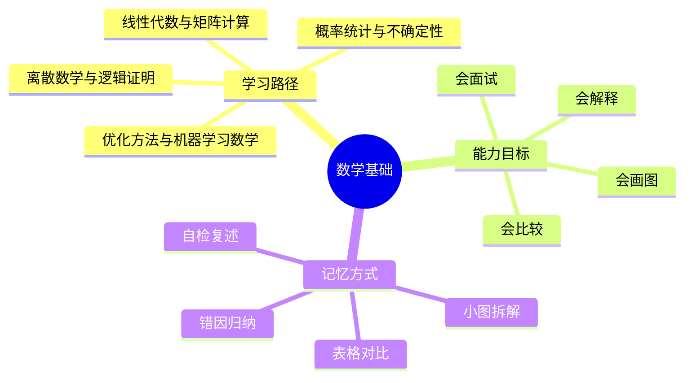
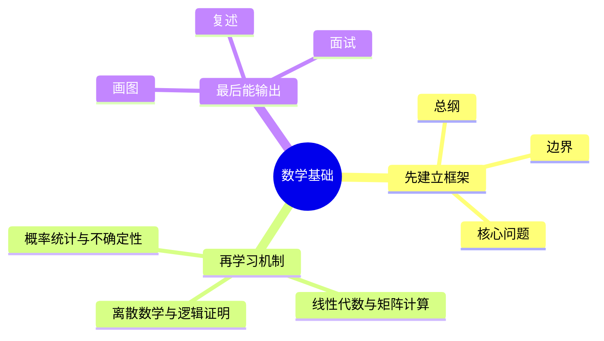

# 数学基础学习路线与知识地图

## 学习目标
- 建立 数学基础 的整体知识框架。
- 明确每个章节解决什么问题、需要记住什么、如何用于工程或面试。
- 用多张小图和表格降低记忆负担，避免单张巨大思维导图。

## 一句话总纲
数学基础为计算机科学、机器学习和系统分析提供语言：离散结构描述对象，线性代数描述空间，概率统计描述不确定性，优化描述学习与决策。

## 记忆口诀
> 离散管结构，线代管空间，概率管不确定，优化管目标，信息论管压缩。

## 思维导图

## Mermaid 图解：学习路线

## 分文件章节安排
| 顺序 | 文件 | 学习重点 | 记忆抓手 |
|---|---|---|---|
| 第 1 章 | [[01-离散数学与逻辑证明]] | 掌握命题逻辑、集合关系、归纳证明和计数方法。 | 命集关图，归纳计数 |
| 第 2 章 | [[02-线性代数与矩阵计算]] | 理解向量空间、矩阵运算、秩、特征值和分解方法。 | 向量成空间，矩阵做变换，秩看信息量 |
| 第 3 章 | [[03-概率统计与不确定性]] | 掌握随机变量、分布、期望方差、贝叶斯和统计估计。 | 分布生数据，统计估参数，贝叶斯更新信念 |
| 第 4 章 | [[04-优化方法与机器学习数学]] | 掌握梯度、凸性、约束优化、SGD 和正则化。 | 目标加约束，梯度指方向，正则控复杂 |
| 第 5 章 | [[05-信息论与数值稳定性]] | 理解熵、交叉熵、KL 散度、浮点误差和数值稳定技巧。 | 熵量不确定，KL量差异，稳定防溢出 |
| 面试 | [[20-数学基础面试20问]] | 高频问答、表达模板、易错点 | Q-A-图-口诀 |

## 推荐学习方法
1. 先读本路线，知道每章在全局中的位置。
2. 每章先看思维导图，再看概念解释，最后用自检题复述。
3. 面试题不要死背，按“定义 → 机制 → 适用场景 → 权衡 → 误区”回答。
4. 复杂图拆成小图，每次只记一个因果链或流程链。

## 自检题
- 你能用 1 分钟说清 数学基础 的核心问题吗？
- 你能指出每章最容易混淆的两个概念吗？
- 你能把章节图不看原文复画出来吗？

## 速记卡片
- 总纲：数学基础为计算机科学、机器学习和系统分析提供语言：离散结构描述对象，线性代数描述空间，概率统计描述不确定性，优化描述学习与决策。
- 口诀：离散管结构，线代管空间，概率管不确定，优化管目标，信息论管压缩。
- 面试表达：先定义边界，再解释机制，最后讲权衡和误区。

## 深度扩展：如何把本学科学到可迁移

### 1. 学科主线
用形式化语言描述结构、空间、不确定性、优化目标和信息量。

这意味着学习时不要把章节看成离散文件，而要形成一条稳定链路：**问题从哪里来 → 需要哪些抽象 → 底层机制如何保证结果 → 代价和风险在哪里 → 如何验证理解是否正确**。

### 2. 小思维导图：三阶段学习法

### 3. 分阶段学习重点
| 阶段 | 目标 | 学习动作 | 产出物 |
|---|---|---|---|
| 入门 | 建立全局地图 | 先读路线，再快速浏览每章思维导图 | 能说清本学科解决什么问题 |
| 理解 | 掌握机制和边界 | 对每章画流程图、列前提条件 | 能解释为什么这样设计 |
| 应用 | 做题或工程迁移 | 用案例检查概念是否能落地 | 能选择方案并说出权衡 |
| 面试 | 形成表达模板 | 按 Q-A-图-误区复述 | 能稳定回答 20 个核心问题 |

### 4. 章节之间的关系
- **第 1 层：离散数学与逻辑证明** —— 学习时要问：它承接了前一章什么问题，又为后一章提供什么工具？
- **第 2 层：线性代数与矩阵计算** —— 学习时要问：它承接了前一章什么问题，又为后一章提供什么工具？
- **第 3 层：概率统计与不确定性** —— 学习时要问：它承接了前一章什么问题，又为后一章提供什么工具？
- **第 4 层：优化方法与机器学习数学** —— 学习时要问：它承接了前一章什么问题，又为后一章提供什么工具？
- **第 5 层：信息论与数值稳定性** —— 学习时要问：它承接了前一章什么问题，又为后一章提供什么工具？

### 5. 复习闭环
- **风险提醒：** 最大风险是记公式但不知道公式成立条件，例如独立性、凸性、线性性、可导性和数值稳定假设。
- **实践抓手：** 学习时要把每个公式翻译成直觉、条件、反例和计算步骤。
- **闭环方式：** 每学完一章，必须能完成“三件事”：复画图、讲反例、做迁移。

### 6. 总自检
1. 你能否不看目录，按依赖关系重新排列所有章节？
2. 你能否为每章说出一个工程场景或面试场景？
3. 你能否说明本学科与操作系统、网络、数据库、LLM 或后端工程的连接点？

## 综合深化：从抽象概念到工程计算

本学科的深层学习目标，是把抽象概念变成能解释、能验证、能迁移的工程判断：**用离散结构、线性空间、概率不确定性、优化目标、信息量和数值稳定性支撑算法、机器学习与工程判断。**

### 1. 学习闭环
1. **先定对象：** 明确本章讨论的是数据、结构、行为、约束还是风险。
2. **再拆机制：** 说清输入、内部状态、转换规则和输出。
3. **证明边界：** 用反例、极端值、失效条件说明什么时候不能套用。
4. **连接实践：** 把概念放入做题、面试、工程排障或系统设计场景。
5. **验证复盘：** 用样例、测试、指标、日志或审计证据证明结论可信。

### 2. 综合案例
训练一个分类模型时，线性代数负责表示和计算，概率统计负责不确定性，优化方法负责寻找参数，信息论解释损失函数，数值稳定保证计算不炸。

### 3. 记忆提示
- 不背孤立名词，背“问题 → 机制 → 边界 → 验证”。
- 每章至少准备一个正例、一个反例、一个工程应用和一个面试追问。

## 专题深化：与其他学科的连接

- **本学科核心连接点：** 例如概率题必须先确认事件是否独立；线性代数题要先看维度和秩；优化问题要先问是否凸、是否可导、约束是否满足。
- **向上连接：** 可以支撑系统设计、工程实践、AI Agent 开发和面试表达。
- **向下连接：** 依赖数据结构、操作系统、计算机网络、数据库和数学基础中的概念。

### 学习产出标准
| 层次 | 能力表现 | 自检方式 |
|---|---|---|
| 记住 | 能说出核心名词 | 不看目录复述章节 |
| 理解 | 能画出机制图 | 给别人讲清流程 |
| 应用 | 能解决案例问题 | 用真实约束做方案选择 |
| 迁移 | 能跨学科解释 | 连接 OS/网络/数据库/LLM 场景 |

## 继续扩写：数学基础学习路线深化

### 路线主线
以证明语言为基础，连接线性代数、概率统计、优化、信息论和数值稳定性。

### 四步学习法
- **1.** 先明确符号、定义域和假设，再推公式
- **2.** 把几何直觉、代数形式和概率含义互相转换
- **3.** 所有近似都说明误差来源和稳定性风险
- **4.** 用极端值、退化矩阵和小样本检验理解

### 典型应用场景
- 推导模型损失函数、梯度和正则项
- 评估实验指标、置信区间和抽样偏差
- 解释向量检索、矩阵分解、熵和交叉熵

### 常见误区纠偏
- **误区：** 只背公式不检查独立同分布、凸性或满秩条件。**纠正：** 回到前提、机制、边界和验证证据重新判断。
- **误区：** 把相关性当因果性。**纠正：** 回到前提、机制、边界和验证证据重新判断。
- **误区：** 忽略浮点上溢、下溢和病态矩阵。**纠正：** 回到前提、机制、边界和验证证据重新判断。

### 阶段验收清单
| 阶段 | 必须能回答的问题 | 验收方式 |
|---|---|---|
| 入门 | 概念解决什么问题？ | 用一句话复述并画出最小流程图 |
| 深入 | 机制为什么成立？ | 手推一个正例和一个边界例 |
| 应用 | 什么场景适用/不适用？ | 写出选择理由和替代方案 |
| 面试 | 被追问时如何防守？ | 按“定义→机制→边界→案例→误区”回答 |
