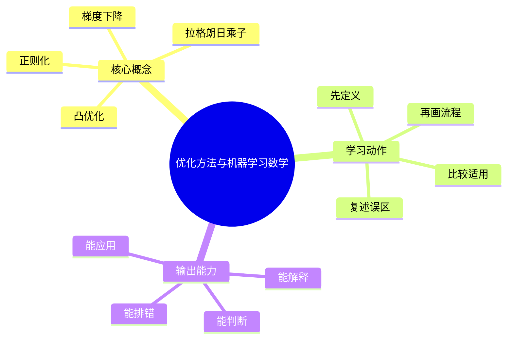
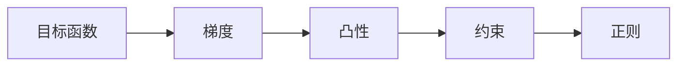
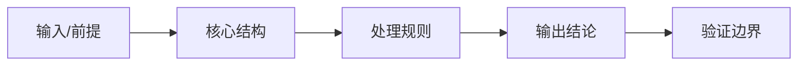
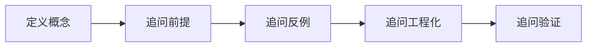
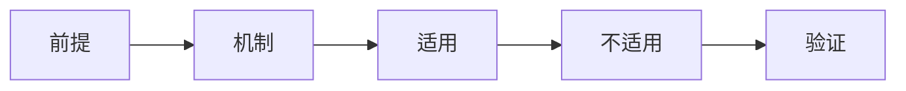

# 数学基础：优化方法与机器学习数学

## 学习目标
- 掌握梯度、凸性、约束优化、SGD 和正则化。
- 能画出本章核心流程图，并能用自己的话解释每个节点。
- 能说出适用场景、边界条件和常见误区。

## 一句话总纲
优化是在约束下寻找目标函数最优点，机器学习训练本质上是经验风险最小化。

## 记忆口诀
> 目标加约束，梯度指方向，正则控复杂

## 思维导图

## Mermaid 图解：核心流程

## 分章节讲解
### 1. 梯度下降
**核心定义：** 梯度下降沿负梯度方向迭代更新参数，学习率控制步长。

**理解路径：**
- 先明确它解决的具体问题，再判断它依赖的前提条件。
- 把它放回“优化是在约束下寻找目标函数最优点，机器学习训练本质上是经验风险最小化。”这条主线中理解，不要孤立记忆。
- 学习时至少能说出：输入是什么、输出是什么、代价是什么、失败边界是什么。

**常见误区：** 学习率过大可能震荡发散，过小收敛慢；梯度为零不一定是全局最优。

### 2. 凸优化
**核心定义：** 凸函数任意局部最优都是全局最优，凸性让优化问题具有强理论保证。

**理解路径：**
- 先明确它解决的具体问题，再判断它依赖的前提条件。
- 把它放回“优化是在约束下寻找目标函数最优点，机器学习训练本质上是经验风险最小化。”这条主线中理解，不要孤立记忆。
- 学习时至少能说出：输入是什么、输出是什么、代价是什么、失败边界是什么。

**常见误区：** 非凸问题不能套用凸优化结论；深度学习多数目标是非凸的。

### 3. 拉格朗日乘子
**核心定义：** 拉格朗日乘子把等式约束优化转化为增广目标的一阶条件。

**理解路径：**
- 先明确它解决的具体问题，再判断它依赖的前提条件。
- 把它放回“优化是在约束下寻找目标函数最优点，机器学习训练本质上是经验风险最小化。”这条主线中理解，不要孤立记忆。
- 学习时至少能说出：输入是什么、输出是什么、代价是什么、失败边界是什么。

**常见误区：** 它不是消除约束的万能方法；不等式约束还需要 KKT 条件。

### 4. 正则化
**核心定义：** 正则化通过惩罚模型复杂度降低过拟合，如 L1 促稀疏、L2 控制权重规模。

**理解路径：**
- 先明确它解决的具体问题，再判断它依赖的前提条件。
- 把它放回“优化是在约束下寻找目标函数最优点，机器学习训练本质上是经验风险最小化。”这条主线中理解，不要孤立记忆。
- 学习时至少能说出：输入是什么、输出是什么、代价是什么、失败边界是什么。

**常见误区：** 正则化过强会欠拟合；它改变优化目标而不是简单后处理。

## 实战深化：目标函数、梯度与约束

### 1. 底层机制拆解
优化把学习问题转化为目标函数最小化，梯度给出局部下降方向，约束决定可行域。

### 2. 适用与不适用
| 判断点 | 适用信号 | 不适用/风险信号 |
|---|---|---|
| 前提 | 对象、约束和目标清晰 | 概念边界含糊或约束缺失 |
| 机制 | 能说明中间状态如何变化 | 只能背结论，无法解释过程 |
| 成本 | 复杂度、维护成本或风险可接受 | 资源、复杂度或安全边界失控 |
| 验证 | 有样例、测试、证明或观测证据 | 无法复现、无法审计、无法回滚 |

### 3. 案例理解
训练深度模型时，学习率过大可能震荡，过小可能收敛慢；正则化可降低过拟合但可能损失表达力。

### 4. 常见误区与纠正
- **误区：** 只记概念定义，不问前提。**纠正：** 每次回答都先说适用条件。
- **误区：** 用单个样例证明普遍正确。**纠正：** 补充边界样例、反例或不变量。
- **误区：** 忽略工程成本。**纠正：** 同时说明性能、可靠性、安全性和维护代价。

### 5. 面试追问路径
- 如果输入规模、业务约束或安全边界变化，结论是否还成立？
- 这个概念和相邻概念的区别是什么？
- 如何设计一个测试、证明或观测指标来验证你的判断？

## 关键对比表
| 知识点 | 正确理解 | 常见误区 |
|---|---|---|
| 梯度下降 | 梯度下降沿负梯度方向迭代更新参数，学习率控制步长。 | 学习率过大可能震荡发散，过小收敛慢；梯度为零不一定是全局最优。 |
| 凸优化 | 凸函数任意局部最优都是全局最优，凸性让优化问题具有强理论保证。 | 非凸问题不能套用凸优化结论；深度学习多数目标是非凸的。 |
| 拉格朗日乘子 | 拉格朗日乘子把等式约束优化转化为增广目标的一阶条件。 | 它不是消除约束的万能方法；不等式约束还需要 KKT 条件。 |
| 正则化 | 正则化通过惩罚模型复杂度降低过拟合，如 L1 促稀疏、L2 控制权重规模。 | 正则化过强会欠拟合；它改变优化目标而不是简单后处理。 |

## 常见误区总结
- **梯度下降：** 学习率过大可能震荡发散，过小收敛慢；梯度为零不一定是全局最优。
- **凸优化：** 非凸问题不能套用凸优化结论；深度学习多数目标是非凸的。
- **拉格朗日乘子：** 它不是消除约束的万能方法；不等式约束还需要 KKT 条件。
- **正则化：** 正则化过强会欠拟合；它改变优化目标而不是简单后处理。

## 自检题
1. 本章的核心问题是什么？请用一句话回答：优化是在约束下寻找目标函数最优点，机器学习训练本质上是经验风险最小化。
2. 本章每个概念的适用前提分别是什么？
3. 哪个误区最容易在面试或工程实践中出现？为什么？

## 速记卡片
- 章节口诀：目标加约束，梯度指方向，正则控复杂
- 答题结构：定义 → 机制 → 场景 → 权衡 → 误区。
- 复习动作：遮住正文，只根据思维导图复述一遍。

## 深度扩展：底层原理与应用边界

### 1. 本章在「数学基础」中的位置
- **核心定位：** 用形式化语言描述结构、空间、不确定性、优化目标和信息量。
- **本章作用：** 「数学基础：优化方法与机器学习数学」负责把总纲落到可操作的判断框架：先确认问题边界，再拆解机制，最后根据代价和风险选择方法。
- **主要风险：** 最大风险是记公式但不知道公式成立条件，例如独立性、凸性、线性性、可导性和数值稳定假设。
- **实践抓手：** 学习时要把每个公式翻译成直觉、条件、反例和计算步骤。

### 2. 小流程图：从概念到应用

### 3. 概念深化：逐个击破
#### 3.1 梯度下降
- **先问它解决什么：** 梯度下降 不是孤立名词，而是用来解决本章某类约束、关系、代价或风险判断的问题。
- **底层机制：** 学习时要拆成“输入条件 → 中间结构 → 处理规则 → 输出结果”四步；如果任何一步说不清，说明只是记住了结论。
- **适用条件：** 当前提满足、边界清楚、代价可接受时使用；如果输入分布、规模、时序、权限或一致性假设变化，就要重新评估。
- **不适用信号：** 需要违反前提才能套用、只能靠特殊样例解释、复杂度或维护成本明显失控时，应换方案。
- **面试表达：** “我会先定义 梯度下降，再说明它依赖的前提，最后用一个反例说明边界。”

#### 3.2 凸优化
- **先问它解决什么：** 凸优化 不是孤立名词，而是用来解决本章某类约束、关系、代价或风险判断的问题。
- **底层机制：** 学习时要拆成“输入条件 → 中间结构 → 处理规则 → 输出结果”四步；如果任何一步说不清，说明只是记住了结论。
- **适用条件：** 当前提满足、边界清楚、代价可接受时使用；如果输入分布、规模、时序、权限或一致性假设变化，就要重新评估。
- **不适用信号：** 需要违反前提才能套用、只能靠特殊样例解释、复杂度或维护成本明显失控时，应换方案。
- **面试表达：** “我会先定义 凸优化，再说明它依赖的前提，最后用一个反例说明边界。”

#### 3.3 拉格朗日乘子
- **先问它解决什么：** 拉格朗日乘子 不是孤立名词，而是用来解决本章某类约束、关系、代价或风险判断的问题。
- **底层机制：** 学习时要拆成“输入条件 → 中间结构 → 处理规则 → 输出结果”四步；如果任何一步说不清，说明只是记住了结论。
- **适用条件：** 当前提满足、边界清楚、代价可接受时使用；如果输入分布、规模、时序、权限或一致性假设变化，就要重新评估。
- **不适用信号：** 需要违反前提才能套用、只能靠特殊样例解释、复杂度或维护成本明显失控时，应换方案。
- **面试表达：** “我会先定义 拉格朗日乘子，再说明它依赖的前提，最后用一个反例说明边界。”

#### 3.4 正则化
- **先问它解决什么：** 正则化 不是孤立名词，而是用来解决本章某类约束、关系、代价或风险判断的问题。
- **底层机制：** 学习时要拆成“输入条件 → 中间结构 → 处理规则 → 输出结果”四步；如果任何一步说不清，说明只是记住了结论。
- **适用条件：** 当前提满足、边界清楚、代价可接受时使用；如果输入分布、规模、时序、权限或一致性假设变化，就要重新评估。
- **不适用信号：** 需要违反前提才能套用、只能靠特殊样例解释、复杂度或维护成本明显失控时，应换方案。
- **面试表达：** “我会先定义 正则化，再说明它依赖的前提，最后用一个反例说明边界。”

### 4. 适用边界对比表
| 判断维度 | 应该怎么想 | 典型错误 | 记忆提示 |
|---|---|---|---|
| 前提条件 | 先列出输入规模、数据分布、系统假设或业务约束 | 不看条件直接套模板 | 先问“凭什么能用” |
| 正确性 | 需要能说明为什么结果保持不变或为什么局部选择成立 | 只给经验结论 | 用不变量、反例或交换论证检查 |
| 复杂度/成本 | 同时估算时间、空间、延迟、吞吐、人力和维护成本 | 只看理论最优 | 工程里还要看常数和可观测性 |
| 失败模式 | 主动说明边界外会怎样失败 | 面试中只讲优点 | 能说失败边界才算真理解 |

### 5. 记忆强化：三层复述法
1. **概念层：** 用一句话定义本章每个核心概念。
2. **机制层：** 不看原文画出输入到输出的流程。
3. **边界层：** 为每个概念准备一个“不能这样用”的反例。

### 6. 工程/做题/面试迁移
- **工程迁移：** 学习时要把每个公式翻译成直觉、条件、反例和计算步骤。
- **做题迁移：** 先把题目中的对象、关系、约束和目标函数圈出来，再映射到本章概念。
- **面试迁移：** 回答时不要只报名词，要说清“为什么需要它、它如何工作、它何时失效”。

### 7. 深度自检题
1. 你能否把本章概念按“前提 → 机制 → 结果 → 代价”重新组织？
2. 如果输入规模、并发量、数据分布或安全边界变化，原结论是否仍成立？
3. 本章哪个概念最容易被误用？请给出一个反例。
4. 如果让你设计一道面试题，你会怎样考察候选人是否真的理解？

### 8. 深度速记卡片
- **总抓手：** 用形式化语言描述结构、空间、不确定性、优化目标和信息量。
- **答题模板：** 定义边界 → 拆底层机制 → 说适用条件 → 讲权衡 → 给反例。
- **复习动作：** 每次复习只看图和表，尝试口述 3 分钟；卡住处再回正文。

## 专题深化：具体机制、案例与追问

### 1. 具体案例：把「优化方法与机器学习数学」放进真实问题
例如概率题必须先确认事件是否独立；线性代数题要先看维度和秩；优化问题要先问是否凸、是否可导、约束是否满足。

### 2. 本章关键机制细化
- 梯度只给局部最陡方向，不保证一步到达最优。
- 凸性让局部最优等于全局最优，这是很多理论保证的来源。
- 正则化通过改变目标函数控制模型复杂度。

### 3. 概念到判断的检查清单
| 概念/动作 | 你要检查什么 | 如果检查失败会怎样 |
|---|---|---|
| 梯度下降 | 前提、输入、输出、代价、失败边界是否都说清 | 可能套错模型、复杂度失控或得到不可验证结论 |
| 凸优化 | 前提、输入、输出、代价、失败边界是否都说清 | 可能套错模型、复杂度失控或得到不可验证结论 |
| 拉格朗日乘子 | 前提、输入、输出、代价、失败边界是否都说清 | 可能套错模型、复杂度失控或得到不可验证结论 |
| 正则化 | 前提、输入、输出、代价、失败边界是否都说清 | 可能套错模型、复杂度失控或得到不可验证结论 |
| 本章在「数学基础」中的位置 | 前提、输入、输出、代价、失败边界是否都说清 | 可能套错模型、复杂度失控或得到不可验证结论 |

### 4. 面试追问路径

- 公式成立需要哪些条件？
- 变量、空间、分布或目标函数分别是什么？
- 有没有反例能说明不能乱用？

### 5. 验证与复盘
- **验证方式：** 用条件检查、单位维度检查、极端值检查和反例检查验证。
- **复盘方式：** 每次做题或设计后，记录“我使用了哪个前提、哪个前提最容易被破坏、如果破坏如何调整”。
- **记忆方式：** 不背孤立结论，只背“问题 → 机制 → 边界 → 验证”的链路。

## 继续扩写：机制、边界与面试追问

### 机制拆解补充
- 梯度下降的表现取决于学习率、尺度、曲率和噪声；凸问题可给全局保证，非凸问题更多依赖经验诊断。
- 拉格朗日乘子把约束转入目标，KKT 条件还要求可行性、互补松弛和对偶条件。
- 正则化不是万能降过拟合，它改变优化目标；过强会欠拟合，过弱不能约束方差。

### 适用 / 不适用场景
| 维度 | 适用信号 | 不适用信号 | 纠偏动作 |
|---|---|---|---|
| 前提 | 关键假设可明确写出 | 只能靠经验套模板 | 先补定义、约束和反例 |
| 代价 | 时间、空间、人力成本可接受 | 复杂度或维护成本不可控 | 降维、分层或换方案 |
| 验证 | 能用样例、测试或演练证明 | 只能口头保证 | 增加边界用例和观测点 |
| 演进 | 变化范围局部可控 | 一处变化牵动多处 | 重画边界和依赖关系 |

### 工程实践案例
- **场景：** 在真实项目或面试题中遇到 `04-优化方法与机器学习数学` 相关问题时，先列出输入、输出、约束、风险和验收标准。
- **做法：** 用最小可行方案跑通主链路，再补边界用例、错误处理和性能/安全验证。
- **复盘：** 如果方案失败，优先检查前提是否被破坏，而不是继续堆叠特殊判断。

### 面试追问路径
1. 这个概念依赖哪些前提？前提不成立时会发生什么？
2. 和相邻方案相比，它牺牲了什么、换来了什么？
3. 如何用最小反例证明误用会失败？
4. 工程落地时需要哪些监控、测试或回滚手段？
