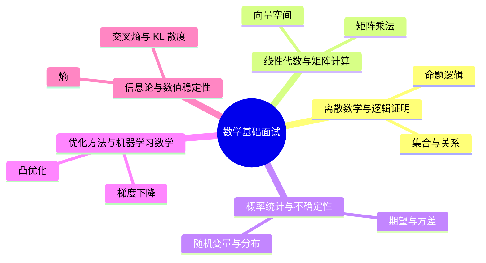

# 数学基础面试20问

## 学习目标
- 用 20 个高频问题串起 数学基础 的核心知识。
- 每个答案都按“定义 → 机制 → 场景 → 权衡 → 误区 → 记忆点”组织，便于面试复述。
- 通过小型 Mermaid 图辅助记忆，避免超大图难以阅读。

## 一句话总纲
数学基础为计算机科学、机器学习和系统分析提供语言：离散结构描述对象，线性代数描述空间，概率统计描述不确定性，优化描述学习与决策。

## 记忆口诀
> 离散管结构，线代管空间，概率管不确定，优化管目标，信息论管压缩。

## 思维导图

## 答题总流程

## 第 1-5 问：小图记忆

## 深度面试答题框架

- **总主线：** 用形式化语言描述结构、空间、不确定性、优化目标和信息量。
- **风险提醒：** 最大风险是记公式但不知道公式成立条件，例如独立性、凸性、线性性、可导性和数值稳定假设。
- **实践抓手：** 学习时要把每个公式翻译成直觉、条件、反例和计算步骤。

## 面试答案强化版：逐题深答

> 回答每题都按：定义 → 机制 → 场景 → 权衡 → 误区 → 验证。

### Q1：请解释“命题逻辑”的核心思想、适用场景和常见误区。

**答：**
1. **定义：** 命题逻辑研究真值、连接词、蕴含和等价，是程序条件判断和形式化验证的基础。
2. **机制：** 把“命题逻辑”放入本学科主线：用离散结构、线性空间、概率不确定性、优化目标、信息量和数值稳定性支撑算法、机器学习与工程判断。回答时先说明输入或前提，再说明内部结构、状态变化或控制规则，最后说明输出结论为什么可信。
3. **适用场景：** 当问题需要围绕 命题逻辑 判断正确性、效率、风险、边界或工程取舍时使用；如果前提不满足，应先换模型或补充约束。
4. **权衡：** 它能降低理解或实现复杂度，但可能引入计算成本、维护成本、误判风险或安全边界问题；面试中要主动比较相邻概念。
5. **常见误区：** 只背定义不讲前提；只讲优点不讲失败模式；不能给出反例、验证方法或工程落地证据。
6. **验证/记忆点：** 用“定义 → 机制 → 场景 → 权衡 → 误区 → 验证”复述；再准备一个正例、一个反例和一个边界条件。

**追问路径：**
- 如果输入规模、数据分布、权限边界或业务目标变化，命题逻辑 是否仍成立？
- 它和相邻概念的边界在哪里，如何用反例区分？
- 如果落到工程实践，你会用什么测试、指标、日志、证明或审计证据验证？

### Q2：请解释“集合与关系”的核心思想、适用场景和常见误区。

**答：**
1. **定义：** 集合描述对象范围，关系描述对象之间的二元联系，等价关系可划分类，偏序关系可描述依赖。
2. **机制：** 把“集合与关系”放入本学科主线：用离散结构、线性空间、概率不确定性、优化目标、信息量和数值稳定性支撑算法、机器学习与工程判断。回答时先说明输入或前提，再说明内部结构、状态变化或控制规则，最后说明输出结论为什么可信。
3. **适用场景：** 当问题需要围绕 集合与关系 判断正确性、效率、风险、边界或工程取舍时使用；如果前提不满足，应先换模型或补充约束。
4. **权衡：** 它能降低理解或实现复杂度，但可能引入计算成本、维护成本、误判风险或安全边界问题；面试中要主动比较相邻概念。
5. **常见误区：** 只背定义不讲前提；只讲优点不讲失败模式；不能给出反例、验证方法或工程落地证据。
6. **验证/记忆点：** 用“定义 → 机制 → 场景 → 权衡 → 误区 → 验证”复述；再准备一个正例、一个反例和一个边界条件。

**追问路径：**
- 如果输入规模、数据分布、权限边界或业务目标变化，集合与关系 是否仍成立？
- 它和相邻概念的边界在哪里，如何用反例区分？
- 如果落到工程实践，你会用什么测试、指标、日志、证明或审计证据验证？

### Q3：请解释“数学归纳法”的核心思想、适用场景和常见误区。

**答：**
1. **定义：** 归纳法通过基础情形和归纳步骤证明无限命题，强归纳允许使用所有更小规模结论。
2. **机制：** 把“数学归纳法”放入本学科主线：用离散结构、线性空间、概率不确定性、优化目标、信息量和数值稳定性支撑算法、机器学习与工程判断。回答时先说明输入或前提，再说明内部结构、状态变化或控制规则，最后说明输出结论为什么可信。
3. **适用场景：** 当问题需要围绕 数学归纳法 判断正确性、效率、风险、边界或工程取舍时使用；如果前提不满足，应先换模型或补充约束。
4. **权衡：** 它能降低理解或实现复杂度，但可能引入计算成本、维护成本、误判风险或安全边界问题；面试中要主动比较相邻概念。
5. **常见误区：** 只背定义不讲前提；只讲优点不讲失败模式；不能给出反例、验证方法或工程落地证据。
6. **验证/记忆点：** 用“定义 → 机制 → 场景 → 权衡 → 误区 → 验证”复述；再准备一个正例、一个反例和一个边界条件。

**追问路径：**
- 如果输入规模、数据分布、权限边界或业务目标变化，数学归纳法 是否仍成立？
- 它和相邻概念的边界在哪里，如何用反例区分？
- 如果落到工程实践，你会用什么测试、指标、日志、证明或审计证据验证？

### Q4：请解释“组合计数”的核心思想、适用场景和常见误区。

**答：**
1. **定义：** 排列、组合、容斥和鸽巢原理用于计算离散对象数量，是复杂度和概率计算的基础。
2. **机制：** 把“组合计数”放入本学科主线：用离散结构、线性空间、概率不确定性、优化目标、信息量和数值稳定性支撑算法、机器学习与工程判断。回答时先说明输入或前提，再说明内部结构、状态变化或控制规则，最后说明输出结论为什么可信。
3. **适用场景：** 当问题需要围绕 组合计数 判断正确性、效率、风险、边界或工程取舍时使用；如果前提不满足，应先换模型或补充约束。
4. **权衡：** 它能降低理解或实现复杂度，但可能引入计算成本、维护成本、误判风险或安全边界问题；面试中要主动比较相邻概念。
5. **常见误区：** 只背定义不讲前提；只讲优点不讲失败模式；不能给出反例、验证方法或工程落地证据。
6. **验证/记忆点：** 用“定义 → 机制 → 场景 → 权衡 → 误区 → 验证”复述；再准备一个正例、一个反例和一个边界条件。

**追问路径：**
- 如果输入规模、数据分布、权限边界或业务目标变化，组合计数 是否仍成立？
- 它和相邻概念的边界在哪里，如何用反例区分？
- 如果落到工程实践，你会用什么测试、指标、日志、证明或审计证据验证？

### Q5：请解释“向量空间”的核心思想、适用场景和常见误区。

**答：**
1. **定义：** 向量空间由向量集合和加法、数乘构成，基和维度刻画表达能力。
2. **机制：** 把“向量空间”放入本学科主线：用离散结构、线性空间、概率不确定性、优化目标、信息量和数值稳定性支撑算法、机器学习与工程判断。回答时先说明输入或前提，再说明内部结构、状态变化或控制规则，最后说明输出结论为什么可信。
3. **适用场景：** 当问题需要围绕 向量空间 判断正确性、效率、风险、边界或工程取舍时使用；如果前提不满足，应先换模型或补充约束。
4. **权衡：** 它能降低理解或实现复杂度，但可能引入计算成本、维护成本、误判风险或安全边界问题；面试中要主动比较相邻概念。
5. **常见误区：** 只背定义不讲前提；只讲优点不讲失败模式；不能给出反例、验证方法或工程落地证据。
6. **验证/记忆点：** 用“定义 → 机制 → 场景 → 权衡 → 误区 → 验证”复述；再准备一个正例、一个反例和一个边界条件。

**追问路径：**
- 如果输入规模、数据分布、权限边界或业务目标变化，向量空间 是否仍成立？
- 它和相邻概念的边界在哪里，如何用反例区分？
- 如果落到工程实践，你会用什么测试、指标、日志、证明或审计证据验证？

### Q6：请解释“矩阵乘法”的核心思想、适用场景和常见误区。

**答：**
1. **定义：** 矩阵乘法表示线性变换复合，也可看成行列内积或基变换。
2. **机制：** 把“矩阵乘法”放入本学科主线：用离散结构、线性空间、概率不确定性、优化目标、信息量和数值稳定性支撑算法、机器学习与工程判断。回答时先说明输入或前提，再说明内部结构、状态变化或控制规则，最后说明输出结论为什么可信。
3. **适用场景：** 当问题需要围绕 矩阵乘法 判断正确性、效率、风险、边界或工程取舍时使用；如果前提不满足，应先换模型或补充约束。
4. **权衡：** 它能降低理解或实现复杂度，但可能引入计算成本、维护成本、误判风险或安全边界问题；面试中要主动比较相邻概念。
5. **常见误区：** 只背定义不讲前提；只讲优点不讲失败模式；不能给出反例、验证方法或工程落地证据。
6. **验证/记忆点：** 用“定义 → 机制 → 场景 → 权衡 → 误区 → 验证”复述；再准备一个正例、一个反例和一个边界条件。

**追问路径：**
- 如果输入规模、数据分布、权限边界或业务目标变化，矩阵乘法 是否仍成立？
- 它和相邻概念的边界在哪里，如何用反例区分？
- 如果落到工程实践，你会用什么测试、指标、日志、证明或审计证据验证？

### Q7：请解释“秩与线性相关”的核心思想、适用场景和常见误区。

**答：**
1. **定义：** 秩表示矩阵中独立信息的数量，决定线性方程组解的结构和降维能力。
2. **机制：** 把“秩与线性相关”放入本学科主线：用离散结构、线性空间、概率不确定性、优化目标、信息量和数值稳定性支撑算法、机器学习与工程判断。回答时先说明输入或前提，再说明内部结构、状态变化或控制规则，最后说明输出结论为什么可信。
3. **适用场景：** 当问题需要围绕 秩与线性相关 判断正确性、效率、风险、边界或工程取舍时使用；如果前提不满足，应先换模型或补充约束。
4. **权衡：** 它能降低理解或实现复杂度，但可能引入计算成本、维护成本、误判风险或安全边界问题；面试中要主动比较相邻概念。
5. **常见误区：** 只背定义不讲前提；只讲优点不讲失败模式；不能给出反例、验证方法或工程落地证据。
6. **验证/记忆点：** 用“定义 → 机制 → 场景 → 权衡 → 误区 → 验证”复述；再准备一个正例、一个反例和一个边界条件。

**追问路径：**
- 如果输入规模、数据分布、权限边界或业务目标变化，秩与线性相关 是否仍成立？
- 它和相邻概念的边界在哪里，如何用反例区分？
- 如果落到工程实践，你会用什么测试、指标、日志、证明或审计证据验证？

### Q8：请解释“特征值与矩阵分解”的核心思想、适用场景和常见误区。

**答：**
1. **定义：** 特征值描述变换在特定方向上的伸缩，SVD 可分解任意矩阵并支撑降维和推荐系统。
2. **机制：** 把“特征值与矩阵分解”放入本学科主线：用离散结构、线性空间、概率不确定性、优化目标、信息量和数值稳定性支撑算法、机器学习与工程判断。回答时先说明输入或前提，再说明内部结构、状态变化或控制规则，最后说明输出结论为什么可信。
3. **适用场景：** 当问题需要围绕 特征值与矩阵分解 判断正确性、效率、风险、边界或工程取舍时使用；如果前提不满足，应先换模型或补充约束。
4. **权衡：** 它能降低理解或实现复杂度，但可能引入计算成本、维护成本、误判风险或安全边界问题；面试中要主动比较相邻概念。
5. **常见误区：** 只背定义不讲前提；只讲优点不讲失败模式；不能给出反例、验证方法或工程落地证据。
6. **验证/记忆点：** 用“定义 → 机制 → 场景 → 权衡 → 误区 → 验证”复述；再准备一个正例、一个反例和一个边界条件。

**追问路径：**
- 如果输入规模、数据分布、权限边界或业务目标变化，特征值与矩阵分解 是否仍成立？
- 它和相邻概念的边界在哪里，如何用反例区分？
- 如果落到工程实践，你会用什么测试、指标、日志、证明或审计证据验证？

### Q9：请解释“随机变量与分布”的核心思想、适用场景和常见误区。

**答：**
1. **定义：** 随机变量把随机试验结果映射为数值，分布描述不同取值的概率。
2. **机制：** 把“随机变量与分布”放入本学科主线：用离散结构、线性空间、概率不确定性、优化目标、信息量和数值稳定性支撑算法、机器学习与工程判断。回答时先说明输入或前提，再说明内部结构、状态变化或控制规则，最后说明输出结论为什么可信。
3. **适用场景：** 当问题需要围绕 随机变量与分布 判断正确性、效率、风险、边界或工程取舍时使用；如果前提不满足，应先换模型或补充约束。
4. **权衡：** 它能降低理解或实现复杂度，但可能引入计算成本、维护成本、误判风险或安全边界问题；面试中要主动比较相邻概念。
5. **常见误区：** 只背定义不讲前提；只讲优点不讲失败模式；不能给出反例、验证方法或工程落地证据。
6. **验证/记忆点：** 用“定义 → 机制 → 场景 → 权衡 → 误区 → 验证”复述；再准备一个正例、一个反例和一个边界条件。

**追问路径：**
- 如果输入规模、数据分布、权限边界或业务目标变化，随机变量与分布 是否仍成立？
- 它和相邻概念的边界在哪里，如何用反例区分？
- 如果落到工程实践，你会用什么测试、指标、日志、证明或审计证据验证？

### Q10：请解释“期望与方差”的核心思想、适用场景和常见误区。

**答：**
1. **定义：** 期望表示长期平均，方差表示离散程度，二者是风险和误差分析的基本量。
2. **机制：** 把“期望与方差”放入本学科主线：用离散结构、线性空间、概率不确定性、优化目标、信息量和数值稳定性支撑算法、机器学习与工程判断。回答时先说明输入或前提，再说明内部结构、状态变化或控制规则，最后说明输出结论为什么可信。
3. **适用场景：** 当问题需要围绕 期望与方差 判断正确性、效率、风险、边界或工程取舍时使用；如果前提不满足，应先换模型或补充约束。
4. **权衡：** 它能降低理解或实现复杂度，但可能引入计算成本、维护成本、误判风险或安全边界问题；面试中要主动比较相邻概念。
5. **常见误区：** 只背定义不讲前提；只讲优点不讲失败模式；不能给出反例、验证方法或工程落地证据。
6. **验证/记忆点：** 用“定义 → 机制 → 场景 → 权衡 → 误区 → 验证”复述；再准备一个正例、一个反例和一个边界条件。

**追问路径：**
- 如果输入规模、数据分布、权限边界或业务目标变化，期望与方差 是否仍成立？
- 它和相邻概念的边界在哪里，如何用反例区分？
- 如果落到工程实践，你会用什么测试、指标、日志、证明或审计证据验证？

### Q11：请解释“贝叶斯公式”的核心思想、适用场景和常见误区。

**答：**
1. **定义：** 贝叶斯公式用先验和似然更新后验，是诊断、分类和概率推理的核心。
2. **机制：** 把“贝叶斯公式”放入本学科主线：用离散结构、线性空间、概率不确定性、优化目标、信息量和数值稳定性支撑算法、机器学习与工程判断。回答时先说明输入或前提，再说明内部结构、状态变化或控制规则，最后说明输出结论为什么可信。
3. **适用场景：** 当问题需要围绕 贝叶斯公式 判断正确性、效率、风险、边界或工程取舍时使用；如果前提不满足，应先换模型或补充约束。
4. **权衡：** 它能降低理解或实现复杂度，但可能引入计算成本、维护成本、误判风险或安全边界问题；面试中要主动比较相邻概念。
5. **常见误区：** 只背定义不讲前提；只讲优点不讲失败模式；不能给出反例、验证方法或工程落地证据。
6. **验证/记忆点：** 用“定义 → 机制 → 场景 → 权衡 → 误区 → 验证”复述；再准备一个正例、一个反例和一个边界条件。

**追问路径：**
- 如果输入规模、数据分布、权限边界或业务目标变化，贝叶斯公式 是否仍成立？
- 它和相邻概念的边界在哪里，如何用反例区分？
- 如果落到工程实践，你会用什么测试、指标、日志、证明或审计证据验证？

### Q12：请解释“估计与置信区间”的核心思想、适用场景和常见误区。

**答：**
1. **定义：** 点估计给出参数值，置信区间描述估计不确定性；最大似然常用于参数估计。
2. **机制：** 把“估计与置信区间”放入本学科主线：用离散结构、线性空间、概率不确定性、优化目标、信息量和数值稳定性支撑算法、机器学习与工程判断。回答时先说明输入或前提，再说明内部结构、状态变化或控制规则，最后说明输出结论为什么可信。
3. **适用场景：** 当问题需要围绕 估计与置信区间 判断正确性、效率、风险、边界或工程取舍时使用；如果前提不满足，应先换模型或补充约束。
4. **权衡：** 它能降低理解或实现复杂度，但可能引入计算成本、维护成本、误判风险或安全边界问题；面试中要主动比较相邻概念。
5. **常见误区：** 只背定义不讲前提；只讲优点不讲失败模式；不能给出反例、验证方法或工程落地证据。
6. **验证/记忆点：** 用“定义 → 机制 → 场景 → 权衡 → 误区 → 验证”复述；再准备一个正例、一个反例和一个边界条件。

**追问路径：**
- 如果输入规模、数据分布、权限边界或业务目标变化，估计与置信区间 是否仍成立？
- 它和相邻概念的边界在哪里，如何用反例区分？
- 如果落到工程实践，你会用什么测试、指标、日志、证明或审计证据验证？

### Q13：请解释“梯度下降”的核心思想、适用场景和常见误区。

**答：**
1. **定义：** 梯度下降沿负梯度方向迭代更新参数，学习率控制步长。
2. **机制：** 把“梯度下降”放入本学科主线：用离散结构、线性空间、概率不确定性、优化目标、信息量和数值稳定性支撑算法、机器学习与工程判断。回答时先说明输入或前提，再说明内部结构、状态变化或控制规则，最后说明输出结论为什么可信。
3. **适用场景：** 当问题需要围绕 梯度下降 判断正确性、效率、风险、边界或工程取舍时使用；如果前提不满足，应先换模型或补充约束。
4. **权衡：** 它能降低理解或实现复杂度，但可能引入计算成本、维护成本、误判风险或安全边界问题；面试中要主动比较相邻概念。
5. **常见误区：** 只背定义不讲前提；只讲优点不讲失败模式；不能给出反例、验证方法或工程落地证据。
6. **验证/记忆点：** 用“定义 → 机制 → 场景 → 权衡 → 误区 → 验证”复述；再准备一个正例、一个反例和一个边界条件。

**追问路径：**
- 如果输入规模、数据分布、权限边界或业务目标变化，梯度下降 是否仍成立？
- 它和相邻概念的边界在哪里，如何用反例区分？
- 如果落到工程实践，你会用什么测试、指标、日志、证明或审计证据验证？

### Q14：请解释“凸优化”的核心思想、适用场景和常见误区。

**答：**
1. **定义：** 凸函数任意局部最优都是全局最优，凸性让优化问题具有强理论保证。
2. **机制：** 把“凸优化”放入本学科主线：用离散结构、线性空间、概率不确定性、优化目标、信息量和数值稳定性支撑算法、机器学习与工程判断。回答时先说明输入或前提，再说明内部结构、状态变化或控制规则，最后说明输出结论为什么可信。
3. **适用场景：** 当问题需要围绕 凸优化 判断正确性、效率、风险、边界或工程取舍时使用；如果前提不满足，应先换模型或补充约束。
4. **权衡：** 它能降低理解或实现复杂度，但可能引入计算成本、维护成本、误判风险或安全边界问题；面试中要主动比较相邻概念。
5. **常见误区：** 只背定义不讲前提；只讲优点不讲失败模式；不能给出反例、验证方法或工程落地证据。
6. **验证/记忆点：** 用“定义 → 机制 → 场景 → 权衡 → 误区 → 验证”复述；再准备一个正例、一个反例和一个边界条件。

**追问路径：**
- 如果输入规模、数据分布、权限边界或业务目标变化，凸优化 是否仍成立？
- 它和相邻概念的边界在哪里，如何用反例区分？
- 如果落到工程实践，你会用什么测试、指标、日志、证明或审计证据验证？

### Q15：请解释“拉格朗日乘子”的核心思想、适用场景和常见误区。

**答：**
1. **定义：** 拉格朗日乘子把等式约束优化转化为增广目标的一阶条件。
2. **机制：** 把“拉格朗日乘子”放入本学科主线：用离散结构、线性空间、概率不确定性、优化目标、信息量和数值稳定性支撑算法、机器学习与工程判断。回答时先说明输入或前提，再说明内部结构、状态变化或控制规则，最后说明输出结论为什么可信。
3. **适用场景：** 当问题需要围绕 拉格朗日乘子 判断正确性、效率、风险、边界或工程取舍时使用；如果前提不满足，应先换模型或补充约束。
4. **权衡：** 它能降低理解或实现复杂度，但可能引入计算成本、维护成本、误判风险或安全边界问题；面试中要主动比较相邻概念。
5. **常见误区：** 只背定义不讲前提；只讲优点不讲失败模式；不能给出反例、验证方法或工程落地证据。
6. **验证/记忆点：** 用“定义 → 机制 → 场景 → 权衡 → 误区 → 验证”复述；再准备一个正例、一个反例和一个边界条件。

**追问路径：**
- 如果输入规模、数据分布、权限边界或业务目标变化，拉格朗日乘子 是否仍成立？
- 它和相邻概念的边界在哪里，如何用反例区分？
- 如果落到工程实践，你会用什么测试、指标、日志、证明或审计证据验证？

### Q16：请解释“正则化”的核心思想、适用场景和常见误区。

**答：**
1. **定义：** 正则化通过惩罚模型复杂度降低过拟合，如 L1 促稀疏、L2 控制权重规模。
2. **机制：** 把“正则化”放入本学科主线：用离散结构、线性空间、概率不确定性、优化目标、信息量和数值稳定性支撑算法、机器学习与工程判断。回答时先说明输入或前提，再说明内部结构、状态变化或控制规则，最后说明输出结论为什么可信。
3. **适用场景：** 当问题需要围绕 正则化 判断正确性、效率、风险、边界或工程取舍时使用；如果前提不满足，应先换模型或补充约束。
4. **权衡：** 它能降低理解或实现复杂度，但可能引入计算成本、维护成本、误判风险或安全边界问题；面试中要主动比较相邻概念。
5. **常见误区：** 只背定义不讲前提；只讲优点不讲失败模式；不能给出反例、验证方法或工程落地证据。
6. **验证/记忆点：** 用“定义 → 机制 → 场景 → 权衡 → 误区 → 验证”复述；再准备一个正例、一个反例和一个边界条件。

**追问路径：**
- 如果输入规模、数据分布、权限边界或业务目标变化，正则化 是否仍成立？
- 它和相邻概念的边界在哪里，如何用反例区分？
- 如果落到工程实践，你会用什么测试、指标、日志、证明或审计证据验证？

### Q17：请解释“熵”的核心思想、适用场景和常见误区。

**答：**
1. **定义：** 熵度量随机变量的不确定性，分布越均匀熵越大。
2. **机制：** 把“熵”放入本学科主线：用离散结构、线性空间、概率不确定性、优化目标、信息量和数值稳定性支撑算法、机器学习与工程判断。回答时先说明输入或前提，再说明内部结构、状态变化或控制规则，最后说明输出结论为什么可信。
3. **适用场景：** 当问题需要围绕 熵 判断正确性、效率、风险、边界或工程取舍时使用；如果前提不满足，应先换模型或补充约束。
4. **权衡：** 它能降低理解或实现复杂度，但可能引入计算成本、维护成本、误判风险或安全边界问题；面试中要主动比较相邻概念。
5. **常见误区：** 只背定义不讲前提；只讲优点不讲失败模式；不能给出反例、验证方法或工程落地证据。
6. **验证/记忆点：** 用“定义 → 机制 → 场景 → 权衡 → 误区 → 验证”复述；再准备一个正例、一个反例和一个边界条件。

**追问路径：**
- 如果输入规模、数据分布、权限边界或业务目标变化，熵 是否仍成立？
- 它和相邻概念的边界在哪里，如何用反例区分？
- 如果落到工程实践，你会用什么测试、指标、日志、证明或审计证据验证？

### Q18：请解释“交叉熵与 KL 散度”的核心思想、适用场景和常见误区。

**答：**
1. **定义：** 交叉熵常作分类损失，KL 散度度量两个分布差异且不对称。
2. **机制：** 把“交叉熵与 KL 散度”放入本学科主线：用离散结构、线性空间、概率不确定性、优化目标、信息量和数值稳定性支撑算法、机器学习与工程判断。回答时先说明输入或前提，再说明内部结构、状态变化或控制规则，最后说明输出结论为什么可信。
3. **适用场景：** 当问题需要围绕 交叉熵与 KL 散度 判断正确性、效率、风险、边界或工程取舍时使用；如果前提不满足，应先换模型或补充约束。
4. **权衡：** 它能降低理解或实现复杂度，但可能引入计算成本、维护成本、误判风险或安全边界问题；面试中要主动比较相邻概念。
5. **常见误区：** 只背定义不讲前提；只讲优点不讲失败模式；不能给出反例、验证方法或工程落地证据。
6. **验证/记忆点：** 用“定义 → 机制 → 场景 → 权衡 → 误区 → 验证”复述；再准备一个正例、一个反例和一个边界条件。

**追问路径：**
- 如果输入规模、数据分布、权限边界或业务目标变化，交叉熵与 KL 散度 是否仍成立？
- 它和相邻概念的边界在哪里，如何用反例区分？
- 如果落到工程实践，你会用什么测试、指标、日志、证明或审计证据验证？

### Q19：请解释“浮点误差”的核心思想、适用场景和常见误区。

**答：**
1. **定义：** 浮点数有限精度会产生舍入误差、溢出、下溢和灾难性抵消。
2. **机制：** 把“浮点误差”放入本学科主线：用离散结构、线性空间、概率不确定性、优化目标、信息量和数值稳定性支撑算法、机器学习与工程判断。回答时先说明输入或前提，再说明内部结构、状态变化或控制规则，最后说明输出结论为什么可信。
3. **适用场景：** 当问题需要围绕 浮点误差 判断正确性、效率、风险、边界或工程取舍时使用；如果前提不满足，应先换模型或补充约束。
4. **权衡：** 它能降低理解或实现复杂度，但可能引入计算成本、维护成本、误判风险或安全边界问题；面试中要主动比较相邻概念。
5. **常见误区：** 只背定义不讲前提；只讲优点不讲失败模式；不能给出反例、验证方法或工程落地证据。
6. **验证/记忆点：** 用“定义 → 机制 → 场景 → 权衡 → 误区 → 验证”复述；再准备一个正例、一个反例和一个边界条件。

**追问路径：**
- 如果输入规模、数据分布、权限边界或业务目标变化，浮点误差 是否仍成立？
- 它和相邻概念的边界在哪里，如何用反例区分？
- 如果落到工程实践，你会用什么测试、指标、日志、证明或审计证据验证？

### Q20：请解释“LogSumExp 技巧”的核心思想、适用场景和常见误区。

**答：**
1. **定义：** LogSumExp 通过减去最大值稳定计算 log(sum(exp(x)))，常用于 softmax 和概率模型。
2. **机制：** 把“LogSumExp 技巧”放入本学科主线：用离散结构、线性空间、概率不确定性、优化目标、信息量和数值稳定性支撑算法、机器学习与工程判断。回答时先说明输入或前提，再说明内部结构、状态变化或控制规则，最后说明输出结论为什么可信。
3. **适用场景：** 当问题需要围绕 LogSumExp 技巧 判断正确性、效率、风险、边界或工程取舍时使用；如果前提不满足，应先换模型或补充约束。
4. **权衡：** 它能降低理解或实现复杂度，但可能引入计算成本、维护成本、误判风险或安全边界问题；面试中要主动比较相邻概念。
5. **常见误区：** 只背定义不讲前提；只讲优点不讲失败模式；不能给出反例、验证方法或工程落地证据。
6. **验证/记忆点：** 用“定义 → 机制 → 场景 → 权衡 → 误区 → 验证”复述；再准备一个正例、一个反例和一个边界条件。

**追问路径：**
- 如果输入规模、数据分布、权限边界或业务目标变化，LogSumExp 技巧 是否仍成立？
- 它和相邻概念的边界在哪里，如何用反例区分？
- 如果落到工程实践，你会用什么测试、指标、日志、证明或审计证据验证？

## 追问矩阵：把 20 问串成一条能力链

| 追问方向 | 应答抓手 | 常见扣分点 |
|---|---|---|
| 前提是否成立 | 先列输入、约束、信任边界或数学条件 | 直接套模板 |
| 机制如何运作 | 讲清状态、转换、不变量或控制点 | 只背定义 |
| 何时失效 | 给出反例、边界值或攻击/故障场景 | 只讲优点 |
| 如何验证 | 用测试、证明、指标、日志、审计或对拍 | 无法落地 |

## 面试终局复盘
| 能力 | 合格表现 | 优秀表现 |
|---|---|---|
| 概念 | 说清定义 | 还能说清边界和反例 |
| 机制 | 说清流程 | 能画图解释不变量或控制点 |
| 工程 | 能给场景 | 能给验证和回滚方式 |
| 表达 | 结构完整 | 能应对追问和对比 |

## 继续扩写：数学基础面试追问与作答校准

### 统一作答校准

面试中不要只背概念。每道 Q1-Q20 都应补足五个层次：
- **定义：** 一句话说清它解决的问题。
- **机制：** 说明输入、状态变化、输出和保持正确的关键不变量。
- **边界：** 主动说出不适用场景、失败条件或常见误用。
- **案例：** 给出一个小例子或工程落地场景。
- **验证：** 说明如何用测试、推导、演练、监控或反例证明回答可信。

### 高频追问矩阵
| 追问类型 | 回答抓手 | 推荐句式 |
|---|---|---|
| 为什么成立 | 不变量、证明、约束 | “它成立的前提是……，关键不变量是……” |
| 为什么不用别的方案 | 成本、边界、失败模式 | “替代方案在……场景更好，但这里受……约束” |
| 工程如何落地 | 测试、监控、回滚 | “我会先用……验证，再用……观测异常” |
| 误区如何纠正 | 反例、边界样例 | “最小反例是……，说明不能把……混为一谈” |

### 二十问复习动作
- 第一遍：只看题目，口头按“定义→机制→边界→案例→验证”复述。
- 第二遍：为每题补一个反例或失败条件。
- 第三遍：把相邻题串联，例如从基础概念追问到工程实践，再回到验证方法。
