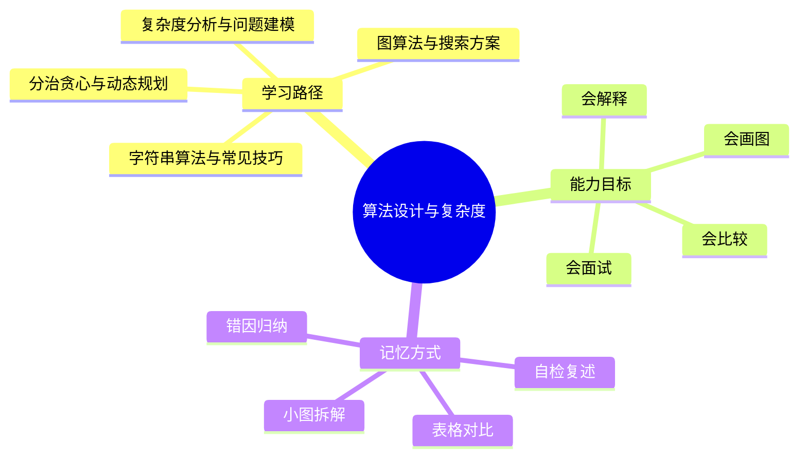
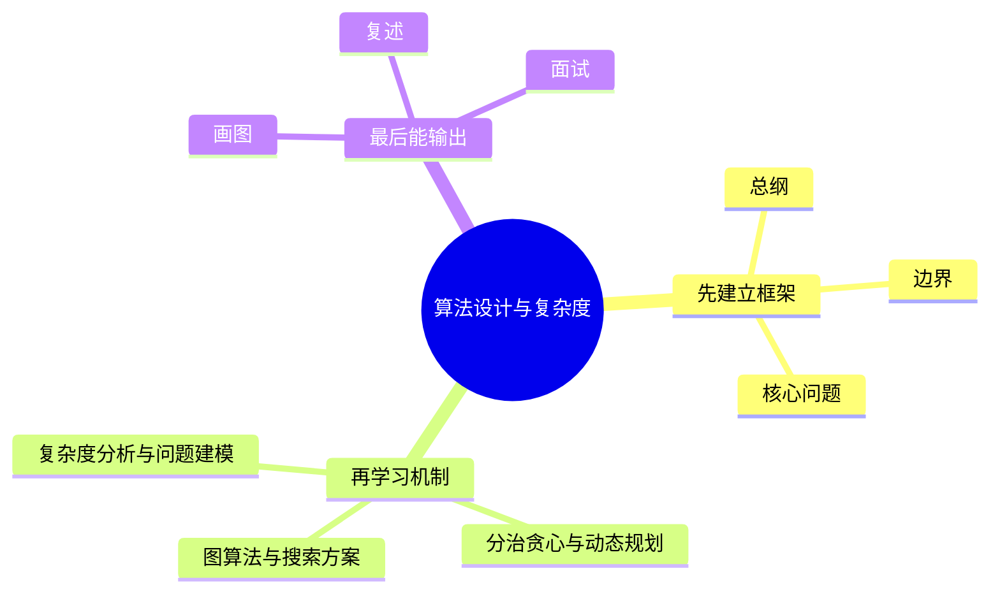

# 算法设计与复杂度学习路线与知识地图

## 学习目标
- 建立 算法设计与复杂度 的整体知识框架。
- 明确每个章节解决什么问题、需要记住什么、如何用于工程或面试。
- 用多张小图和表格降低记忆负担，避免单张巨大思维导图。

## 一句话总纲
算法学习的核心不是背模板，而是把问题建模成状态、结构、约束和代价，再选择可证明正确且复杂度可承受的方法。

## 记忆口诀
> 规模定上界，结构选范式，证明保正确，复杂度控成本。

## 思维导图

## Mermaid 图解：学习路线

## 分文件章节安排
| 顺序 | 文件 | 学习重点 | 记忆抓手 |
|---|---|---|---|
| 第 1 章 | [[01-复杂度分析与问题建模]] | 掌握渐进复杂度、递归分析、均摊分析和问题抽象方法。 | 规模、模型、递推、边界 |
| 第 2 章 | [[02-分治贪心与动态规划]] | 区分三大经典范式的适用条件，并能给出正确性证明。 | 分可合，贪可证，动可转 |
| 第 3 章 | [[03-图算法与搜索方案]] | 掌握图建模、遍历、最短路、生成树、拓扑与连通性。 | 点边权向，搜短树连 |
| 第 4 章 | [[04-字符串算法与常见技巧]] | 理解模式匹配、字典树、哈希、二分答案和扫描线等技巧。 | 前缀跳，树共享，哈希判，二分验 |
| 第 5 章 | [[05-高级思想与复杂度边界]] | 理解随机化、近似、规约、在线算法和算法工程取舍。 | 随机控期望，近似控误差，规约判难度 |
| 面试 | [[20-算法设计与复杂度面试20问]] | 高频问答、表达模板、易错点 | Q-A-图-口诀 |

## 推荐学习方法
1. 先读本路线，知道每章在全局中的位置。
2. 每章先看思维导图，再看概念解释，最后用自检题复述。
3. 面试题不要死背，按“定义 → 机制 → 适用场景 → 权衡 → 误区”回答。
4. 复杂图拆成小图，每次只记一个因果链或流程链。

## 自检题
- 你能用 1 分钟说清 算法设计与复杂度 的核心问题吗？
- 你能指出每章最容易混淆的两个概念吗？
- 你能把章节图不看原文复画出来吗？

## 速记卡片
- 总纲：算法学习的核心不是背模板，而是把问题建模成状态、结构、约束和代价，再选择可证明正确且复杂度可承受的方法。
- 口诀：规模定上界，结构选范式，证明保正确，复杂度控成本。
- 面试表达：先定义边界，再解释机制，最后讲权衡和误区。

## 深度扩展：如何把本学科学到可迁移

### 1. 学科主线
把问题抽象为规模、状态、结构和代价，再选择可证明正确且复杂度可承受的算法范式。

这意味着学习时不要把章节看成离散文件，而要形成一条稳定链路：**问题从哪里来 → 需要哪些抽象 → 底层机制如何保证结果 → 代价和风险在哪里 → 如何验证理解是否正确**。

### 2. 小思维导图：三阶段学习法

### 3. 分阶段学习重点
| 阶段 | 目标 | 学习动作 | 产出物 |
|---|---|---|---|
| 入门 | 建立全局地图 | 先读路线，再快速浏览每章思维导图 | 能说清本学科解决什么问题 |
| 理解 | 掌握机制和边界 | 对每章画流程图、列前提条件 | 能解释为什么这样设计 |
| 应用 | 做题或工程迁移 | 用案例检查概念是否能落地 | 能选择方案并说出权衡 |
| 面试 | 形成表达模板 | 按 Q-A-图-误区复述 | 能稳定回答 20 个核心问题 |

### 4. 章节之间的关系
- **第 1 层：复杂度分析与问题建模** —— 学习时要问：它承接了前一章什么问题，又为后一章提供什么工具？
- **第 2 层：分治贪心与动态规划** —— 学习时要问：它承接了前一章什么问题，又为后一章提供什么工具？
- **第 3 层：图算法与搜索方案** —— 学习时要问：它承接了前一章什么问题，又为后一章提供什么工具？
- **第 4 层：字符串算法与常见技巧** —— 学习时要问：它承接了前一章什么问题，又为后一章提供什么工具？
- **第 5 层：高级思想与复杂度边界** —— 学习时要问：它承接了前一章什么问题，又为后一章提供什么工具？

### 5. 复习闭环
- **风险提醒：** 最大风险是只背模板，不验证约束、单调性、最优子结构和复杂度上界。
- **实践抓手：** 做题时先写输入规模和目标复杂度，再判断能否排序、建图、动态规划、贪心或二分答案。
- **闭环方式：** 每学完一章，必须能完成“三件事”：复画图、讲反例、做迁移。

### 6. 总自检
1. 你能否不看目录，按依赖关系重新排列所有章节？
2. 你能否为每章说出一个工程场景或面试场景？
3. 你能否说明本学科与操作系统、网络、数据库、LLM 或后端工程的连接点？

## 综合深化：从约束到算法选择的学习闭环

算法学习的核心不是背模板，而是把题目约束翻译成可证明、可验证、可落地的解法。建议每道题都按同一条链路复盘：

### 1. 约束驱动的算法选择
| 约束信号 | 常见含义 | 优先考虑 | 警惕误区 |
|---|---|---|---|
| n≤20 | 状态空间可枚举 | 回溯、位压 DP、meet-in-the-middle | 忽略指数常数 |
| n≈10^5 | O(n log n) 通常可接受 | 排序、堆、树状数组、线性扫描 | 写成 O(n²) 双循环 |
| 图边权非负 | 最短路可用贪心扩展 | Dijkstra、0-1 BFS | 负边误用 Dijkstra |
| 有“最大最小/最小最大” | 可能存在单调判定 | 二分答案 + check | check 函数不单调 |
| 子问题重复 | 需要记忆历史状态 | 动态规划、记忆化搜索 | 状态定义含糊 |

### 2. 做题复盘模板
1. **输入输出：** 明确对象、规模、是否有重复、是否有顺序。
2. **不变量：** 写出循环、递归或贪心选择中始终成立的事实。
3. **正确性证明：** 选择归纳、交换论证、割性质、最优子结构或反证法。
4. **复杂度预算：** 先看数量级，再看常数、内存和实现风险。
5. **验证样例：** 覆盖空、单元素、重复、极值、不可达、多个最优解。

### 3. 面试表达总模板
> 我会先根据输入规模排除不可行复杂度，再把题目转成图/区间/状态/集合等模型；随后说明为什么这个转化保持答案不变，最后用复杂度、边界样例和对拍验证。

### 4. 跨章节连接
- **复杂度分析**决定“什么解法可能过”。
- **分治、贪心、DP**决定“子问题如何组织”。
- **图算法**决定“关系网络如何搜索与优化”。
- **字符串技巧**决定“模式、前缀、集合匹配如何加速”。
- **高级边界**决定“精确最优是否现实，不现实时怎样近似或随机化”。

## 专题深化：与其他学科的连接

- **本学科核心连接点：** 例如 n≈10^5 时通常不能接受 O(n^2)，n≤20 时可考虑状态压缩或搜索；图题先看边权是否非负，再决定 BFS、Dijkstra、Bellman-Ford 或 Floyd。
- **向上连接：** 可以支撑系统设计、工程实践、AI Agent 开发和面试表达。
- **向下连接：** 依赖数据结构、操作系统、计算机网络、数据库和数学基础中的概念。

### 学习产出标准
| 层次 | 能力表现 | 自检方式 |
|---|---|---|
| 记住 | 能说出核心名词 | 不看目录复述章节 |
| 理解 | 能画出机制图 | 给别人讲清流程 |
| 应用 | 能解决案例问题 | 用真实约束做方案选择 |
| 迁移 | 能跨学科解释 | 连接 OS/网络/数据库/LLM 场景 |

## 继续扩写：算法设计与复杂度学习路线深化

### 路线主线
从输入规模、结构不变量、正确性证明到复杂度边界逐层推进。

### 四步学习法
- **1.** 先写清输入规模、边权/重复/顺序等约束，再选范式
- **2.** 每个算法都用不变量或交换/归纳证明支撑
- **3.** 把最坏、均摊、期望和工程常数分开表达
- **4.** 准备一个正例、一个边界例、一个反例

### 典型应用场景
- 刷题面试中根据 n 反推复杂度预算
- 工程中为批处理、搜索、推荐重排选择近似或离线方案
- 高并发路径中评估哈希、堆、图搜索的尾延迟风险

### 常见误区纠偏
- **误区：** 把样例通过当作复杂度可行。**纠正：** 回到前提、机制、边界和验证证据重新判断。
- **误区：** 把 DFS/BFS/DP 模板套到约束已变化的问题。**纠正：** 回到前提、机制、边界和验证证据重新判断。
- **误区：** 只讨论 Big-O 不讨论内存、缓存和递归栈。**纠正：** 回到前提、机制、边界和验证证据重新判断。

### 阶段验收清单
| 阶段 | 必须能回答的问题 | 验收方式 |
|---|---|---|
| 入门 | 概念解决什么问题？ | 用一句话复述并画出最小流程图 |
| 深入 | 机制为什么成立？ | 手推一个正例和一个边界例 |
| 应用 | 什么场景适用/不适用？ | 写出选择理由和替代方案 |
| 面试 | 被追问时如何防守？ | 按“定义→机制→边界→案例→误区”回答 |
