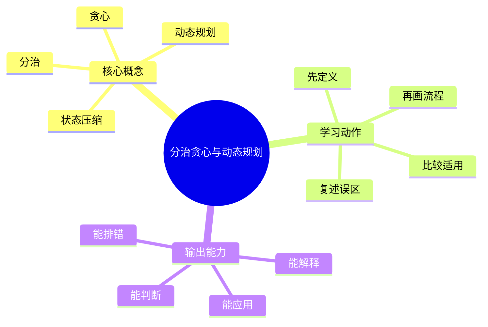
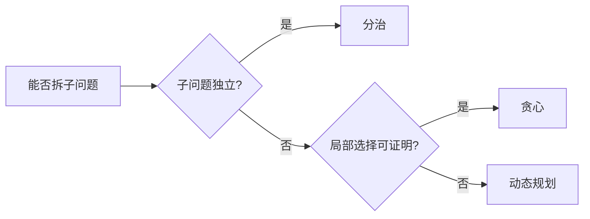

# 算法设计与复杂度：分治贪心与动态规划

## 学习目标
- 区分三大经典范式的适用条件，并能给出正确性证明。
- 能画出本章核心流程图，并能用自己的话解释每个节点。
- 能说出适用场景、边界条件和常见误区。

## 一句话总纲
分治看独立子问题，贪心看局部选择可交换，动态规划看状态重叠。

## 记忆口诀
> 分可合，贪可证，动可转

## 思维导图

## Mermaid 图解：核心流程

## 分章节讲解
### 1. 分治
**核心定义：** 分治把原问题拆成相互独立的子问题，递归求解后合并答案，如归并排序、快速排序、最近点对。

**理解路径：**
- 先明确它解决的具体问题，再判断它依赖的前提条件。
- 把它放回“分治看独立子问题，贪心看局部选择可交换，动态规划看状态重叠。”这条主线中理解，不要孤立记忆。
- 学习时至少能说出：输入是什么、输出是什么、代价是什么、失败边界是什么。

**常见误区：** 如果子问题不独立，强行分治会重复计算或丢失跨区间信息。

### 2. 贪心
**核心定义：** 贪心每一步做当前最优选择，必须证明局部最优能导向全局最优，常用交换论证或反证法。

**理解路径：**
- 先明确它解决的具体问题，再判断它依赖的前提条件。
- 把它放回“分治看独立子问题，贪心看局部选择可交换，动态规划看状态重叠。”这条主线中理解，不要孤立记忆。
- 学习时至少能说出：输入是什么、输出是什么、代价是什么、失败边界是什么。

**常见误区：** 看到“最大/最小”不等于能贪心；没有证明的贪心通常只是启发式。

### 3. 动态规划
**核心定义：** 动态规划适用于最优子结构和重叠子问题，通过状态定义、状态转移、初始化和遍历顺序求解。

**理解路径：**
- 先明确它解决的具体问题，再判断它依赖的前提条件。
- 把它放回“分治看独立子问题，贪心看局部选择可交换，动态规划看状态重叠。”这条主线中理解，不要孤立记忆。
- 学习时至少能说出：输入是什么、输出是什么、代价是什么、失败边界是什么。

**常见误区：** 状态定义不清会导致转移重复、漏算或把未来信息用于当前状态。

### 4. 状态压缩
**核心定义：** 状态压缩用滚动数组、位掩码或轮廓状态减少空间或表达集合状态。

**理解路径：**
- 先明确它解决的具体问题，再判断它依赖的前提条件。
- 把它放回“分治看独立子问题，贪心看局部选择可交换，动态规划看状态重叠。”这条主线中理解，不要孤立记忆。
- 学习时至少能说出：输入是什么、输出是什么、代价是什么、失败边界是什么。

**常见误区：** 压缩空间前必须确认转移只依赖有限历史，否则会覆盖仍需使用的状态。

## 实战深化：三类范式的证明与反例

### 1. 分治、贪心、DP 的判断路径

| 范式 | 正确性抓手 | 典型证法 | 失败信号 |
|---|---|---|---|
| 分治 | 子问题独立且可合并 | 归纳法 | 合并步骤丢信息 |
| 贪心 | 局部选择不损失全局最优 | 交换论证、割性质 | 找到局部最优反例 |
| DP | 最优子结构 + 重叠子问题 | 状态转移归纳 | 状态不能覆盖历史 |
| 状压 | 集合状态可用位表示 | 枚举子集/转移归纳 | n 太大或状态维度爆炸 |

### 2. 做题机制拆解
- **分治：** 先确定 base case，再保证每次递归规模缩小，最后证明合并结果覆盖所有答案。
- **贪心：** 先写出排序或选择规则，再证明任意最优解可交换成包含该选择的最优解。
- **DP：** 先定义状态含义，再写转移来源、初始化、遍历顺序和答案位置。
- **状态压缩：** 先确认集合元素数量小，再检查位操作是否与问题语义一致。

### 3. 反例训练
- 活动选择按“最早结束”可贪心；按“持续时间最短”可能失败。
- 0/1 背包不能用单位价值贪心保证最优，必须 DP 或搜索剪枝。
- 区间最大子段和可分治，也可用 DP；面试中要能比较两者复杂度和实现风险。

### 4. 工程/面试理解
在工程系统中，DP 常见于资源分配、排程、推荐召回组合；贪心常见于缓存淘汰、任务排序、带宽分配初版策略。但工程贪心更需要监控和回滚，因为真实目标函数可能随业务变化。

### 5. 追问路径
- 你的贪心选择如何证明？能给一个不成立的相似问题吗？
- DP 状态是否最小？能否滚动数组优化？
- 分治合并步骤是否成为复杂度瓶颈？

## 关键对比表
| 知识点 | 正确理解 | 常见误区 |
|---|---|---|
| 分治 | 分治把原问题拆成相互独立的子问题，递归求解后合并答案，如归并排序、快速排序、最近点对。 | 如果子问题不独立，强行分治会重复计算或丢失跨区间信息。 |
| 贪心 | 贪心每一步做当前最优选择，必须证明局部最优能导向全局最优，常用交换论证或反证法。 | 看到“最大/最小”不等于能贪心；没有证明的贪心通常只是启发式。 |
| 动态规划 | 动态规划适用于最优子结构和重叠子问题，通过状态定义、状态转移、初始化和遍历顺序求解。 | 状态定义不清会导致转移重复、漏算或把未来信息用于当前状态。 |
| 状态压缩 | 状态压缩用滚动数组、位掩码或轮廓状态减少空间或表达集合状态。 | 压缩空间前必须确认转移只依赖有限历史，否则会覆盖仍需使用的状态。 |

## 常见误区总结
- **分治：** 如果子问题不独立，强行分治会重复计算或丢失跨区间信息。
- **贪心：** 看到“最大/最小”不等于能贪心；没有证明的贪心通常只是启发式。
- **动态规划：** 状态定义不清会导致转移重复、漏算或把未来信息用于当前状态。
- **状态压缩：** 压缩空间前必须确认转移只依赖有限历史，否则会覆盖仍需使用的状态。

## 自检题
1. 本章的核心问题是什么？请用一句话回答：分治看独立子问题，贪心看局部选择可交换，动态规划看状态重叠。
2. 本章每个概念的适用前提分别是什么？
3. 哪个误区最容易在面试或工程实践中出现？为什么？

## 速记卡片
- 章节口诀：分可合，贪可证，动可转
- 答题结构：定义 → 机制 → 场景 → 权衡 → 误区。
- 复习动作：遮住正文，只根据思维导图复述一遍。

## 深度扩展：底层原理与应用边界

### 1. 本章在「算法设计与复杂度」中的位置
- **核心定位：** 把问题抽象为规模、状态、结构和代价，再选择可证明正确且复杂度可承受的算法范式。
- **本章作用：** 「算法设计与复杂度：分治贪心与动态规划」负责把总纲落到可操作的判断框架：先确认问题边界，再拆解机制，最后根据代价和风险选择方法。
- **主要风险：** 最大风险是只背模板，不验证约束、单调性、最优子结构和复杂度上界。
- **实践抓手：** 做题时先写输入规模和目标复杂度，再判断能否排序、建图、动态规划、贪心或二分答案。

### 2. 小流程图：从概念到应用

### 3. 概念深化：逐个击破
#### 3.1 分治
- **先问它解决什么：** 分治 不是孤立名词，而是用来解决本章某类约束、关系、代价或风险判断的问题。
- **底层机制：** 学习时要拆成“输入条件 → 中间结构 → 处理规则 → 输出结果”四步；如果任何一步说不清，说明只是记住了结论。
- **适用条件：** 当前提满足、边界清楚、代价可接受时使用；如果输入分布、规模、时序、权限或一致性假设变化，就要重新评估。
- **不适用信号：** 需要违反前提才能套用、只能靠特殊样例解释、复杂度或维护成本明显失控时，应换方案。
- **面试表达：** “我会先定义 分治，再说明它依赖的前提，最后用一个反例说明边界。”

#### 3.2 贪心
- **先问它解决什么：** 贪心 不是孤立名词，而是用来解决本章某类约束、关系、代价或风险判断的问题。
- **底层机制：** 学习时要拆成“输入条件 → 中间结构 → 处理规则 → 输出结果”四步；如果任何一步说不清，说明只是记住了结论。
- **适用条件：** 当前提满足、边界清楚、代价可接受时使用；如果输入分布、规模、时序、权限或一致性假设变化，就要重新评估。
- **不适用信号：** 需要违反前提才能套用、只能靠特殊样例解释、复杂度或维护成本明显失控时，应换方案。
- **面试表达：** “我会先定义 贪心，再说明它依赖的前提，最后用一个反例说明边界。”

#### 3.3 动态规划
- **先问它解决什么：** 动态规划 不是孤立名词，而是用来解决本章某类约束、关系、代价或风险判断的问题。
- **底层机制：** 学习时要拆成“输入条件 → 中间结构 → 处理规则 → 输出结果”四步；如果任何一步说不清，说明只是记住了结论。
- **适用条件：** 当前提满足、边界清楚、代价可接受时使用；如果输入分布、规模、时序、权限或一致性假设变化，就要重新评估。
- **不适用信号：** 需要违反前提才能套用、只能靠特殊样例解释、复杂度或维护成本明显失控时，应换方案。
- **面试表达：** “我会先定义 动态规划，再说明它依赖的前提，最后用一个反例说明边界。”

#### 3.4 状态压缩
- **先问它解决什么：** 状态压缩 不是孤立名词，而是用来解决本章某类约束、关系、代价或风险判断的问题。
- **底层机制：** 学习时要拆成“输入条件 → 中间结构 → 处理规则 → 输出结果”四步；如果任何一步说不清，说明只是记住了结论。
- **适用条件：** 当前提满足、边界清楚、代价可接受时使用；如果输入分布、规模、时序、权限或一致性假设变化，就要重新评估。
- **不适用信号：** 需要违反前提才能套用、只能靠特殊样例解释、复杂度或维护成本明显失控时，应换方案。
- **面试表达：** “我会先定义 状态压缩，再说明它依赖的前提，最后用一个反例说明边界。”

### 4. 适用边界对比表
| 判断维度 | 应该怎么想 | 典型错误 | 记忆提示 |
|---|---|---|---|
| 前提条件 | 先列出输入规模、数据分布、系统假设或业务约束 | 不看条件直接套模板 | 先问“凭什么能用” |
| 正确性 | 需要能说明为什么结果保持不变或为什么局部选择成立 | 只给经验结论 | 用不变量、反例或交换论证检查 |
| 复杂度/成本 | 同时估算时间、空间、延迟、吞吐、人力和维护成本 | 只看理论最优 | 工程里还要看常数和可观测性 |
| 失败模式 | 主动说明边界外会怎样失败 | 面试中只讲优点 | 能说失败边界才算真理解 |

### 5. 记忆强化：三层复述法
1. **概念层：** 用一句话定义本章每个核心概念。
2. **机制层：** 不看原文画出输入到输出的流程。
3. **边界层：** 为每个概念准备一个“不能这样用”的反例。

### 6. 工程/做题/面试迁移
- **工程迁移：** 做题时先写输入规模和目标复杂度，再判断能否排序、建图、动态规划、贪心或二分答案。
- **做题迁移：** 先把题目中的对象、关系、约束和目标函数圈出来，再映射到本章概念。
- **面试迁移：** 回答时不要只报名词，要说清“为什么需要它、它如何工作、它何时失效”。

### 7. 深度自检题
1. 你能否把本章概念按“前提 → 机制 → 结果 → 代价”重新组织？
2. 如果输入规模、并发量、数据分布或安全边界变化，原结论是否仍成立？
3. 本章哪个概念最容易被误用？请给出一个反例。
4. 如果让你设计一道面试题，你会怎样考察候选人是否真的理解？

### 8. 深度速记卡片
- **总抓手：** 把问题抽象为规模、状态、结构和代价，再选择可证明正确且复杂度可承受的算法范式。
- **答题模板：** 定义边界 → 拆底层机制 → 说适用条件 → 讲权衡 → 给反例。
- **复习动作：** 每次复习只看图和表，尝试口述 3 分钟；卡住处再回正文。

## 专题深化：具体机制、案例与追问

### 1. 具体案例：把「分治贪心与动态规划」放进真实问题
例如 n≈10^5 时通常不能接受 O(n^2)，n≤20 时可考虑状态压缩或搜索；图题先看边权是否非负，再决定 BFS、Dijkstra、Bellman-Ford 或 Floyd。

### 2. 本章关键机制细化
- 分治要求子问题相对独立；DP 允许重叠但必须定义状态；贪心必须证明局部选择安全。
- 贪心证明常用交换论证：把任意最优解一步步换成贪心选择且不变差。
- DP 优化前先保证状态含义、初始化和遍历顺序正确。

### 3. 概念到判断的检查清单
| 概念/动作 | 你要检查什么 | 如果检查失败会怎样 |
|---|---|---|
| 分治 | 前提、输入、输出、代价、失败边界是否都说清 | 可能套错模型、复杂度失控或得到不可验证结论 |
| 贪心 | 前提、输入、输出、代价、失败边界是否都说清 | 可能套错模型、复杂度失控或得到不可验证结论 |
| 动态规划 | 前提、输入、输出、代价、失败边界是否都说清 | 可能套错模型、复杂度失控或得到不可验证结论 |
| 状态压缩 | 前提、输入、输出、代价、失败边界是否都说清 | 可能套错模型、复杂度失控或得到不可验证结论 |
| 本章在「算法设计与复杂度」中的位置 | 前提、输入、输出、代价、失败边界是否都说清 | 可能套错模型、复杂度失控或得到不可验证结论 |

### 4. 面试追问路径

- 输入规模是否决定了算法上限？
- 是否存在可证明的不变量或最优子结构？
- 边界数据会不会击穿复杂度或正确性？

### 5. 验证与复盘
- **验证方式：** 用极小样例、边界样例、随机对拍和复杂度估算共同验证。
- **复盘方式：** 每次做题或设计后，记录“我使用了哪个前提、哪个前提最容易被破坏、如果破坏如何调整”。
- **记忆方式：** 不背孤立结论，只背“问题 → 机制 → 边界 → 验证”的链路。

## 继续扩写：机制、边界与面试追问

### 机制拆解补充
- 分治看子问题是否独立，贪心看局部选择能否交换到最优解，DP 看状态是否覆盖未来信息。
- DP 状态设计优先保证语义完整，再考虑滚动数组或位压缩；过早优化最容易写错。
- 贪心题必须准备反例搜索：改变排序键、加入负权、引入容量约束，常能暴露局部最优失效。

### 适用 / 不适用场景
| 维度 | 适用信号 | 不适用信号 | 纠偏动作 |
|---|---|---|---|
| 前提 | 关键假设可明确写出 | 只能靠经验套模板 | 先补定义、约束和反例 |
| 代价 | 时间、空间、人力成本可接受 | 复杂度或维护成本不可控 | 降维、分层或换方案 |
| 验证 | 能用样例、测试或演练证明 | 只能口头保证 | 增加边界用例和观测点 |
| 演进 | 变化范围局部可控 | 一处变化牵动多处 | 重画边界和依赖关系 |

### 工程实践案例
- **场景：** 在真实项目或面试题中遇到 `02-分治贪心与动态规划` 相关问题时，先列出输入、输出、约束、风险和验收标准。
- **做法：** 用最小可行方案跑通主链路，再补边界用例、错误处理和性能/安全验证。
- **复盘：** 如果方案失败，优先检查前提是否被破坏，而不是继续堆叠特殊判断。

### 面试追问路径
1. 这个概念依赖哪些前提？前提不成立时会发生什么？
2. 和相邻方案相比，它牺牲了什么、换来了什么？
3. 如何用最小反例证明误用会失败？
4. 工程落地时需要哪些监控、测试或回滚手段？
