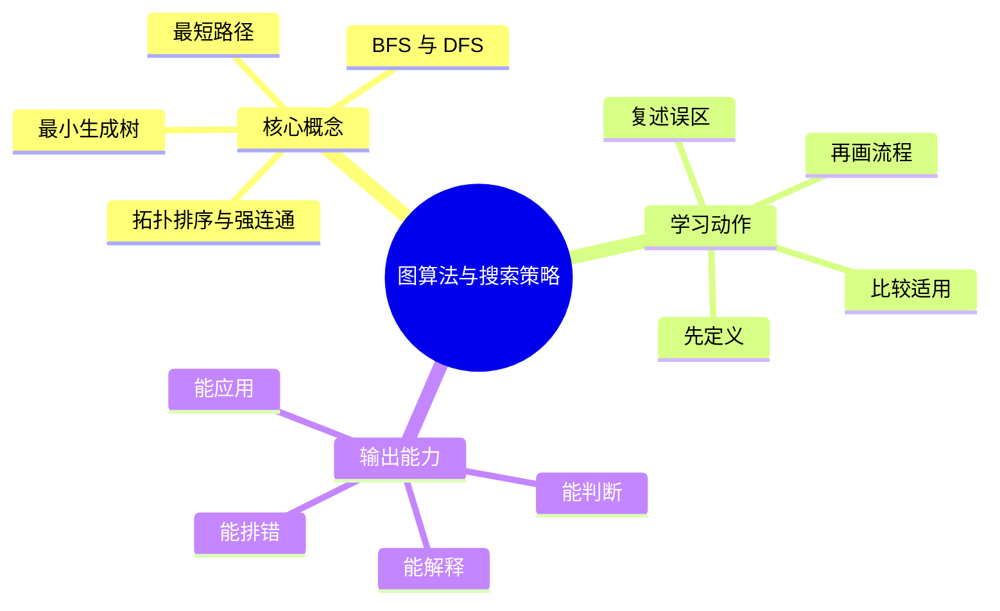

# 算法设计与复杂度：图算法与搜索策略

## 学习目标
- 掌握图建模、遍历、最短路、生成树、拓扑与连通性。
- 能画出本章核心流程图，并能用自己的话解释每个节点。
- 能说出适用场景、边界条件和常见误区。

## 一句话总纲
图算法的第一步是把实体和关系正确转成点、边、权和方向。

## 记忆口诀
> 点边权向，搜短树连

## 思维导图

## Mermaid 图解：核心流程

## 分章节讲解
### 1. BFS 与 DFS
**核心定义：** BFS 按层扩展适合无权最短路，DFS 深入递归适合连通性、拓扑、回溯和环检测。

**理解路径：**
- 先明确它解决的具体问题，再判断它依赖的前提条件。
- 把它放回“图算法的第一步是把实体和关系正确转成点、边、权和方向。”这条主线中理解，不要孤立记忆。
- 学习时至少能说出：输入是什么、输出是什么、代价是什么、失败边界是什么。

**常见误区：** 无权最短路用 DFS 容易出错；递归 DFS 还要注意栈深度。

### 2. 最短路径
**核心定义：** Dijkstra 适合非负权，Bellman-Ford 可处理负权并检测负环，Floyd 适合多源最短路且点数较小。

**理解路径：**
- 先明确它解决的具体问题，再判断它依赖的前提条件。
- 把它放回“图算法的第一步是把实体和关系正确转成点、边、权和方向。”这条主线中理解，不要孤立记忆。
- 学习时至少能说出：输入是什么、输出是什么、代价是什么、失败边界是什么。

**常见误区：** Dijkstra 不能用于含负权边的通用场景；负环会让最短路失去定义。

### 3. 最小生成树
**核心定义：** Kruskal 按边权排序配合并查集，Prim 从点集扩展；二者都依赖割性质。

**理解路径：**
- 先明确它解决的具体问题，再判断它依赖的前提条件。
- 把它放回“图算法的第一步是把实体和关系正确转成点、边、权和方向。”这条主线中理解，不要孤立记忆。
- 学习时至少能说出：输入是什么、输出是什么、代价是什么、失败边界是什么。

**常见误区：** 最小生成树只适用于无向连通图；有向图要考虑最小树形图而不是 MST。

### 4. 拓扑排序与强连通
**核心定义：** 拓扑排序用于 DAG 依赖顺序，强连通分量把有向图中互达节点压缩成 DAG。

**理解路径：**
- 先明确它解决的具体问题，再判断它依赖的前提条件。
- 把它放回“图算法的第一步是把实体和关系正确转成点、边、权和方向。”这条主线中理解，不要孤立记忆。
- 学习时至少能说出：输入是什么、输出是什么、代价是什么、失败边界是什么。

**常见误区：** 存在环时拓扑序不存在；强连通不是弱连通。

## 实战深化：图建模、搜索边界与算法选择

### 1. 图题先问五件事

| 问题信号 | 推荐方向 | 前提 | 常见误用 |
|---|---|---|---|
| 无权最短路 | BFS | 每条边成本相同 | 用 DFS 找最短 |
| 非负权最短路 | Dijkstra | 边权非负 | 忽略负边 |
| 存在负权 | Bellman-Ford/SPFA谨慎 | 需检测负环 | 把 SPFA 当稳定最优 |
| 全源最短路且 n 小 | Floyd | O(n³) 可接受 | n 大时爆炸 |
| 依赖顺序 | 拓扑排序 | 必须是 DAG | 有环还强行排序 |
| 互相可达分组 | SCC | 有向图 | 与无向连通分量混淆 |

### 2. 搜索机制拆解
- **BFS：** 队列保证按层扩展，所以第一次到达即无权最短距离。
- **DFS：** 递归栈记录探索路径，适合环检测、连通性、拓扑后序和回溯。
- **Dijkstra：** 每次确定当前最小未确定点，依赖非负边保证以后不会被更短路径推翻。
- **MST：** Kruskal 依赖“跨割最小边安全”，Prim 依赖“从已选点集向外扩展最小边安全”。

### 3. 工程案例
服务依赖图中，一个服务发布前要确认所有上游契约兼容。若依赖关系无环，可用拓扑排序生成发布顺序；若存在强连通分量，说明一组服务互相依赖，需要先拆环或整体灰度。

### 4. 边界条件
- 图可能不连通，最短路和 MST 都要说明不可达/森林情况。
- 边可能重复，自环可能存在，输入规模决定邻接表还是邻接矩阵。
- DFS 递归可能爆栈，工程实现可改为显式栈。

### 5. 面试追问路径
- 为什么 BFS 第一次到达就是最短？如果边权是 0/1 呢？
- Dijkstra 为什么不能处理负边？给一个反例。
- 拓扑排序失败时能输出什么诊断信息？

## 关键对比表
| 知识点 | 正确理解 | 常见误区 |
|---|---|---|
| BFS 与 DFS | BFS 按层扩展适合无权最短路，DFS 深入递归适合连通性、拓扑、回溯和环检测。 | 无权最短路用 DFS 容易出错；递归 DFS 还要注意栈深度。 |
| 最短路径 | Dijkstra 适合非负权，Bellman-Ford 可处理负权并检测负环，Floyd 适合多源最短路且点数较小。 | Dijkstra 不能用于含负权边的通用场景；负环会让最短路失去定义。 |
| 最小生成树 | Kruskal 按边权排序配合并查集，Prim 从点集扩展；二者都依赖割性质。 | 最小生成树只适用于无向连通图；有向图要考虑最小树形图而不是 MST。 |
| 拓扑排序与强连通 | 拓扑排序用于 DAG 依赖顺序，强连通分量把有向图中互达节点压缩成 DAG。 | 存在环时拓扑序不存在；强连通不是弱连通。 |

## 常见误区总结
- **BFS 与 DFS：** 无权最短路用 DFS 容易出错；递归 DFS 还要注意栈深度。
- **最短路径：** Dijkstra 不能用于含负权边的通用场景；负环会让最短路失去定义。
- **最小生成树：** 最小生成树只适用于无向连通图；有向图要考虑最小树形图而不是 MST。
- **拓扑排序与强连通：** 存在环时拓扑序不存在；强连通不是弱连通。

## 自检题
1. 本章的核心问题是什么？请用一句话回答：图算法的第一步是把实体和关系正确转成点、边、权和方向。
2. 本章每个概念的适用前提分别是什么？
3. 哪个误区最容易在面试或工程实践中出现？为什么？

## 速记卡片
- 章节口诀：点边权向，搜短树连
- 答题结构：定义 → 机制 → 场景 → 权衡 → 误区。
- 复习动作：遮住正文，只根据思维导图复述一遍。

## 深度扩展：底层原理与应用边界

### 1. 本章在「算法设计与复杂度」中的位置
- **核心定位：** 把问题抽象为规模、状态、结构和代价，再选择可证明正确且复杂度可承受的算法范式。
- **本章作用：** 「算法设计与复杂度：图算法与搜索策略」负责把总纲落到可操作的判断框架：先确认问题边界，再拆解机制，最后根据代价和风险选择方法。
- **主要风险：** 最大风险是只背模板，不验证约束、单调性、最优子结构和复杂度上界。
- **实践抓手：** 做题时先写输入规模和目标复杂度，再判断能否排序、建图、动态规划、贪心或二分答案。

### 2. 小流程图：从概念到应用

### 3. 概念深化：逐个击破
#### 3.1 BFS 与 DFS
- **先问它解决什么：** BFS 与 DFS 不是孤立名词，而是用来解决本章某类约束、关系、代价或风险判断的问题。
- **底层机制：** 学习时要拆成“输入条件 → 中间结构 → 处理规则 → 输出结果”四步；如果任何一步说不清，说明只是记住了结论。
- **适用条件：** 当前提满足、边界清楚、代价可接受时使用；如果输入分布、规模、时序、权限或一致性假设变化，就要重新评估。
- **不适用信号：** 需要违反前提才能套用、只能靠特殊样例解释、复杂度或维护成本明显失控时，应换方案。
- **面试表达：** “我会先定义 BFS 与 DFS，再说明它依赖的前提，最后用一个反例说明边界。”

#### 3.2 最短路径
- **先问它解决什么：** 最短路径 不是孤立名词，而是用来解决本章某类约束、关系、代价或风险判断的问题。
- **底层机制：** 学习时要拆成“输入条件 → 中间结构 → 处理规则 → 输出结果”四步；如果任何一步说不清，说明只是记住了结论。
- **适用条件：** 当前提满足、边界清楚、代价可接受时使用；如果输入分布、规模、时序、权限或一致性假设变化，就要重新评估。
- **不适用信号：** 需要违反前提才能套用、只能靠特殊样例解释、复杂度或维护成本明显失控时，应换方案。
- **面试表达：** “我会先定义 最短路径，再说明它依赖的前提，最后用一个反例说明边界。”

#### 3.3 最小生成树
- **先问它解决什么：** 最小生成树 不是孤立名词，而是用来解决本章某类约束、关系、代价或风险判断的问题。
- **底层机制：** 学习时要拆成“输入条件 → 中间结构 → 处理规则 → 输出结果”四步；如果任何一步说不清，说明只是记住了结论。
- **适用条件：** 当前提满足、边界清楚、代价可接受时使用；如果输入分布、规模、时序、权限或一致性假设变化，就要重新评估。
- **不适用信号：** 需要违反前提才能套用、只能靠特殊样例解释、复杂度或维护成本明显失控时，应换方案。
- **面试表达：** “我会先定义 最小生成树，再说明它依赖的前提，最后用一个反例说明边界。”

#### 3.4 拓扑排序与强连通
- **先问它解决什么：** 拓扑排序与强连通 不是孤立名词，而是用来解决本章某类约束、关系、代价或风险判断的问题。
- **底层机制：** 学习时要拆成“输入条件 → 中间结构 → 处理规则 → 输出结果”四步；如果任何一步说不清，说明只是记住了结论。
- **适用条件：** 当前提满足、边界清楚、代价可接受时使用；如果输入分布、规模、时序、权限或一致性假设变化，就要重新评估。
- **不适用信号：** 需要违反前提才能套用、只能靠特殊样例解释、复杂度或维护成本明显失控时，应换方案。
- **面试表达：** “我会先定义 拓扑排序与强连通，再说明它依赖的前提，最后用一个反例说明边界。”

### 4. 适用边界对比表
| 判断维度 | 应该怎么想 | 典型错误 | 记忆提示 |
|---|---|---|---|
| 前提条件 | 先列出输入规模、数据分布、系统假设或业务约束 | 不看条件直接套模板 | 先问“凭什么能用” |
| 正确性 | 需要能说明为什么结果保持不变或为什么局部选择成立 | 只给经验结论 | 用不变量、反例或交换论证检查 |
| 复杂度/成本 | 同时估算时间、空间、延迟、吞吐、人力和维护成本 | 只看理论最优 | 工程里还要看常数和可观测性 |
| 失败模式 | 主动说明边界外会怎样失败 | 面试中只讲优点 | 能说失败边界才算真理解 |

### 5. 记忆强化：三层复述法
1. **概念层：** 用一句话定义本章每个核心概念。
2. **机制层：** 不看原文画出输入到输出的流程。
3. **边界层：** 为每个概念准备一个“不能这样用”的反例。

### 6. 工程/做题/面试迁移
- **工程迁移：** 做题时先写输入规模和目标复杂度，再判断能否排序、建图、动态规划、贪心或二分答案。
- **做题迁移：** 先把题目中的对象、关系、约束和目标函数圈出来，再映射到本章概念。
- **面试迁移：** 回答时不要只报名词，要说清“为什么需要它、它如何工作、它何时失效”。

### 7. 深度自检题
1. 你能否把本章概念按“前提 → 机制 → 结果 → 代价”重新组织？
2. 如果输入规模、并发量、数据分布或安全边界变化，原结论是否仍成立？
3. 本章哪个概念最容易被误用？请给出一个反例。
4. 如果让你设计一道面试题，你会怎样考察候选人是否真的理解？

### 8. 深度速记卡片
- **总抓手：** 把问题抽象为规模、状态、结构和代价，再选择可证明正确且复杂度可承受的算法范式。
- **答题模板：** 定义边界 → 拆底层机制 → 说适用条件 → 讲权衡 → 给反例。
- **复习动作：** 每次复习只看图和表，尝试口述 3 分钟；卡住处再回正文。

## 专题深化：具体机制、案例与追问

### 1. 具体案例：把「图算法与搜索策略」放进真实问题
例如 n≈10^5 时通常不能接受 O(n^2)，n≤20 时可考虑状态压缩或搜索；图题先看边权是否非负，再决定 BFS、Dijkstra、Bellman-Ford 或 Floyd。

### 2. 本章关键机制细化
- BFS 的队列层序是不变量，适合无权最短路和最少步数问题。
- DFS 的递归栈是不变量，适合连通性、环检测、回溯枚举和拓扑后序。
- 最短路算法必须先检查边权、源点数量和负环风险。
- 最小生成树解决连通无向图的低成本连接，不等于最短路径树。

### 3. 概念到判断的检查清单
| 概念/动作 | 你要检查什么 | 如果检查失败会怎样 |
|---|---|---|
| BFS 与 DFS | 前提、输入、输出、代价、失败边界是否都说清 | 可能套错模型、复杂度失控或得到不可验证结论 |
| 最短路径 | 前提、输入、输出、代价、失败边界是否都说清 | 可能套错模型、复杂度失控或得到不可验证结论 |
| 最小生成树 | 前提、输入、输出、代价、失败边界是否都说清 | 可能套错模型、复杂度失控或得到不可验证结论 |
| 拓扑排序与强连通 | 前提、输入、输出、代价、失败边界是否都说清 | 可能套错模型、复杂度失控或得到不可验证结论 |
| 本章在「算法设计与复杂度」中的位置 | 前提、输入、输出、代价、失败边界是否都说清 | 可能套错模型、复杂度失控或得到不可验证结论 |

### 4. 面试追问路径

- 输入规模是否决定了算法上限？
- 是否存在可证明的不变量或最优子结构？
- 边界数据会不会击穿复杂度或正确性？

### 5. 验证与复盘
- **验证方式：** 用极小样例、边界样例、随机对拍和复杂度估算共同验证。
- **复盘方式：** 每次做题或设计后，记录“我使用了哪个前提、哪个前提最容易被破坏、如果破坏如何调整”。
- **记忆方式：** 不背孤立结论，只背“问题 → 机制 → 边界 → 验证”的链路。

## 继续扩写：机制、边界与面试追问

### 机制拆解补充
- 图题先确认有向/无向、权重正负、是否多源、是否动态图；这些条件直接决定 BFS、Dijkstra、Bellman-Ford 或拓扑 DP。
- 访问标记不是细节，而是不变量：白灰黑三色分别表达未访问、搜索中、已完成。
- 工程图搜索要关注内存峰值、队列膨胀、不可达节点和输入中重复边的处理。

### 适用 / 不适用场景
| 维度 | 适用信号 | 不适用信号 | 纠偏动作 |
|---|---|---|---|
| 前提 | 关键假设可明确写出 | 只能靠经验套模板 | 先补定义、约束和反例 |
| 代价 | 时间、空间、人力成本可接受 | 复杂度或维护成本不可控 | 降维、分层或换方案 |
| 验证 | 能用样例、测试或演练证明 | 只能口头保证 | 增加边界用例和观测点 |
| 演进 | 变化范围局部可控 | 一处变化牵动多处 | 重画边界和依赖关系 |

### 工程实践案例
- **场景：** 在真实项目或面试题中遇到 `03-图算法与搜索策略` 相关问题时，先列出输入、输出、约束、风险和验收标准。
- **做法：** 用最小可行方案跑通主链路，再补边界用例、错误处理和性能/安全验证。
- **复盘：** 如果方案失败，优先检查前提是否被破坏，而不是继续堆叠特殊判断。

### 面试追问路径
1. 这个概念依赖哪些前提？前提不成立时会发生什么？
2. 和相邻方案相比，它牺牲了什么、换来了什么？
3. 如何用最小反例证明误用会失败？
4. 工程落地时需要哪些监控、测试或回滚手段？
