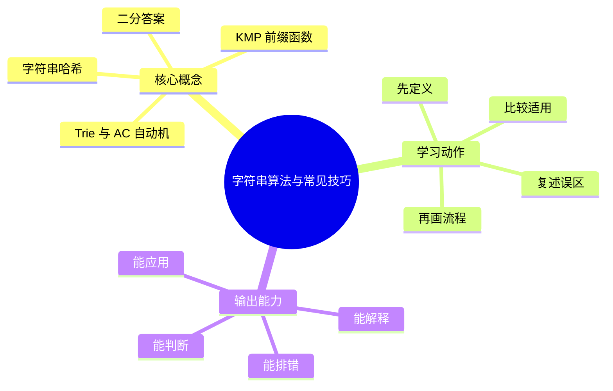
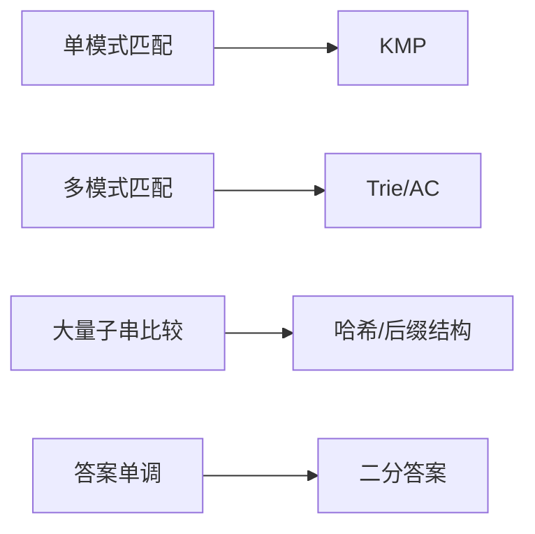

# 算法设计与复杂度：字符串算法与常见技巧

## 学习目标
- 理解模式匹配、字典树、哈希、二分答案和扫描线等技巧。
- 能画出本章核心流程图，并能用自己的话解释每个节点。
- 能说出适用场景、边界条件和常见误区。

## 一句话总纲
字符串题常把比较成本转化为预处理后的状态跳转或哈希查询。

## 记忆口诀
> 前缀跳，树共享，哈希判，二分验

## 思维导图

## Mermaid 图解：核心流程

## 分章节讲解
### 1. KMP 前缀函数
**核心定义：** KMP 利用前缀函数在失配时跳转到最长可复用前后缀，实现 O(n+m) 模式匹配。

**理解路径：**
- 先明确它解决的具体问题，再判断它依赖的前提条件。
- 把它放回“字符串题常把比较成本转化为预处理后的状态跳转或哈希查询。”这条主线中理解，不要孤立记忆。
- 学习时至少能说出：输入是什么、输出是什么、代价是什么、失败边界是什么。

**常见误区：** next 数组含义不清会造成下标错误；KMP 不是记忆模板而是复用已匹配信息。

### 2. Trie 与 AC 自动机
**核心定义：** Trie 共享字符串前缀，AC 自动机在 Trie 上加入失败指针，可同时匹配多个模式串。

**理解路径：**
- 先明确它解决的具体问题，再判断它依赖的前提条件。
- 把它放回“字符串题常把比较成本转化为预处理后的状态跳转或哈希查询。”这条主线中理解，不要孤立记忆。
- 学习时至少能说出：输入是什么、输出是什么、代价是什么、失败边界是什么。

**常见误区：** 字符集很大时 Trie 空间可能爆炸；AC 自动机的失败边和输出链要处理完整。

### 3. 字符串哈希
**核心定义：** 字符串哈希把子串比较转化为数值比较，常配合前缀哈希实现 O(1) 子串查询。

**理解路径：**
- 先明确它解决的具体问题，再判断它依赖的前提条件。
- 把它放回“字符串题常把比较成本转化为预处理后的状态跳转或哈希查询。”这条主线中理解，不要孤立记忆。
- 学习时至少能说出：输入是什么、输出是什么、代价是什么、失败边界是什么。

**常见误区：** 哈希存在碰撞；关键场景要用双哈希或最终校验。

### 4. 二分答案
**核心定义：** 当答案具有单调可判定性时，可二分答案范围并设计 check 函数验证可行性。

**理解路径：**
- 先明确它解决的具体问题，再判断它依赖的前提条件。
- 把它放回“字符串题常把比较成本转化为预处理后的状态跳转或哈希查询。”这条主线中理解，不要孤立记忆。
- 学习时至少能说出：输入是什么、输出是什么、代价是什么、失败边界是什么。

**常见误区：** 没有单调性不能二分；check 的复杂度决定整体复杂度。

## 实战深化：字符串模式、自动机与判定技巧

### 1. 字符串题的选择路线

| 技巧 | 解决什么 | 关键机制 | 风险 |
|---|---|---|---|
| KMP | 单模式串匹配 | 复用最长相等前后缀 | 前缀函数含义混乱 |
| Trie | 前缀检索 | 共享前缀路径 | 字符集大导致空间高 |
| AC 自动机 | 多模式匹配 | Trie + fail 指针 | 输出链和重叠匹配遗漏 |
| 字符串哈希 | 快速子串比较 | 前缀哈希差分 | 哈希碰撞 |
| 二分答案 | 最大最小类答案 | 单调 check | 判定函数不单调 |

### 2. 底层机制拆解
- **KMP：** 失配时不回退文本指针，而是用前缀函数移动模式串。
- **AC 自动机：** fail 指针表示当前匹配失败后可复用的最长后缀状态。
- **哈希：** 把子串映射为数值，工程上常用双哈希或最终字符串复核降低碰撞风险。
- **二分答案：** 难点不在二分模板，而在证明“可行/不可行”随答案单调变化。

### 3. 案例：敏感词过滤
敏感词过滤适合 Trie/AC 自动机：构建词库 Trie，再补 fail 指针，扫描文本时同时识别多个模式。若需要支持动态增删词库，要考虑重建成本、分片词库或增量结构；若涉及安全合规，不能只依赖算法匹配，还要结合归一化、大小写、繁简转换和混淆字符处理。

### 4. 常见误区与纠正
- **误区：** KMP 只能背模板。**纠正：** 面试要解释“为什么文本指针不回退”。
- **误区：** 哈希相等就是字符串相等。**纠正：** 哈希有碰撞概率，关键场景要复核。
- **误区：** 二分答案只要会写 while。**纠正：** 单调性证明和边界收缩才是核心。

### 5. 追问路径
- 前缀函数 `pi[i]` 的语义是什么？失配时跳到哪里？
- AC 自动机如何处理一个位置匹配多个模式？
- 二分 check 的时间复杂度是多少，总复杂度如何计算？

## 关键对比表
| 知识点 | 正确理解 | 常见误区 |
|---|---|---|
| KMP 前缀函数 | KMP 利用前缀函数在失配时跳转到最长可复用前后缀，实现 O(n+m) 模式匹配。 | next 数组含义不清会造成下标错误；KMP 不是记忆模板而是复用已匹配信息。 |
| Trie 与 AC 自动机 | Trie 共享字符串前缀，AC 自动机在 Trie 上加入失败指针，可同时匹配多个模式串。 | 字符集很大时 Trie 空间可能爆炸；AC 自动机的失败边和输出链要处理完整。 |
| 字符串哈希 | 字符串哈希把子串比较转化为数值比较，常配合前缀哈希实现 O(1) 子串查询。 | 哈希存在碰撞；关键场景要用双哈希或最终校验。 |
| 二分答案 | 当答案具有单调可判定性时，可二分答案范围并设计 check 函数验证可行性。 | 没有单调性不能二分；check 的复杂度决定整体复杂度。 |

## 常见误区总结
- **KMP 前缀函数：** next 数组含义不清会造成下标错误；KMP 不是记忆模板而是复用已匹配信息。
- **Trie 与 AC 自动机：** 字符集很大时 Trie 空间可能爆炸；AC 自动机的失败边和输出链要处理完整。
- **字符串哈希：** 哈希存在碰撞；关键场景要用双哈希或最终校验。
- **二分答案：** 没有单调性不能二分；check 的复杂度决定整体复杂度。

## 自检题
1. 本章的核心问题是什么？请用一句话回答：字符串题常把比较成本转化为预处理后的状态跳转或哈希查询。
2. 本章每个概念的适用前提分别是什么？
3. 哪个误区最容易在面试或工程实践中出现？为什么？

## 速记卡片
- 章节口诀：前缀跳，树共享，哈希判，二分验
- 答题结构：定义 → 机制 → 场景 → 权衡 → 误区。
- 复习动作：遮住正文，只根据思维导图复述一遍。

## 深度扩展：底层原理与应用边界

### 1. 本章在「算法设计与复杂度」中的位置
- **核心定位：** 把问题抽象为规模、状态、结构和代价，再选择可证明正确且复杂度可承受的算法范式。
- **本章作用：** 「算法设计与复杂度：字符串算法与常见技巧」负责把总纲落到可操作的判断框架：先确认问题边界，再拆解机制，最后根据代价和风险选择方法。
- **主要风险：** 最大风险是只背模板，不验证约束、单调性、最优子结构和复杂度上界。
- **实践抓手：** 做题时先写输入规模和目标复杂度，再判断能否排序、建图、动态规划、贪心或二分答案。

### 2. 小流程图：从概念到应用

### 3. 概念深化：逐个击破
#### 3.1 KMP 前缀函数
- **先问它解决什么：** KMP 前缀函数 不是孤立名词，而是用来解决本章某类约束、关系、代价或风险判断的问题。
- **底层机制：** 学习时要拆成“输入条件 → 中间结构 → 处理规则 → 输出结果”四步；如果任何一步说不清，说明只是记住了结论。
- **适用条件：** 当前提满足、边界清楚、代价可接受时使用；如果输入分布、规模、时序、权限或一致性假设变化，就要重新评估。
- **不适用信号：** 需要违反前提才能套用、只能靠特殊样例解释、复杂度或维护成本明显失控时，应换方案。
- **面试表达：** “我会先定义 KMP 前缀函数，再说明它依赖的前提，最后用一个反例说明边界。”

#### 3.2 Trie 与 AC 自动机
- **先问它解决什么：** Trie 与 AC 自动机 不是孤立名词，而是用来解决本章某类约束、关系、代价或风险判断的问题。
- **底层机制：** 学习时要拆成“输入条件 → 中间结构 → 处理规则 → 输出结果”四步；如果任何一步说不清，说明只是记住了结论。
- **适用条件：** 当前提满足、边界清楚、代价可接受时使用；如果输入分布、规模、时序、权限或一致性假设变化，就要重新评估。
- **不适用信号：** 需要违反前提才能套用、只能靠特殊样例解释、复杂度或维护成本明显失控时，应换方案。
- **面试表达：** “我会先定义 Trie 与 AC 自动机，再说明它依赖的前提，最后用一个反例说明边界。”

#### 3.3 字符串哈希
- **先问它解决什么：** 字符串哈希 不是孤立名词，而是用来解决本章某类约束、关系、代价或风险判断的问题。
- **底层机制：** 学习时要拆成“输入条件 → 中间结构 → 处理规则 → 输出结果”四步；如果任何一步说不清，说明只是记住了结论。
- **适用条件：** 当前提满足、边界清楚、代价可接受时使用；如果输入分布、规模、时序、权限或一致性假设变化，就要重新评估。
- **不适用信号：** 需要违反前提才能套用、只能靠特殊样例解释、复杂度或维护成本明显失控时，应换方案。
- **面试表达：** “我会先定义 字符串哈希，再说明它依赖的前提，最后用一个反例说明边界。”

#### 3.4 二分答案
- **先问它解决什么：** 二分答案 不是孤立名词，而是用来解决本章某类约束、关系、代价或风险判断的问题。
- **底层机制：** 学习时要拆成“输入条件 → 中间结构 → 处理规则 → 输出结果”四步；如果任何一步说不清，说明只是记住了结论。
- **适用条件：** 当前提满足、边界清楚、代价可接受时使用；如果输入分布、规模、时序、权限或一致性假设变化，就要重新评估。
- **不适用信号：** 需要违反前提才能套用、只能靠特殊样例解释、复杂度或维护成本明显失控时，应换方案。
- **面试表达：** “我会先定义 二分答案，再说明它依赖的前提，最后用一个反例说明边界。”

### 4. 适用边界对比表
| 判断维度 | 应该怎么想 | 典型错误 | 记忆提示 |
|---|---|---|---|
| 前提条件 | 先列出输入规模、数据分布、系统假设或业务约束 | 不看条件直接套模板 | 先问“凭什么能用” |
| 正确性 | 需要能说明为什么结果保持不变或为什么局部选择成立 | 只给经验结论 | 用不变量、反例或交换论证检查 |
| 复杂度/成本 | 同时估算时间、空间、延迟、吞吐、人力和维护成本 | 只看理论最优 | 工程里还要看常数和可观测性 |
| 失败模式 | 主动说明边界外会怎样失败 | 面试中只讲优点 | 能说失败边界才算真理解 |

### 5. 记忆强化：三层复述法
1. **概念层：** 用一句话定义本章每个核心概念。
2. **机制层：** 不看原文画出输入到输出的流程。
3. **边界层：** 为每个概念准备一个“不能这样用”的反例。

### 6. 工程/做题/面试迁移
- **工程迁移：** 做题时先写输入规模和目标复杂度，再判断能否排序、建图、动态规划、贪心或二分答案。
- **做题迁移：** 先把题目中的对象、关系、约束和目标函数圈出来，再映射到本章概念。
- **面试迁移：** 回答时不要只报名词，要说清“为什么需要它、它如何工作、它何时失效”。

### 7. 深度自检题
1. 你能否把本章概念按“前提 → 机制 → 结果 → 代价”重新组织？
2. 如果输入规模、并发量、数据分布或安全边界变化，原结论是否仍成立？
3. 本章哪个概念最容易被误用？请给出一个反例。
4. 如果让你设计一道面试题，你会怎样考察候选人是否真的理解？

### 8. 深度速记卡片
- **总抓手：** 把问题抽象为规模、状态、结构和代价，再选择可证明正确且复杂度可承受的算法范式。
- **答题模板：** 定义边界 → 拆底层机制 → 说适用条件 → 讲权衡 → 给反例。
- **复习动作：** 每次复习只看图和表，尝试口述 3 分钟；卡住处再回正文。

## 专题深化：具体机制、案例与追问

### 1. 具体案例：把「字符串算法与常见技巧」放进真实问题
例如 n≈10^5 时通常不能接受 O(n^2)，n≤20 时可考虑状态压缩或搜索；图题先看边权是否非负，再决定 BFS、Dijkstra、Bellman-Ford 或 Floyd。

### 2. 本章关键机制细化
- KMP 的本质是复用已经匹配的前缀信息，失败时不是回到起点。
- Trie 用空间换前缀共享，AC 自动机再加失败指针处理多模式匹配。
- 字符串哈希是概率工具，重要场景要双哈希或最终字符校验。

### 3. 概念到判断的检查清单
| 概念/动作 | 你要检查什么 | 如果检查失败会怎样 |
|---|---|---|
| KMP 前缀函数 | 前提、输入、输出、代价、失败边界是否都说清 | 可能套错模型、复杂度失控或得到不可验证结论 |
| Trie 与 AC 自动机 | 前提、输入、输出、代价、失败边界是否都说清 | 可能套错模型、复杂度失控或得到不可验证结论 |
| 字符串哈希 | 前提、输入、输出、代价、失败边界是否都说清 | 可能套错模型、复杂度失控或得到不可验证结论 |
| 二分答案 | 前提、输入、输出、代价、失败边界是否都说清 | 可能套错模型、复杂度失控或得到不可验证结论 |
| 本章在「算法设计与复杂度」中的位置 | 前提、输入、输出、代价、失败边界是否都说清 | 可能套错模型、复杂度失控或得到不可验证结论 |

### 4. 面试追问路径

- 输入规模是否决定了算法上限？
- 是否存在可证明的不变量或最优子结构？
- 边界数据会不会击穿复杂度或正确性？

### 5. 验证与复盘
- **验证方式：** 用极小样例、边界样例、随机对拍和复杂度估算共同验证。
- **复盘方式：** 每次做题或设计后，记录“我使用了哪个前提、哪个前提最容易被破坏、如果破坏如何调整”。
- **记忆方式：** 不背孤立结论，只背“问题 → 机制 → 边界 → 验证”的链路。

## 继续扩写：机制、边界与面试追问

### 机制拆解补充
- 字符串题要分清比较、匹配、字典序、前缀结构和自动机状态，不能把所有问题都当滑动窗口。
- KMP、Trie、哈希、后缀数组各自对应不同代价模型：预处理成本、查询次数和碰撞风险要一起评估。
- Unicode、大小写归一化、分词边界和流式输入是工程场景中最常被忽略的字符串边界。

### 适用 / 不适用场景
| 维度 | 适用信号 | 不适用信号 | 纠偏动作 |
|---|---|---|---|
| 前提 | 关键假设可明确写出 | 只能靠经验套模板 | 先补定义、约束和反例 |
| 代价 | 时间、空间、人力成本可接受 | 复杂度或维护成本不可控 | 降维、分层或换方案 |
| 验证 | 能用样例、测试或演练证明 | 只能口头保证 | 增加边界用例和观测点 |
| 演进 | 变化范围局部可控 | 一处变化牵动多处 | 重画边界和依赖关系 |

### 工程实践案例
- **场景：** 在真实项目或面试题中遇到 `04-字符串算法与常见技巧` 相关问题时，先列出输入、输出、约束、风险和验收标准。
- **做法：** 用最小可行方案跑通主链路，再补边界用例、错误处理和性能/安全验证。
- **复盘：** 如果方案失败，优先检查前提是否被破坏，而不是继续堆叠特殊判断。

### 面试追问路径
1. 这个概念依赖哪些前提？前提不成立时会发生什么？
2. 和相邻方案相比，它牺牲了什么、换来了什么？
3. 如何用最小反例证明误用会失败？
4. 工程落地时需要哪些监控、测试或回滚手段？
