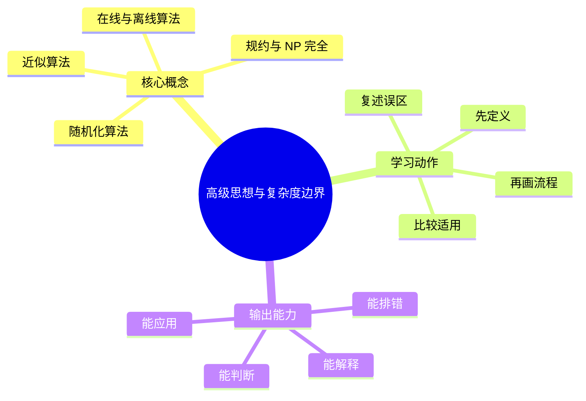
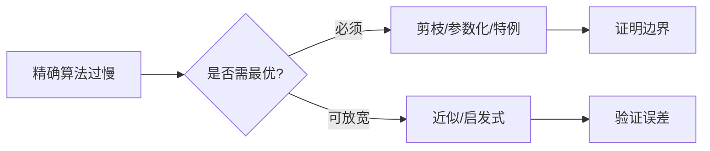

# 算法设计与复杂度：高级思想与复杂度边界

## 学习目标
- 理解随机化、近似、规约、在线算法和算法工程取舍。
- 能画出本章核心流程图，并能用自己的话解释每个节点。
- 能说出适用场景、边界条件和常见误区。

## 一句话总纲
高级算法强调在不可精确或不可多项式求解时管理概率、误差和边界。

## 记忆口诀
> 随机控期望，近似控误差，规约判难度

## 思维导图

## Mermaid 图解：核心流程

## 分章节讲解
### 1. 随机化算法
**核心定义：** 随机化通过随机选择降低期望复杂度或避免最坏输入，如随机快速排序、随机哈希。

**理解路径：**
- 先明确它解决的具体问题，再判断它依赖的前提条件。
- 把它放回“高级算法强调在不可精确或不可多项式求解时管理概率、误差和边界。”这条主线中理解，不要孤立记忆。
- 学习时至少能说出：输入是什么、输出是什么、代价是什么、失败边界是什么。

**常见误区：** 期望复杂度不是确定上界；对抗性输入下要关注随机源和失败概率。

### 2. 近似算法
**核心定义：** 近似算法在 NP-hard 等难问题上追求可证明的近似比，而不是精确最优解。

**理解路径：**
- 先明确它解决的具体问题，再判断它依赖的前提条件。
- 把它放回“高级算法强调在不可精确或不可多项式求解时管理概率、误差和边界。”这条主线中理解，不要孤立记忆。
- 学习时至少能说出：输入是什么、输出是什么、代价是什么、失败边界是什么。

**常见误区：** 启发式不等于近似算法；没有近似比证明就不能宣称有理论保证。

### 3. 规约与 NP 完全
**核心定义：** 规约用已知难问题转化证明新问题至少同样难；NP 完全问题既在 NP 中又 NP-hard。

**理解路径：**
- 先明确它解决的具体问题，再判断它依赖的前提条件。
- 把它放回“高级算法强调在不可精确或不可多项式求解时管理概率、误差和边界。”这条主线中理解，不要孤立记忆。
- 学习时至少能说出：输入是什么、输出是什么、代价是什么、失败边界是什么。

**常见误区：** NP-hard 不要求属于 NP；不能把“目前不会解”当成 NP-hard 证明。

### 4. 在线与离线算法
**核心定义：** 在线算法边接收输入边决策，离线算法可看到全部输入；二者可用竞争比或全局排序技巧分析。

**理解路径：**
- 先明确它解决的具体问题，再判断它依赖的前提条件。
- 把它放回“高级算法强调在不可精确或不可多项式求解时管理概率、误差和边界。”这条主线中理解，不要孤立记忆。
- 学习时至少能说出：输入是什么、输出是什么、代价是什么、失败边界是什么。

**常见误区：** 在线场景不能使用未来信息；把离线最优方案搬到在线系统会失效。

## 实战深化：当精确最优不可承受时怎么办

### 1. 决策路线

| 方法 | 适用场景 | 需要说明 | 不适用信号 |
|---|---|---|---|
| 随机化 | 避免坏输入、降低期望成本 | 失败概率、随机种子、重复性 | 强确定性审计要求 |
| 近似算法 | 最优解太贵但可接受误差 | 近似比或经验误差 | 误差不可解释 |
| 规约/NP 完全 | 判断问题难度边界 | 多项式转化和等价性 | 把“不会做”当 NP-hard |
| 在线算法 | 输入逐步到达 | 竞争比、延迟约束 | 可离线全局优化却不用 |

### 2. 底层原理
- **随机化**把“对抗性输入”转成“期望表现”，但要管理可复现实验和极端失败概率。
- **近似**放弃精确最优，换取可证明的上界或可解释误差。
- **规约**不是求解算法，而是证明难度和选择工程策略的依据。
- **在线算法**在信息不完整时决策，评价标准不能只看最终最优值，还要看竞争比和响应时延。

### 3. 工程案例
路径规划、广告投放、排班、装箱和推荐重排常常无法在生产约束内求精确最优。工程上会组合贪心初解、局部搜索、随机扰动、约束剪枝和离线评估；上线后用 A/B 实验、成本上限和异常回滚保护业务。

### 4. 常见误区
- **误区：** 随机化就是不可靠。**纠正：** 可用固定种子、重复试验和概率界控制风险。
- **误区：** 近似算法等于随便凑答案。**纠正：** 近似算法应说明误差界或业务可接受范围。
- **误区：** NP 完全说明问题无解。**纠正：** 只能说明一般情形难，特定规模和特定结构仍可能可解。

### 5. 面试追问路径
- 如果精确最优不可行，你如何给出可接受方案？
- 你的随机算法如何复现线上问题？
- 如何向业务解释近似误差和最坏情况？

## 关键对比表
| 知识点 | 正确理解 | 常见误区 |
|---|---|---|
| 随机化算法 | 随机化通过随机选择降低期望复杂度或避免最坏输入，如随机快速排序、随机哈希。 | 期望复杂度不是确定上界；对抗性输入下要关注随机源和失败概率。 |
| 近似算法 | 近似算法在 NP-hard 等难问题上追求可证明的近似比，而不是精确最优解。 | 启发式不等于近似算法；没有近似比证明就不能宣称有理论保证。 |
| 规约与 NP 完全 | 规约用已知难问题转化证明新问题至少同样难；NP 完全问题既在 NP 中又 NP-hard。 | NP-hard 不要求属于 NP；不能把“目前不会解”当成 NP-hard 证明。 |
| 在线与离线算法 | 在线算法边接收输入边决策，离线算法可看到全部输入；二者可用竞争比或全局排序技巧分析。 | 在线场景不能使用未来信息；把离线最优方案搬到在线系统会失效。 |

## 常见误区总结
- **随机化算法：** 期望复杂度不是确定上界；对抗性输入下要关注随机源和失败概率。
- **近似算法：** 启发式不等于近似算法；没有近似比证明就不能宣称有理论保证。
- **规约与 NP 完全：** NP-hard 不要求属于 NP；不能把“目前不会解”当成 NP-hard 证明。
- **在线与离线算法：** 在线场景不能使用未来信息；把离线最优方案搬到在线系统会失效。

## 自检题
1. 本章的核心问题是什么？请用一句话回答：高级算法强调在不可精确或不可多项式求解时管理概率、误差和边界。
2. 本章每个概念的适用前提分别是什么？
3. 哪个误区最容易在面试或工程实践中出现？为什么？

## 速记卡片
- 章节口诀：随机控期望，近似控误差，规约判难度
- 答题结构：定义 → 机制 → 场景 → 权衡 → 误区。
- 复习动作：遮住正文，只根据思维导图复述一遍。

## 深度扩展：底层原理与应用边界

### 1. 本章在「算法设计与复杂度」中的位置
- **核心定位：** 把问题抽象为规模、状态、结构和代价，再选择可证明正确且复杂度可承受的算法范式。
- **本章作用：** 「算法设计与复杂度：高级思想与复杂度边界」负责把总纲落到可操作的判断框架：先确认问题边界，再拆解机制，最后根据代价和风险选择方法。
- **主要风险：** 最大风险是只背模板，不验证约束、单调性、最优子结构和复杂度上界。
- **实践抓手：** 做题时先写输入规模和目标复杂度，再判断能否排序、建图、动态规划、贪心或二分答案。

### 2. 小流程图：从概念到应用

### 3. 概念深化：逐个击破
#### 3.1 随机化算法
- **先问它解决什么：** 随机化算法 不是孤立名词，而是用来解决本章某类约束、关系、代价或风险判断的问题。
- **底层机制：** 学习时要拆成“输入条件 → 中间结构 → 处理规则 → 输出结果”四步；如果任何一步说不清，说明只是记住了结论。
- **适用条件：** 当前提满足、边界清楚、代价可接受时使用；如果输入分布、规模、时序、权限或一致性假设变化，就要重新评估。
- **不适用信号：** 需要违反前提才能套用、只能靠特殊样例解释、复杂度或维护成本明显失控时，应换方案。
- **面试表达：** “我会先定义 随机化算法，再说明它依赖的前提，最后用一个反例说明边界。”

#### 3.2 近似算法
- **先问它解决什么：** 近似算法 不是孤立名词，而是用来解决本章某类约束、关系、代价或风险判断的问题。
- **底层机制：** 学习时要拆成“输入条件 → 中间结构 → 处理规则 → 输出结果”四步；如果任何一步说不清，说明只是记住了结论。
- **适用条件：** 当前提满足、边界清楚、代价可接受时使用；如果输入分布、规模、时序、权限或一致性假设变化，就要重新评估。
- **不适用信号：** 需要违反前提才能套用、只能靠特殊样例解释、复杂度或维护成本明显失控时，应换方案。
- **面试表达：** “我会先定义 近似算法，再说明它依赖的前提，最后用一个反例说明边界。”

#### 3.3 规约与 NP 完全
- **先问它解决什么：** 规约与 NP 完全 不是孤立名词，而是用来解决本章某类约束、关系、代价或风险判断的问题。
- **底层机制：** 学习时要拆成“输入条件 → 中间结构 → 处理规则 → 输出结果”四步；如果任何一步说不清，说明只是记住了结论。
- **适用条件：** 当前提满足、边界清楚、代价可接受时使用；如果输入分布、规模、时序、权限或一致性假设变化，就要重新评估。
- **不适用信号：** 需要违反前提才能套用、只能靠特殊样例解释、复杂度或维护成本明显失控时，应换方案。
- **面试表达：** “我会先定义 规约与 NP 完全，再说明它依赖的前提，最后用一个反例说明边界。”

#### 3.4 在线与离线算法
- **先问它解决什么：** 在线与离线算法 不是孤立名词，而是用来解决本章某类约束、关系、代价或风险判断的问题。
- **底层机制：** 学习时要拆成“输入条件 → 中间结构 → 处理规则 → 输出结果”四步；如果任何一步说不清，说明只是记住了结论。
- **适用条件：** 当前提满足、边界清楚、代价可接受时使用；如果输入分布、规模、时序、权限或一致性假设变化，就要重新评估。
- **不适用信号：** 需要违反前提才能套用、只能靠特殊样例解释、复杂度或维护成本明显失控时，应换方案。
- **面试表达：** “我会先定义 在线与离线算法，再说明它依赖的前提，最后用一个反例说明边界。”

### 4. 适用边界对比表
| 判断维度 | 应该怎么想 | 典型错误 | 记忆提示 |
|---|---|---|---|
| 前提条件 | 先列出输入规模、数据分布、系统假设或业务约束 | 不看条件直接套模板 | 先问“凭什么能用” |
| 正确性 | 需要能说明为什么结果保持不变或为什么局部选择成立 | 只给经验结论 | 用不变量、反例或交换论证检查 |
| 复杂度/成本 | 同时估算时间、空间、延迟、吞吐、人力和维护成本 | 只看理论最优 | 工程里还要看常数和可观测性 |
| 失败模式 | 主动说明边界外会怎样失败 | 面试中只讲优点 | 能说失败边界才算真理解 |

### 5. 记忆强化：三层复述法
1. **概念层：** 用一句话定义本章每个核心概念。
2. **机制层：** 不看原文画出输入到输出的流程。
3. **边界层：** 为每个概念准备一个“不能这样用”的反例。

### 6. 工程/做题/面试迁移
- **工程迁移：** 做题时先写输入规模和目标复杂度，再判断能否排序、建图、动态规划、贪心或二分答案。
- **做题迁移：** 先把题目中的对象、关系、约束和目标函数圈出来，再映射到本章概念。
- **面试迁移：** 回答时不要只报名词，要说清“为什么需要它、它如何工作、它何时失效”。

### 7. 深度自检题
1. 你能否把本章概念按“前提 → 机制 → 结果 → 代价”重新组织？
2. 如果输入规模、并发量、数据分布或安全边界变化，原结论是否仍成立？
3. 本章哪个概念最容易被误用？请给出一个反例。
4. 如果让你设计一道面试题，你会怎样考察候选人是否真的理解？

### 8. 深度速记卡片
- **总抓手：** 把问题抽象为规模、状态、结构和代价，再选择可证明正确且复杂度可承受的算法范式。
- **答题模板：** 定义边界 → 拆底层机制 → 说适用条件 → 讲权衡 → 给反例。
- **复习动作：** 每次复习只看图和表，尝试口述 3 分钟；卡住处再回正文。

## 专题深化：具体机制、案例与追问

### 1. 具体案例：把「高级思想与复杂度边界」放进真实问题
例如 n≈10^5 时通常不能接受 O(n^2)，n≤20 时可考虑状态压缩或搜索；图题先看边权是否非负，再决定 BFS、Dijkstra、Bellman-Ford 或 Floyd。

### 2. 本章关键机制细化
- 随机化降低期望风险，但要说明失败概率和对抗输入。
- 近似算法要有近似比证明，启发式只能说经验有效。
- 规约证明的是问题难度关系，不是直接给求解算法。

### 3. 概念到判断的检查清单
| 概念/动作 | 你要检查什么 | 如果检查失败会怎样 |
|---|---|---|
| 随机化算法 | 前提、输入、输出、代价、失败边界是否都说清 | 可能套错模型、复杂度失控或得到不可验证结论 |
| 近似算法 | 前提、输入、输出、代价、失败边界是否都说清 | 可能套错模型、复杂度失控或得到不可验证结论 |
| 规约与 NP 完全 | 前提、输入、输出、代价、失败边界是否都说清 | 可能套错模型、复杂度失控或得到不可验证结论 |
| 在线与离线算法 | 前提、输入、输出、代价、失败边界是否都说清 | 可能套错模型、复杂度失控或得到不可验证结论 |
| 本章在「算法设计与复杂度」中的位置 | 前提、输入、输出、代价、失败边界是否都说清 | 可能套错模型、复杂度失控或得到不可验证结论 |

### 4. 面试追问路径

- 输入规模是否决定了算法上限？
- 是否存在可证明的不变量或最优子结构？
- 边界数据会不会击穿复杂度或正确性？

### 5. 验证与复盘
- **验证方式：** 用极小样例、边界样例、随机对拍和复杂度估算共同验证。
- **复盘方式：** 每次做题或设计后，记录“我使用了哪个前提、哪个前提最容易被破坏、如果破坏如何调整”。
- **记忆方式：** 不背孤立结论，只背“问题 → 机制 → 边界 → 验证”的链路。

## 继续扩写：机制、边界与面试追问

### 机制拆解补充
- 二分答案依赖可判定谓词的单调性；随机化依赖失败概率可控；近似算法依赖误差可解释。
- 规约用于证明“别再找通用多项式精确解”，但不排除小规模、特殊图结构或参数化算法。
- 在线算法重视竞争比和响应延迟，离线算法重视全局排序、批处理和可复现性。

### 适用 / 不适用场景
| 维度 | 适用信号 | 不适用信号 | 纠偏动作 |
|---|---|---|---|
| 前提 | 关键假设可明确写出 | 只能靠经验套模板 | 先补定义、约束和反例 |
| 代价 | 时间、空间、人力成本可接受 | 复杂度或维护成本不可控 | 降维、分层或换方案 |
| 验证 | 能用样例、测试或演练证明 | 只能口头保证 | 增加边界用例和观测点 |
| 演进 | 变化范围局部可控 | 一处变化牵动多处 | 重画边界和依赖关系 |

### 工程实践案例
- **场景：** 在真实项目或面试题中遇到 `05-高级思想与复杂度边界` 相关问题时，先列出输入、输出、约束、风险和验收标准。
- **做法：** 用最小可行方案跑通主链路，再补边界用例、错误处理和性能/安全验证。
- **复盘：** 如果方案失败，优先检查前提是否被破坏，而不是继续堆叠特殊判断。

### 面试追问路径
1. 这个概念依赖哪些前提？前提不成立时会发生什么？
2. 和相邻方案相比，它牺牲了什么、换来了什么？
3. 如何用最小反例证明误用会失败？
4. 工程落地时需要哪些监控、测试或回滚手段？
