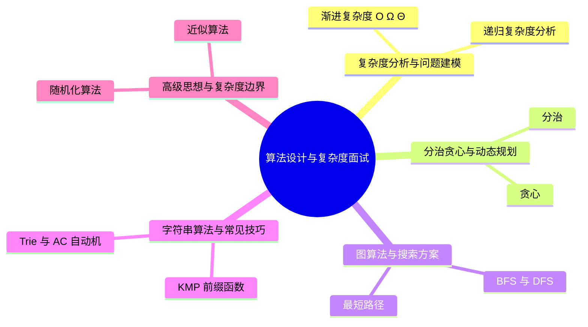
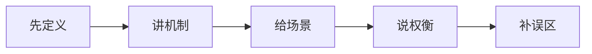
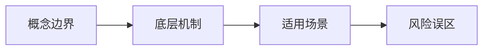
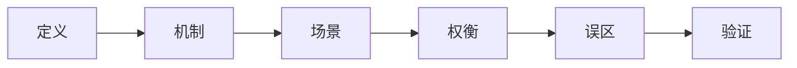
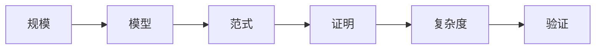
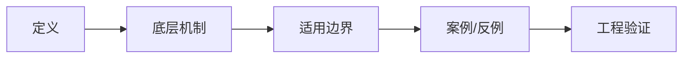

# 算法设计与复杂度面试20问

## 学习目标
- 用 20 个高频问题串起 算法设计与复杂度 的核心知识。
- 每个答案都按“定义 → 机制 → 场景 → 权衡 → 误区 → 记忆点”组织，便于面试复述。
- 通过小型 Mermaid 图辅助记忆，避免超大图难以阅读。

## 一句话总纲
算法学习的核心不是背模板，而是把问题建模成状态、结构、约束和代价，再选择可证明正确且复杂度可承受的方法。

## 记忆口诀
> 规模定上界，结构选范式，证明保正确，复杂度控成本。

## 思维导图

## 答题总流程

## 第 1-5 问：小图记忆

## 深度面试答题框架

- **总主线：** 把问题抽象为规模、状态、结构和代价，再选择可证明正确且复杂度可承受的算法范式。
- **风险提醒：** 最大风险是只背模板，不验证约束、单调性、最优子结构和复杂度上界。
- **实践抓手：** 做题时先写输入规模和目标复杂度，再判断能否排序、建图、动态规划、贪心或二分答案。

## 面试答案强化版：逐题深答

> 回答每题都按：定义 → 机制 → 场景 → 权衡 → 误区 → 验证。

### Q1：请解释“渐进复杂度 O Ω Θ”的核心思想、适用场景和常见误区。

**答：**
1. **定义：** O 是上界，Ω 是下界，Θ 是紧确界，描述输入规模趋大时增长率，而不是某一次运行时间。
2. **机制：** 先确定输入规模和基本操作，再把循环、递归或数据结构操作换算成数量级；O 用来排除不可行方案，Θ 用来表达紧确增长，Ω 用来说明至少要付出的成本。
3. **适用场景：** 方案筛选、性能预估、面试判断算法能否通过。
4. **权衡：** 渐进符号忽略常数，工程上仍要考虑缓存、递归栈、内存和多组数据。
5. **常见误区：** 把 O 当精确耗时；只看时间不看空间；忽略隐藏的排序、哈希冲突或递归深度。
6. **验证/记忆点：** 用最大数据量估算操作次数，再用边界样例和压测验证。

**追问路径：**
- 面试官可能追问“前提被破坏会怎样”，回答时先指出失效条件，再给反例。
- 面试官可能追问“为什么不用别的方案”，从复杂度、正确性证明、实现风险三个角度比较。
- 面试官可能要求手推样例，优先选择最小边界样例和一个能暴露误区的反例。
### Q2：请解释“递归复杂度分析”的核心思想、适用场景和常见误区。

**答：**
1. **定义：** 递归复杂度把算法成本写成递推式，例如 T(n)=aT(n/b)+f(n)，再用主定理、递归树或代入法求解。
2. **机制：** 递归树看每层子问题数量和单层成本；主定理要求子问题规模均匀；代入法用于猜测后证明上下界。
3. **适用场景：** 归并排序、二分、快速选择、树形递归和分治优化。
4. **权衡：** 不均匀拆分、重叠子问题或随机递归不一定能直接套主定理。
5. **常见误区：** 只数递归层数不数每层工作；把重叠递归误认为分治；忽略递归栈空间。
6. **验证/记忆点：** 写出前几层递归树，检查总节点数、层成本和终止条件。

**追问路径：**
- 面试官可能追问“前提被破坏会怎样”，回答时先指出失效条件，再给反例。
- 面试官可能追问“为什么不用别的方案”，从复杂度、正确性证明、实现风险三个角度比较。
- 面试官可能要求手推样例，优先选择最小边界样例和一个能暴露误区的反例。
### Q3：请解释“均摊分析”的核心思想、适用场景和常见误区。

**答：**
1. **定义：** 均摊分析关注一串操作的总成本平均到每次操作，而不是每次操作的最坏成本。
2. **机制：** 聚合分析直接算总成本；记账法给便宜操作预存信用；势能法用状态势能解释未来成本。
3. **适用场景：** 动态数组扩容、栈的多次弹出、并查集路径压缩、单调栈。
4. **权衡：** 均摊快不代表单次延迟稳定；实时系统可能仍关心单次最坏。
5. **常见误区：** 把均摊等同平均随机；只证明一两个操作；忽略操作序列前提。
6. **验证/记忆点：** 构造最坏操作序列，证明总成本被线性或近线性界住。

**追问路径：**
- 面试官可能追问“前提被破坏会怎样”，回答时先指出失效条件，再给反例。
- 面试官可能追问“为什么不用别的方案”，从复杂度、正确性证明、实现风险三个角度比较。
- 面试官可能要求手推样例，优先选择最小边界样例和一个能暴露误区的反例。
### Q4：请解释“问题建模”的核心思想、适用场景和常见误区。

**答：**
1. **定义：** 问题建模是把自然语言题目转成输入、输出、约束、目标函数、状态和可验证不变量。
2. **机制：** 先识别对象是数组、图、区间、集合还是字符串，再确定关系、顺序、重复、权重和可接受误差。
3. **适用场景：** 所有算法选择之前，尤其是系统设计、排程、路径、匹配和优化问题。
4. **权衡：** 建模越贴近本质，算法越简单；但过度抽象会丢失业务约束。
5. **常见误区：** 没看数据范围就选算法；把有向图当无向图；把在线问题当离线问题。
6. **验证/记忆点：** 用反例检查模型是否保持答案不变，并覆盖边界输入。

**追问路径：**
- 面试官可能追问“前提被破坏会怎样”，回答时先指出失效条件，再给反例。
- 面试官可能追问“为什么不用别的方案”，从复杂度、正确性证明、实现风险三个角度比较。
- 面试官可能要求手推样例，优先选择最小边界样例和一个能暴露误区的反例。
### Q5：请解释“分治”的核心思想、适用场景和常见误区。

**答：**
1. **定义：** 分治把问题拆成相互独立的子问题，分别求解后合并答案。
2. **机制：** 关键是递归终止、规模缩小、子问题覆盖完整和合并正确；正确性通常用归纳法证明。
3. **适用场景：** 归并排序、快速排序、最近点对、线段树构建和分治 FFT 思想。
4. **权衡：** 合并步骤可能成为瓶颈；子问题若重叠，可能应转 DP。
5. **常见误区：** 只要递归就是分治；合并时漏掉跨区间答案；忽略递归栈。
6. **验证/记忆点：** 检查 base case、合并覆盖性和复杂度递推式。

**追问路径：**
- 面试官可能追问“前提被破坏会怎样”，回答时先指出失效条件，再给反例。
- 面试官可能追问“为什么不用别的方案”，从复杂度、正确性证明、实现风险三个角度比较。
- 面试官可能要求手推样例，优先选择最小边界样例和一个能暴露误区的反例。
### Q6：请解释“贪心”的核心思想、适用场景和常见误区。

**答：**
1. **定义：** 贪心每一步做当前最优选择，但必须证明局部最优不会破坏全局最优。
2. **机制：** 常用交换论证、割性质或反证法：证明某个最优解可以转化为包含当前选择的最优解。
3. **适用场景：** 活动选择、Huffman 编码、最小生成树、区间覆盖的部分问题。
4. **权衡：** 实现简单但证明要求高；很多看似局部最优的问题实际需要 DP。
5. **常见误区：** 凭直觉排序；用样例代替证明；无法给出失败反例。
6. **验证/记忆点：** 准备一个正确证明和一个相似但贪心失败的反例。

**追问路径：**
- 面试官可能追问“前提被破坏会怎样”，回答时先指出失效条件，再给反例。
- 面试官可能追问“为什么不用别的方案”，从复杂度、正确性证明、实现风险三个角度比较。
- 面试官可能要求手推样例，优先选择最小边界样例和一个能暴露误区的反例。
### Q7：请解释“动态规划”的核心思想、适用场景和常见误区。

**答：**
1. **定义：** 动态规划适用于最优子结构和重叠子问题，通过状态定义和转移复用子问题答案。
2. **机制：** 四步：定义状态含义，写转移来源，设初始化，确定遍历顺序和答案位置。
3. **适用场景：** 背包、区间、序列匹配、路径计数、资源分配。
4. **权衡：** 状态越完整越正确但越贵；状态压缩可降空间但增加理解成本。
5. **常见误区：** 状态只写下标不写语义；遍历顺序与依赖相反；初始化漏边界。
6. **验证/记忆点：** 用小样例手推 DP 表，检查每个状态是否只依赖已知状态。

**追问路径：**
- 面试官可能追问“前提被破坏会怎样”，回答时先指出失效条件，再给反例。
- 面试官可能追问“为什么不用别的方案”，从复杂度、正确性证明、实现风险三个角度比较。
- 面试官可能要求手推样例，优先选择最小边界样例和一个能暴露误区的反例。
### Q8：请解释“状态压缩”的核心思想、适用场景和常见误区。

**答：**
1. **定义：** 状态压缩用位掩码、滚动数组或轮廓表示减少空间或表达集合状态。
2. **机制：** 位掩码表达子集，滚动数组利用转移只依赖近邻层，轮廓 DP 保留边界信息。
3. **适用场景：** n 小的集合优化、旅行商、棋盘覆盖、背包空间优化。
4. **权衡：** 位数、状态维度和转移枚举会迅速爆炸。
5. **常见误区：** 盲目压缩导致覆盖状态；更新方向错误导致重复使用元素。
6. **验证/记忆点：** 检查状态是否仍包含转移所需全部信息，并用未压缩版本对拍。

**追问路径：**
- 面试官可能追问“前提被破坏会怎样”，回答时先指出失效条件，再给反例。
- 面试官可能追问“为什么不用别的方案”，从复杂度、正确性证明、实现风险三个角度比较。
- 面试官可能要求手推样例，优先选择最小边界样例和一个能暴露误区的反例。
### Q9：请解释“BFS 与 DFS”的核心思想、适用场景和常见误区。

**答：**
1. **定义：** BFS 按层扩展，适合无权最短路；DFS 深入探索，适合连通性、环检测、拓扑和回溯。
2. **机制：** BFS 的队列维护层序不变量；DFS 的递归栈维护当前路径和访问状态。
3. **适用场景：** 迷宫最少步数、依赖分析、连通分量、枚举组合。
4. **权衡：** BFS 空间可能大，DFS 可能爆栈；图有环必须维护访问状态。
5. **常见误区：** 用 DFS 找无权最短路；访问标记时机错误；忽略不连通图。
6. **验证/记忆点：** 用层数、访问颜色和不可达样例验证。

**追问路径：**
- 面试官可能追问“前提被破坏会怎样”，回答时先指出失效条件，再给反例。
- 面试官可能追问“为什么不用别的方案”，从复杂度、正确性证明、实现风险三个角度比较。
- 面试官可能要求手推样例，优先选择最小边界样例和一个能暴露误区的反例。
### Q10：请解释“最短路径”的核心思想、适用场景和常见误区。

**答：**
1. **定义：** 最短路径根据边权和源点数量选择 BFS、Dijkstra、Bellman-Ford 或 Floyd。
2. **机制：** 无权用 BFS；非负权用 Dijkstra；有负边用 Bellman-Ford 并检测负环；多源小图可 Floyd。
3. **适用场景：** 路由、依赖成本、地图路径、状态图最少代价。
4. **权衡：** 算法前提非常关键，负边会破坏 Dijkstra 的已确定最短不变量。
5. **常见误区：** 不检查边权；把最短路径树等同 MST；忽略不可达和负环。
6. **验证/记忆点：** 构造负边、不可达、重复边和多条最短路样例。

**追问路径：**
- 面试官可能追问“前提被破坏会怎样”，回答时先指出失效条件，再给反例。
- 面试官可能追问“为什么不用别的方案”，从复杂度、正确性证明、实现风险三个角度比较。
- 面试官可能要求手推样例，优先选择最小边界样例和一个能暴露误区的反例。
### Q11：请解释“最小生成树”的核心思想、适用场景和常见误区。

**答：**
1. **定义：** 最小生成树是在连通无向图中连接所有点且总边权最小的树。
2. **机制：** Kruskal 按边排序并用并查集避免成环；Prim 从点集向外选择最小跨割边；正确性依赖割性质。
3. **适用场景：** 网络布线、聚类、低成本连通和图结构压缩。
4. **权衡：** 只适用于连接成本，不保证任意两点路径最短。
5. **常见误区：** 把 MST 当最短路；忘记图不连通时只能得到生成森林。
6. **验证/记忆点：** 验证边数为 n-1、无环、连通，并用割性质解释选择。

**追问路径：**
- 面试官可能追问“前提被破坏会怎样”，回答时先指出失效条件，再给反例。
- 面试官可能追问“为什么不用别的方案”，从复杂度、正确性证明、实现风险三个角度比较。
- 面试官可能要求手推样例，优先选择最小边界样例和一个能暴露误区的反例。
### Q12：请解释“拓扑排序与强连通”的核心思想、适用场景和常见误区。

**答：**
1. **定义：** 拓扑排序给 DAG 的依赖顺序；强连通分量把有向图中互相可达的点压缩成 DAG。
2. **机制：** 拓扑可用入度队列或 DFS 后序；SCC 可用 Tarjan/Kosaraju，通过 lowlink 或反图顺序识别互达集合。
3. **适用场景：** 构建任务顺序、课程依赖、服务依赖拆环、编译依赖分析。
4. **权衡：** 有环时拓扑不存在，但 SCC 压缩后可分析环结构。
5. **常见误区：** 把无向连通分量和 SCC 混淆；拓扑失败只返回空而不诊断环。
6. **验证/记忆点：** 用有环/无环、有多个入度零点、孤立点样例验证。

**追问路径：**
- 面试官可能追问“前提被破坏会怎样”，回答时先指出失效条件，再给反例。
- 面试官可能追问“为什么不用别的方案”，从复杂度、正确性证明、实现风险三个角度比较。
- 面试官可能要求手推样例，优先选择最小边界样例和一个能暴露误区的反例。
### Q13：请解释“KMP 前缀函数”的核心思想、适用场景和常见误区。

**答：**
1. **定义：** KMP 利用前缀函数在失配时复用已匹配信息，实现 O(n+m) 单模式匹配。
2. **机制：** pi[i] 表示模式串前缀中，以 i 结尾的最长相等真前后缀长度；失配时跳到 pi[j-1]。
3. **适用场景：** 日志搜索、模板匹配、重复周期判断。
4. **权衡：** 适合单模式精确匹配，多模式通常考虑 AC 自动机。
5. **常见误区：** 背模板不懂 pi 语义；文本指针回退；边界 j=0 处理错误。
6. **验证/记忆点：** 用重叠模式如 ababaca 手推 pi 数组和匹配过程。

**追问路径：**
- 面试官可能追问“前提被破坏会怎样”，回答时先指出失效条件，再给反例。
- 面试官可能追问“为什么不用别的方案”，从复杂度、正确性证明、实现风险三个角度比较。
- 面试官可能要求手推样例，优先选择最小边界样例和一个能暴露误区的反例。
### Q14：请解释“Trie 与 AC 自动机”的核心思想、适用场景和常见误区。

**答：**
1. **定义：** Trie 共享字符串前缀；AC 自动机在 Trie 上加失败指针，实现多模式串同时匹配。
2. **机制：** Trie 节点表示前缀状态；fail 指针指向当前后缀可复用的最长前缀状态；扫描文本时沿自动机转移。
3. **适用场景：** 敏感词过滤、词典匹配、搜索提示、多模式日志检测。
4. **权衡：** 空间与字符集、词库规模有关；动态词库更新可能需要重建或分层。
5. **常见误区：** 漏掉输出链；不处理重叠匹配；忽略大小写和归一化。
6. **验证/记忆点：** 用多个有公共前后缀的模式串验证 fail 和输出。

**追问路径：**
- 面试官可能追问“前提被破坏会怎样”，回答时先指出失效条件，再给反例。
- 面试官可能追问“为什么不用别的方案”，从复杂度、正确性证明、实现风险三个角度比较。
- 面试官可能要求手推样例，优先选择最小边界样例和一个能暴露误区的反例。
### Q15：请解释“字符串哈希”的核心思想、适用场景和常见误区。

**答：**
1. **定义：** 字符串哈希把子串映射成数值，配合前缀哈希可 O(1) 比较子串。
2. **机制：** 滚动哈希维护 H[i]，子串哈希由前缀差分得到；双模数或 64 位自然溢出可降低碰撞概率。
3. **适用场景：** 子串比较、重复子串、回文判断辅助、二分答案 check。
4. **权衡：** 哈希是概率等价，不是数学必然等价。
5. **常见误区：** 哈希相等就直接认定字符串相等；模数和 base 选择不当；溢出语义混乱。
6. **验证/记忆点：** 关键场景用双哈希或最终字符串复核，并构造碰撞风险意识。

**追问路径：**
- 面试官可能追问“前提被破坏会怎样”，回答时先指出失效条件，再给反例。
- 面试官可能追问“为什么不用别的方案”，从复杂度、正确性证明、实现风险三个角度比较。
- 面试官可能要求手推样例，优先选择最小边界样例和一个能暴露误区的反例。
### Q16：请解释“二分答案”的核心思想、适用场景和常见误区。

**答：**
1. **定义：** 二分答案用于答案空间有单调可判定性的优化问题。
2. **机制：** 先定义 check(x) 表示 x 是否可行，再证明可行性随 x 单调，最后维护左右边界收缩。
3. **适用场景：** 最大最小、最小最大、容量分配、距离阈值、时间阈值。
4. **权衡：** 难点在 check 设计和单调性证明，不在二分模板本身。
5. **常见误区：** 边界死循环；check 不单调；整数/浮点精度处理错误。
6. **验证/记忆点：** 画出可行区间，测试最小、最大、刚好不可行和刚好可行样例。

**追问路径：**
- 面试官可能追问“前提被破坏会怎样”，回答时先指出失效条件，再给反例。
- 面试官可能追问“为什么不用别的方案”，从复杂度、正确性证明、实现风险三个角度比较。
- 面试官可能要求手推样例，优先选择最小边界样例和一个能暴露误区的反例。
### Q17：请解释“随机化算法”的核心思想、适用场景和常见误区。

**答：**
1. **定义：** 随机化通过随机选择降低期望复杂度、打散坏输入或获得概率正确性。
2. **机制：** 随机快排随机选 pivot，随机哈希降低对抗碰撞，Monte Carlo/Las Vegas 分别权衡正确性和运行时间。
3. **适用场景：** 排序、哈希、采样、负载均衡、近似统计。
4. **权衡：** 需要管理随机种子、复现性和失败概率。
5. **常见误区：** 随机化等于不可靠；只报平均不报最坏；线上问题无法复现。
6. **验证/记忆点：** 固定种子重放、重复试验、统计失败率并保留降级方案。

**追问路径：**
- 面试官可能追问“前提被破坏会怎样”，回答时先指出失效条件，再给反例。
- 面试官可能追问“为什么不用别的方案”，从复杂度、正确性证明、实现风险三个角度比较。
- 面试官可能要求手推样例，优先选择最小边界样例和一个能暴露误区的反例。
### Q18：请解释“近似算法”的核心思想、适用场景和常见误区。

**答：**
1. **定义：** 近似算法在精确最优太贵时追求可证明或可解释的近似质量。
2. **机制：** 用近似比、误差界或业务容忍度评价结果；常结合贪心、线性规划松弛或局部搜索。
3. **适用场景：** 装箱、覆盖、路径规划、排班、推荐重排等 NP-hard 或大规模优化。
4. **权衡：** 不适合必须精确正确的安全、账务、判题类场景。
5. **常见误区：** 把启发式当近似算法；只说快不说误差；无法解释最坏情况。
6. **验证/记忆点：** 用小规模精确解对比、大规模 A/B 和误差分布验证。

**追问路径：**
- 面试官可能追问“前提被破坏会怎样”，回答时先指出失效条件，再给反例。
- 面试官可能追问“为什么不用别的方案”，从复杂度、正确性证明、实现风险三个角度比较。
- 面试官可能要求手推样例，优先选择最小边界样例和一个能暴露误区的反例。
### Q19：请解释“规约与 NP 完全”的核心思想、适用场景和常见误区。

**答：**
1. **定义：** 规约把已知问题多项式转化到目标问题，用于证明难度；NP 完全表示既在 NP 中又 NP-hard。
2. **机制：** 证明通常包括：目标问题在 NP 中；从已知 NP 完全问题构造多项式映射；证明答案等价。
3. **适用场景：** 判断是否应寻找精确多项式算法，还是转向特例、近似、参数化或工程启发式。
4. **权衡：** NP 完全不等于所有输入都不可解，特定规模或结构可能可做。
5. **常见误区：** 把不会做当 NP-hard；规约方向写反；忽略多项式构造。
6. **验证/记忆点：** 检查证书可验证性、规约方向和双向等价。

**追问路径：**
- 面试官可能追问“前提被破坏会怎样”，回答时先指出失效条件，再给反例。
- 面试官可能追问“为什么不用别的方案”，从复杂度、正确性证明、实现风险三个角度比较。
- 面试官可能要求手推样例，优先选择最小边界样例和一个能暴露误区的反例。
### Q20：请解释“在线与离线算法”的核心思想、适用场景和常见误区。

**答：**
1. **定义：** 在线算法边接收输入边决策，离线算法能看到全部输入后统一处理。
2. **机制：** 在线算法用竞争比评价与最优离线解差距；离线算法可排序、分块、扫描线或批处理优化。
3. **适用场景：** 缓存替换、流式调度、实时推荐、区间查询离线处理。
4. **权衡：** 在线响应快但信息少；离线全局性强但延迟高、需要完整数据。
5. **常见误区：** 可离线却硬做在线；在线算法用离线最优标准评价；忽略输入到达顺序。
6. **验证/记忆点：** 用同一批数据比较在线决策与离线最优，并测试乱序和延迟约束。

**追问路径：**
- 面试官可能追问“前提被破坏会怎样”，回答时先指出失效条件，再给反例。
- 面试官可能追问“为什么不用别的方案”，从复杂度、正确性证明、实现风险三个角度比较。
- 面试官可能要求手推样例，优先选择最小边界样例和一个能暴露误区的反例。

## 追问矩阵：把 20 问串成一条答题链

| 追问方向 | 应答抓手 | 典型反例 |
|---|---|---|
| 复杂度能否通过 | 用 n、m、状态数估算操作量 | n=10^5 的 O(n²) |
| 正确性如何证明 | 不变量、归纳、交换、割性质 | 贪心反例 |
| 边界如何处理 | 空输入、重复、不可达、负权、溢出 | Dijkstra 遇负边 |
| 工程如何落地 | 内存、栈深、对拍、监控、回滚 | 递归爆栈或哈希碰撞 |

## 面试终局复盘
| 能力 | 合格表现 | 优秀表现 |
|---|---|---|
| 概念 | 说清定义 | 还能说清边界和反例 |
| 机制 | 说清流程 | 能画图解释不变量或控制点 |
| 工程 | 能给场景 | 能给验证和回滚方式 |
| 表达 | 结构完整 | 能应对追问和对比 |

## 继续扩写：算法设计与复杂度面试追问与作答校准

### 统一作答校准

面试中不要只背概念。每道 Q1-Q20 都应补足五个层次：
- **定义：** 一句话说清它解决的问题。
- **机制：** 说明输入、状态变化、输出和保持正确的关键不变量。
- **边界：** 主动说出不适用场景、失败条件或常见误用。
- **案例：** 给出一个小例子或工程落地场景。
- **验证：** 说明如何用测试、推导、演练、监控或反例证明回答可信。

### 高频追问矩阵
| 追问类型 | 回答抓手 | 推荐句式 |
|---|---|---|
| 为什么成立 | 不变量、证明、约束 | “它成立的前提是……，关键不变量是……” |
| 为什么不用别的方案 | 成本、边界、失败模式 | “替代方案在……场景更好，但这里受……约束” |
| 工程如何落地 | 测试、监控、回滚 | “我会先用……验证，再用……观测异常” |
| 误区如何纠正 | 反例、边界样例 | “最小反例是……，说明不能把……混为一谈” |

### 二十问复习动作
- 第一遍：只看题目，口头按“定义→机制→边界→案例→验证”复述。
- 第二遍：为每题补一个反例或失败条件。
- 第三遍：把相邻题串联，例如从基础概念追问到工程实践，再回到验证方法。
