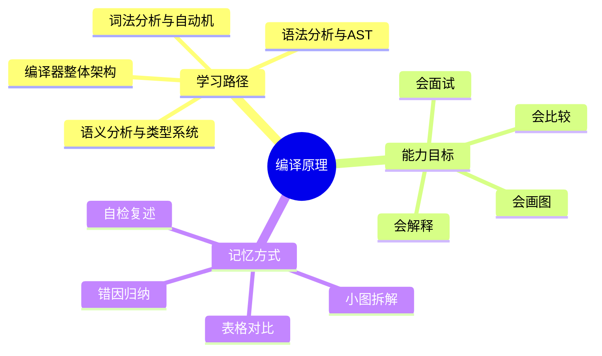
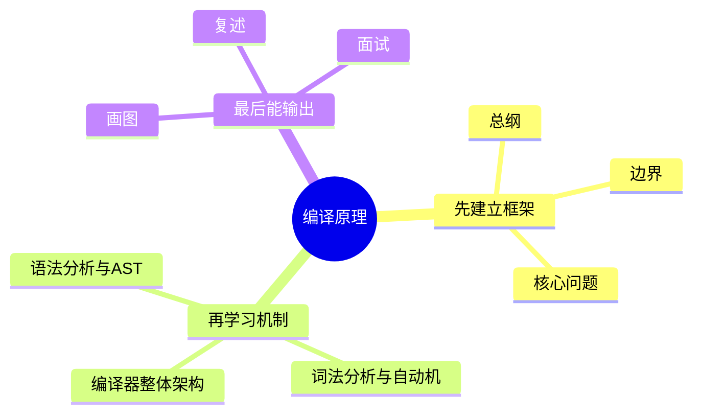

# 编译原理学习路线与知识地图

## 学习目标
- 建立 编译原理 的整体知识框架。
- 明确每个章节解决什么问题、需要记住什么、如何用于工程或面试。
- 用多张小图和表格降低记忆负担，避免单张巨大思维导图。

## 一句话总纲
编译原理研究如何把高级语言逐步翻译为可执行代码，核心链路是词法、语法、语义、中间表示、优化、代码生成和运行时。

## 记忆口诀
> 词法分词，语法成树，语义查错，IR优化，后端落机。

## 思维导图

## Mermaid 图解：学习路线

## 分文件章节安排
| 顺序 | 文件 | 学习重点 | 记忆抓手 |
|---|---|---|---|
| 第 1 章 | [[01-编译器整体架构]] | 建立从源代码到机器代码的全流程视角。 | 前端懂语言，中端做优化，后端懂机器 |
| 第 2 章 | [[02-词法分析与自动机]] | 理解正则、NFA、DFA、Token 和词法错误处理。 | 字符变Token，正则到自动机 |
| 第 3 章 | [[03-语法分析与AST]] | 掌握上下文无关文法、LL/LR 分析、AST 和错误恢复。 | 文法定结构，分析建语法树 |
| 第 4 章 | [[04-语义分析与类型系统]] | 理解作用域、符号表、类型检查和语义约束。 | 名字入表，类型校验，作用域定边界 |
| 第 5 章 | [[05-IR优化与代码生成]] | 理解 SSA、数据流分析、常见优化、寄存器分配和指令选择。 | SSA利分析，数据流找事实，后端管资源 |
| 第 6 章 | [[06-运行时与工程实践]] | 理解栈帧、垃圾回收、链接、JIT 和编译器测试。 | 栈管调用，堆管对象，链接合符号 |
| 面试 | [[20-编译原理面试20问]] | 高频问答、表达模板、易错点 | Q-A-图-口诀 |

## 推荐学习方法
1. 先读本路线，知道每章在全局中的位置。
2. 每章先看思维导图，再看概念解释，最后用自检题复述。
3. 面试题不要死背，按“定义 → 机制 → 适用场景 → 权衡 → 误区”回答。
4. 复杂图拆成小图，每次只记一个因果链或流程链。

## 自检题
- 你能用 1 分钟说清 编译原理 的核心问题吗？
- 你能指出每章最容易混淆的两个概念吗？
- 你能把章节图不看原文复画出来吗？

## 速记卡片
- 总纲：编译原理研究如何把高级语言逐步翻译为可执行代码，核心链路是词法、语法、语义、中间表示、优化、代码生成和运行时。
- 口诀：词法分词，语法成树，语义查错，IR优化，后端落机。
- 面试表达：先定义边界，再解释机制，最后讲权衡和误区。

## 深度扩展：如何把本学科学到可迁移

### 1. 学科主线
把源程序经过词法、语法、语义、IR、优化、代码生成和运行时协作，语义保持地翻译成目标程序。

这意味着学习时不要把章节看成离散文件，而要形成一条稳定链路：**问题从哪里来 → 需要哪些抽象 → 底层机制如何保证结果 → 代价和风险在哪里 → 如何验证理解是否正确**。

### 2. 小思维导图：三阶段学习法

### 3. 分阶段学习重点
| 阶段 | 目标 | 学习动作 | 产出物 |
|---|---|---|---|
| 入门 | 建立全局地图 | 先读路线，再快速浏览每章思维导图 | 能说清本学科解决什么问题 |
| 理解 | 掌握机制和边界 | 对每章画流程图、列前提条件 | 能解释为什么这样设计 |
| 应用 | 做题或工程迁移 | 用案例检查概念是否能落地 | 能选择方案并说出权衡 |
| 面试 | 形成表达模板 | 按 Q-A-图-误区复述 | 能稳定回答 20 个核心问题 |

### 4. 章节之间的关系
- **第 1 层：编译器整体架构** —— 学习时要问：它承接了前一章什么问题，又为后一章提供什么工具？
- **第 2 层：词法分析与自动机** —— 学习时要问：它承接了前一章什么问题，又为后一章提供什么工具？
- **第 3 层：语法分析与AST** —— 学习时要问：它承接了前一章什么问题，又为后一章提供什么工具？
- **第 4 层：语义分析与类型系统** —— 学习时要问：它承接了前一章什么问题，又为后一章提供什么工具？
- **第 5 层：IR优化与代码生成** —— 学习时要问：它承接了前一章什么问题，又为后一章提供什么工具？
- **第 6 层：运行时与工程实践** —— 学习时要问：它承接了前一章什么问题，又为后一章提供什么工具？

### 5. 复习闭环
- **风险提醒：** 最大风险是把编译器理解成 parser，忽视语义分析、IR 优化、ABI、运行时和错误恢复。
- **实践抓手：** 面试回答要沿编译流水线讲清输入输出、数据结构和阶段间不变量。
- **闭环方式：** 每学完一章，必须能完成“三件事”：复画图、讲反例、做迁移。

### 6. 总自检
1. 你能否不看目录，按依赖关系重新排列所有章节？
2. 你能否为每章说出一个工程场景或面试场景？
3. 你能否说明本学科与操作系统、网络、数据库、LLM 或后端工程的连接点？

## 综合深化：从语言语义到可执行系统

本学科的深层学习目标，是把抽象概念变成能解释、能验证、能迁移的工程判断：**把源程序经过词法、语法、语义、IR、优化、代码生成和运行时协作，语义保持地翻译成目标程序。**

### 1. 学习闭环
1. **先定对象：** 明确本章讨论的是数据、结构、行为、约束还是风险。
2. **再拆机制：** 说清输入、内部状态、转换规则和输出。
3. **证明边界：** 用反例、极端值、失效条件说明什么时候不能套用。
4. **连接实践：** 把概念放入做题、面试、工程排障或系统设计场景。
5. **验证复盘：** 用样例、测试、指标、日志或审计证据证明结论可信。

### 2. 综合案例
表达式 a+b*c 会依次变成 Token、AST、类型约束、IR 指令、优化后的数据流和目标机器指令。

### 3. 记忆提示
- 不背孤立名词，背“问题 → 机制 → 边界 → 验证”。
- 每章至少准备一个正例、一个反例、一个工程应用和一个面试追问。

## 专题深化：与其他学科的连接

- **本学科核心连接点：** 例如表达式 a+b*c 会经历 Token 流、语法树、类型检查、IR 指令、优化、寄存器分配和目标指令选择。
- **向上连接：** 可以支撑系统设计、工程实践、AI Agent 开发和面试表达。
- **向下连接：** 依赖数据结构、操作系统、计算机网络、数据库和数学基础中的概念。

### 学习产出标准
| 层次 | 能力表现 | 自检方式 |
|---|---|---|
| 记住 | 能说出核心名词 | 不看目录复述章节 |
| 理解 | 能画出机制图 | 给别人讲清流程 |
| 应用 | 能解决案例问题 | 用真实约束做方案选择 |
| 迁移 | 能跨学科解释 | 连接 OS/网络/数据库/LLM 场景 |

## 继续扩写：编译原理学习路线深化

### 路线主线
沿源代码到可执行程序的数据流，理解词法、语法、语义、IR、优化、代码生成和运行时。

### 四步学习法
- **1.** 每一阶段都明确输入表示、输出表示和错误恢复策略
- **2.** 把语义保持作为优化和代码生成的底线
- **3.** 区分语言规范、编译器实现和目标机器约束
- **4.** 用小程序跟踪 token、AST、IR 和汇编变化

### 典型应用场景
- 实现 DSL、静态分析器或代码转换工具
- 定位类型错误、优化失效和运行时崩溃
- 理解 JIT、解释器、VM 与原生编译的权衡

### 常见误区纠偏
- **误区：** 把 AST 当语义结果，忽略符号表和类型环境。**纠正：** 回到前提、机制、边界和验证证据重新判断。
- **误区：** 优化只看局部性能，不证明语义等价。**纠正：** 回到前提、机制、边界和验证证据重新判断。
- **误区：** 忽略 ABI、栈帧、GC 和异常处理。**纠正：** 回到前提、机制、边界和验证证据重新判断。

### 阶段验收清单
| 阶段 | 必须能回答的问题 | 验收方式 |
|---|---|---|
| 入门 | 概念解决什么问题？ | 用一句话复述并画出最小流程图 |
| 深入 | 机制为什么成立？ | 手推一个正例和一个边界例 |
| 应用 | 什么场景适用/不适用？ | 写出选择理由和替代方案 |
| 面试 | 被追问时如何防守？ | 按“定义→机制→边界→案例→误区”回答 |
