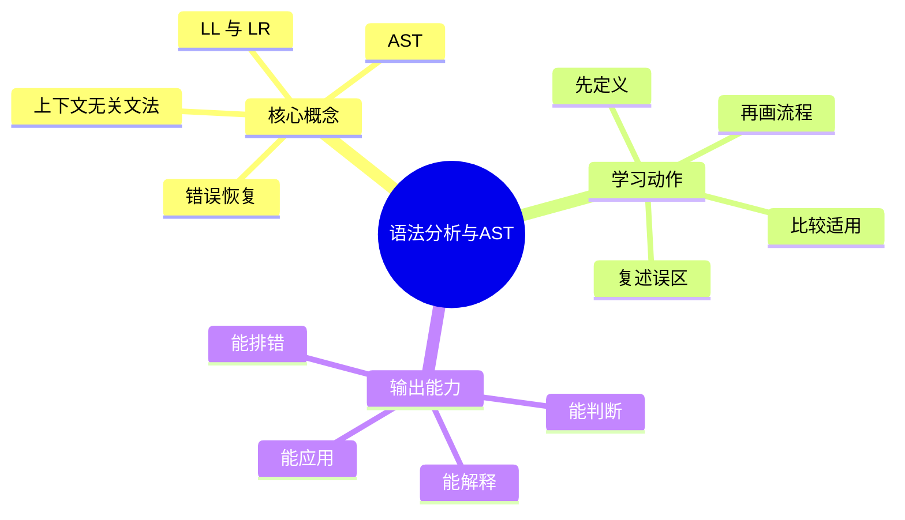
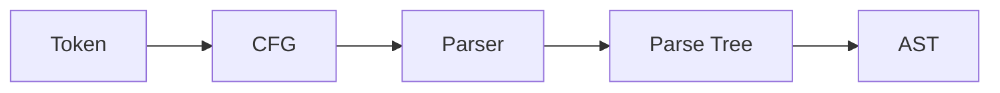

# 编译原理：语法分析与AST

## 学习目标
- 掌握上下文无关文法、LL/LR 分析、AST 和错误恢复。
- 能画出本章核心流程图，并能用自己的话解释每个节点。
- 能说出适用场景、边界条件和常见误区。

## 一句话总纲
语法分析把 Token 流组织成体现程序结构的树。

## 记忆口诀
> 文法定结构，分析建语法树

## 思维导图

## Mermaid 图解：核心流程

## 分章节讲解
### 1. 上下文无关文法
**核心定义：** CFG 用非终结符、终结符、产生式和开始符号描述递归语法结构。

**理解路径：**
- 先明确它解决的具体问题，再判断它依赖的前提条件。
- 把它放回“语法分析把 Token 流组织成体现程序结构的树。”这条主线中理解，不要孤立记忆。
- 学习时至少能说出：输入是什么、输出是什么、代价是什么、失败边界是什么。

**常见误区：** 词法规则和语法规则边界要清晰；缩进敏感语言还需特殊处理。

### 2. LL 与 LR
**核心定义：** LL 自顶向下预测分析，LR 自底向上归约分析；LR 通常能处理更广文法。

**理解路径：**
- 先明确它解决的具体问题，再判断它依赖的前提条件。
- 把它放回“语法分析把 Token 流组织成体现程序结构的树。”这条主线中理解，不要孤立记忆。
- 学习时至少能说出：输入是什么、输出是什么、代价是什么、失败边界是什么。

**常见误区：** 左递归会影响 LL 分析；冲突需要通过改写文法或优先级解决。

### 3. AST
**核心定义：** AST 抽象掉不必要语法细节，保留表达式、语句、声明等语义结构。

**理解路径：**
- 先明确它解决的具体问题，再判断它依赖的前提条件。
- 把它放回“语法分析把 Token 流组织成体现程序结构的树。”这条主线中理解，不要孤立记忆。
- 学习时至少能说出：输入是什么、输出是什么、代价是什么、失败边界是什么。

**常见误区：** AST 不等于完整语法树；括号等细节可能只影响节点结构而不直接保留。

### 4. 错误恢复
**核心定义：** 语法错误恢复通过同步符号、短语级修复等方法继续分析，给出更多诊断。

**理解路径：**
- 先明确它解决的具体问题，再判断它依赖的前提条件。
- 把它放回“语法分析把 Token 流组织成体现程序结构的树。”这条主线中理解，不要孤立记忆。
- 学习时至少能说出：输入是什么、输出是什么、代价是什么、失败边界是什么。

**常见误区：** 遇到第一个错误就停止会降低编译器可用性；恢复也不能制造大量误报。

## 实战深化：文法、分析表与错误恢复

### 1. 底层机制拆解
语法分析根据上下文无关文法构造结构，AST 去掉多余语法细节，保留语义相关层次。

### 2. 适用与不适用
| 判断点 | 适用信号 | 不适用/风险信号 |
|---|---|---|
| 前提 | 对象、约束和目标清晰 | 概念边界含糊或约束缺失 |
| 机制 | 能说明中间状态如何变化 | 只能背结论，无法解释过程 |
| 成本 | 复杂度、维护成本或风险可接受 | 资源、复杂度或安全边界失控 |
| 验证 | 有样例、测试、证明或观测证据 | 无法复现、无法审计、无法回滚 |

### 3. 案例理解
表达式优先级可通过文法分层或 Pratt Parser 处理；错误恢复要避免一个缺分号引发满屏误报。

### 4. 常见误区与纠正
- **误区：** 只记概念定义，不问前提。**纠正：** 每次回答都先说适用条件。
- **误区：** 用单个样例证明普遍正确。**纠正：** 补充边界样例、反例或不变量。
- **误区：** 忽略工程成本。**纠正：** 同时说明性能、可靠性、安全性和维护代价。

### 5. 面试追问路径
- 如果输入规模、业务约束或安全边界变化，结论是否还成立？
- 这个概念和相邻概念的区别是什么？
- 如何设计一个测试、证明或观测指标来验证你的判断？

## 关键对比表
| 知识点 | 正确理解 | 常见误区 |
|---|---|---|
| 上下文无关文法 | CFG 用非终结符、终结符、产生式和开始符号描述递归语法结构。 | 词法规则和语法规则边界要清晰；缩进敏感语言还需特殊处理。 |
| LL 与 LR | LL 自顶向下预测分析，LR 自底向上归约分析；LR 通常能处理更广文法。 | 左递归会影响 LL 分析；冲突需要通过改写文法或优先级解决。 |
| AST | AST 抽象掉不必要语法细节，保留表达式、语句、声明等语义结构。 | AST 不等于完整语法树；括号等细节可能只影响节点结构而不直接保留。 |
| 错误恢复 | 语法错误恢复通过同步符号、短语级修复等方法继续分析，给出更多诊断。 | 遇到第一个错误就停止会降低编译器可用性；恢复也不能制造大量误报。 |

## 常见误区总结
- **上下文无关文法：** 词法规则和语法规则边界要清晰；缩进敏感语言还需特殊处理。
- **LL 与 LR：** 左递归会影响 LL 分析；冲突需要通过改写文法或优先级解决。
- **AST：** AST 不等于完整语法树；括号等细节可能只影响节点结构而不直接保留。
- **错误恢复：** 遇到第一个错误就停止会降低编译器可用性；恢复也不能制造大量误报。

## 自检题
1. 本章的核心问题是什么？请用一句话回答：语法分析把 Token 流组织成体现程序结构的树。
2. 本章每个概念的适用前提分别是什么？
3. 哪个误区最容易在面试或工程实践中出现？为什么？

## 速记卡片
- 章节口诀：文法定结构，分析建语法树
- 答题结构：定义 → 机制 → 场景 → 权衡 → 误区。
- 复习动作：遮住正文，只根据思维导图复述一遍。

## 深度扩展：底层原理与应用边界

### 1. 本章在「编译原理」中的位置
- **核心定位：** 把源程序经过词法、语法、语义、IR、优化、代码生成和运行时协作，语义保持地翻译成目标程序。
- **本章作用：** 「编译原理：语法分析与AST」负责把总纲落到可操作的判断框架：先确认问题边界，再拆解机制，最后根据代价和风险选择方法。
- **主要风险：** 最大风险是把编译器理解成 parser，忽视语义分析、IR 优化、ABI、运行时和错误恢复。
- **实践抓手：** 面试回答要沿编译流水线讲清输入输出、数据结构和阶段间不变量。

### 2. 小流程图：从概念到应用

### 3. 概念深化：逐个击破
#### 3.1 上下文无关文法
- **先问它解决什么：** 上下文无关文法 不是孤立名词，而是用来解决本章某类约束、关系、代价或风险判断的问题。
- **底层机制：** 学习时要拆成“输入条件 → 中间结构 → 处理规则 → 输出结果”四步；如果任何一步说不清，说明只是记住了结论。
- **适用条件：** 当前提满足、边界清楚、代价可接受时使用；如果输入分布、规模、时序、权限或一致性假设变化，就要重新评估。
- **不适用信号：** 需要违反前提才能套用、只能靠特殊样例解释、复杂度或维护成本明显失控时，应换方案。
- **面试表达：** “我会先定义 上下文无关文法，再说明它依赖的前提，最后用一个反例说明边界。”

#### 3.2 LL 与 LR
- **先问它解决什么：** LL 与 LR 不是孤立名词，而是用来解决本章某类约束、关系、代价或风险判断的问题。
- **底层机制：** 学习时要拆成“输入条件 → 中间结构 → 处理规则 → 输出结果”四步；如果任何一步说不清，说明只是记住了结论。
- **适用条件：** 当前提满足、边界清楚、代价可接受时使用；如果输入分布、规模、时序、权限或一致性假设变化，就要重新评估。
- **不适用信号：** 需要违反前提才能套用、只能靠特殊样例解释、复杂度或维护成本明显失控时，应换方案。
- **面试表达：** “我会先定义 LL 与 LR，再说明它依赖的前提，最后用一个反例说明边界。”

#### 3.3 AST
- **先问它解决什么：** AST 不是孤立名词，而是用来解决本章某类约束、关系、代价或风险判断的问题。
- **底层机制：** 学习时要拆成“输入条件 → 中间结构 → 处理规则 → 输出结果”四步；如果任何一步说不清，说明只是记住了结论。
- **适用条件：** 当前提满足、边界清楚、代价可接受时使用；如果输入分布、规模、时序、权限或一致性假设变化，就要重新评估。
- **不适用信号：** 需要违反前提才能套用、只能靠特殊样例解释、复杂度或维护成本明显失控时，应换方案。
- **面试表达：** “我会先定义 AST，再说明它依赖的前提，最后用一个反例说明边界。”

#### 3.4 错误恢复
- **先问它解决什么：** 错误恢复 不是孤立名词，而是用来解决本章某类约束、关系、代价或风险判断的问题。
- **底层机制：** 学习时要拆成“输入条件 → 中间结构 → 处理规则 → 输出结果”四步；如果任何一步说不清，说明只是记住了结论。
- **适用条件：** 当前提满足、边界清楚、代价可接受时使用；如果输入分布、规模、时序、权限或一致性假设变化，就要重新评估。
- **不适用信号：** 需要违反前提才能套用、只能靠特殊样例解释、复杂度或维护成本明显失控时，应换方案。
- **面试表达：** “我会先定义 错误恢复，再说明它依赖的前提，最后用一个反例说明边界。”

### 4. 适用边界对比表
| 判断维度 | 应该怎么想 | 典型错误 | 记忆提示 |
|---|---|---|---|
| 前提条件 | 先列出输入规模、数据分布、系统假设或业务约束 | 不看条件直接套模板 | 先问“凭什么能用” |
| 正确性 | 需要能说明为什么结果保持不变或为什么局部选择成立 | 只给经验结论 | 用不变量、反例或交换论证检查 |
| 复杂度/成本 | 同时估算时间、空间、延迟、吞吐、人力和维护成本 | 只看理论最优 | 工程里还要看常数和可观测性 |
| 失败模式 | 主动说明边界外会怎样失败 | 面试中只讲优点 | 能说失败边界才算真理解 |

### 5. 记忆强化：三层复述法
1. **概念层：** 用一句话定义本章每个核心概念。
2. **机制层：** 不看原文画出输入到输出的流程。
3. **边界层：** 为每个概念准备一个“不能这样用”的反例。

### 6. 工程/做题/面试迁移
- **工程迁移：** 面试回答要沿编译流水线讲清输入输出、数据结构和阶段间不变量。
- **做题迁移：** 先把题目中的对象、关系、约束和目标函数圈出来，再映射到本章概念。
- **面试迁移：** 回答时不要只报名词，要说清“为什么需要它、它如何工作、它何时失效”。

### 7. 深度自检题
1. 你能否把本章概念按“前提 → 机制 → 结果 → 代价”重新组织？
2. 如果输入规模、并发量、数据分布或安全边界变化，原结论是否仍成立？
3. 本章哪个概念最容易被误用？请给出一个反例。
4. 如果让你设计一道面试题，你会怎样考察候选人是否真的理解？

### 8. 深度速记卡片
- **总抓手：** 把源程序经过词法、语法、语义、IR、优化、代码生成和运行时协作，语义保持地翻译成目标程序。
- **答题模板：** 定义边界 → 拆底层机制 → 说适用条件 → 讲权衡 → 给反例。
- **复习动作：** 每次复习只看图和表，尝试口述 3 分钟；卡住处再回正文。

## 专题深化：具体机制、案例与追问

### 1. 具体案例：把「语法分析与AST」放进真实问题
例如表达式 a+b*c 会经历 Token 流、语法树、类型检查、IR 指令、优化、寄存器分配和目标指令选择。

### 2. 本章关键机制细化
- 语法分析处理递归结构，AST 抽象掉纯语法噪声。
- LL 自顶向下，LR 自底向上；冲突反映文法或优先级不清。
- 错误恢复要在少报错和少误报之间平衡。

### 3. 概念到判断的检查清单
| 概念/动作 | 你要检查什么 | 如果检查失败会怎样 |
|---|---|---|
| 上下文无关文法 | 前提、输入、输出、代价、失败边界是否都说清 | 可能套错模型、复杂度失控或得到不可验证结论 |
| LL 与 LR | 前提、输入、输出、代价、失败边界是否都说清 | 可能套错模型、复杂度失控或得到不可验证结论 |
| AST | 前提、输入、输出、代价、失败边界是否都说清 | 可能套错模型、复杂度失控或得到不可验证结论 |
| 错误恢复 | 前提、输入、输出、代价、失败边界是否都说清 | 可能套错模型、复杂度失控或得到不可验证结论 |
| 本章在「编译原理」中的位置 | 前提、输入、输出、代价、失败边界是否都说清 | 可能套错模型、复杂度失控或得到不可验证结论 |

### 4. 面试追问路径

- 本阶段输入和输出是什么？
- 阶段间保留了什么语义不变量？
- 错误应该在哪一层被诊断？

### 5. 验证与复盘
- **验证方式：** 用合法程序、非法程序、边界语法、优化前后等价和差分测试验证。
- **复盘方式：** 每次做题或设计后，记录“我使用了哪个前提、哪个前提最容易被破坏、如果破坏如何调整”。
- **记忆方式：** 不背孤立结论，只背“问题 → 机制 → 边界 → 验证”的链路。

## 继续扩写：机制、边界与面试追问

### 机制拆解补充
- 语法分析解决 token 如何组成结构，AST 则保留后续语义分析需要的层次而不是所有语法细节。
- LL、LR、Pratt parser 的差异主要体现在递归方向、冲突处理和表达式优先级表达方式。
- 错误恢复要避免级联报错，常通过同步 token、短语级恢复或插入/删除候选 token 实现。

### 适用 / 不适用场景
| 维度 | 适用信号 | 不适用信号 | 纠偏动作 |
|---|---|---|---|
| 前提 | 关键假设可明确写出 | 只能靠经验套模板 | 先补定义、约束和反例 |
| 代价 | 时间、空间、人力成本可接受 | 复杂度或维护成本不可控 | 降维、分层或换方案 |
| 验证 | 能用样例、测试或演练证明 | 只能口头保证 | 增加边界用例和观测点 |
| 演进 | 变化范围局部可控 | 一处变化牵动多处 | 重画边界和依赖关系 |

### 工程实践案例
- **场景：** 在真实项目或面试题中遇到 `03-语法分析与AST` 相关问题时，先列出输入、输出、约束、风险和验收标准。
- **做法：** 用最小可行方案跑通主链路，再补边界用例、错误处理和性能/安全验证。
- **复盘：** 如果方案失败，优先检查前提是否被破坏，而不是继续堆叠特殊判断。

### 面试追问路径
1. 这个概念依赖哪些前提？前提不成立时会发生什么？
2. 和相邻方案相比，它牺牲了什么、换来了什么？
3. 如何用最小反例证明误用会失败？
4. 工程落地时需要哪些监控、测试或回滚手段？
