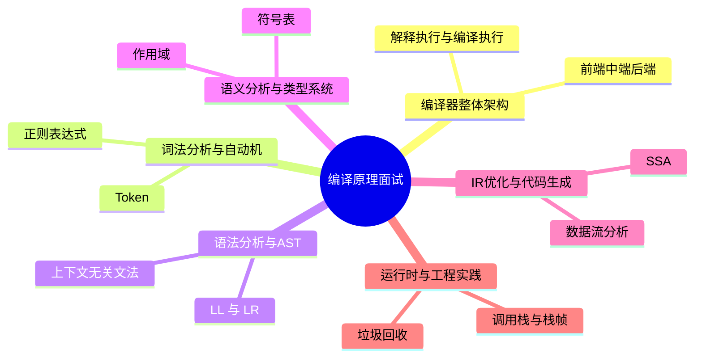

# 编译原理面试20问

## 学习目标
- 用 20 个高频问题串起 编译原理 的核心知识。
- 每个答案都按“定义 → 机制 → 场景 → 权衡 → 误区 → 记忆点”组织，便于面试复述。
- 通过小型 Mermaid 图辅助记忆，避免超大图难以阅读。

## 一句话总纲
编译原理研究如何把高级语言逐步翻译为可执行代码，核心链路是词法、语法、语义、中间表示、优化、代码生成和运行时。

## 记忆口诀
> 词法分词，语法成树，语义查错，IR优化，后端落机。

## 思维导图

## 答题总流程

## 第 1-5 问：小图记忆

## 深度面试答题框架

- **总主线：** 把源程序经过词法、语法、语义、IR、优化、代码生成和运行时协作，语义保持地翻译成目标程序。
- **风险提醒：** 最大风险是把编译器理解成 parser，忽视语义分析、IR 优化、ABI、运行时和错误恢复。
- **实践抓手：** 面试回答要沿编译流水线讲清输入输出、数据结构和阶段间不变量。

## 面试答案强化版：逐题深答

> 回答每题都按：定义 → 机制 → 场景 → 权衡 → 误区 → 验证。

### Q1：请解释“前端中端后端”的核心思想、适用场景和常见误区。

**答：**
1. **定义：** 前端负责词法、语法、语义分析；中端在 IR 上优化；后端完成指令选择、寄存器分配和代码发射。
2. **机制：** 把“前端中端后端”放入本学科主线：把源程序经过词法、语法、语义、IR、优化、代码生成和运行时协作，语义保持地翻译成目标程序。回答时先说明输入或前提，再说明内部结构、状态变化或控制规则，最后说明输出结论为什么可信。
3. **适用场景：** 当问题需要围绕 前端中端后端 判断正确性、效率、风险、边界或工程取舍时使用；如果前提不满足，应先换模型或补充约束。
4. **权衡：** 它能降低理解或实现复杂度，但可能引入计算成本、维护成本、误判风险或安全边界问题；面试中要主动比较相邻概念。
5. **常见误区：** 只背定义不讲前提；只讲优点不讲失败模式；不能给出反例、验证方法或工程落地证据。
6. **验证/记忆点：** 用“定义 → 机制 → 场景 → 权衡 → 误区 → 验证”复述；再准备一个正例、一个反例和一个边界条件。

**追问路径：**
- 如果输入规模、数据分布、权限边界或业务目标变化，前端中端后端 是否仍成立？
- 它和相邻概念的边界在哪里，如何用反例区分？
- 如果落到工程实践，你会用什么测试、指标、日志、证明或审计证据验证？

### Q2：请解释“解释执行与编译执行”的核心思想、适用场景和常见误区。

**答：**
1. **定义：** 解释器边读边执行，编译器先翻译再运行；现代语言常混合使用 JIT、字节码和解释器。
2. **机制：** 把“解释执行与编译执行”放入本学科主线：把源程序经过词法、语法、语义、IR、优化、代码生成和运行时协作，语义保持地翻译成目标程序。回答时先说明输入或前提，再说明内部结构、状态变化或控制规则，最后说明输出结论为什么可信。
3. **适用场景：** 当问题需要围绕 解释执行与编译执行 判断正确性、效率、风险、边界或工程取舍时使用；如果前提不满足，应先换模型或补充约束。
4. **权衡：** 它能降低理解或实现复杂度，但可能引入计算成本、维护成本、误判风险或安全边界问题；面试中要主动比较相邻概念。
5. **常见误区：** 只背定义不讲前提；只讲优点不讲失败模式；不能给出反例、验证方法或工程落地证据。
6. **验证/记忆点：** 用“定义 → 机制 → 场景 → 权衡 → 误区 → 验证”复述；再准备一个正例、一个反例和一个边界条件。

**追问路径：**
- 如果输入规模、数据分布、权限边界或业务目标变化，解释执行与编译执行 是否仍成立？
- 它和相邻概念的边界在哪里，如何用反例区分？
- 如果落到工程实践，你会用什么测试、指标、日志、证明或审计证据验证？

### Q3：请解释“中间表示 IR”的核心思想、适用场景和常见误区。

**答：**
1. **定义：** IR 是源语言和目标机器之间的桥梁，便于优化和多后端复用。
2. **机制：** 把“中间表示 IR”放入本学科主线：把源程序经过词法、语法、语义、IR、优化、代码生成和运行时协作，语义保持地翻译成目标程序。回答时先说明输入或前提，再说明内部结构、状态变化或控制规则，最后说明输出结论为什么可信。
3. **适用场景：** 当问题需要围绕 中间表示 IR 判断正确性、效率、风险、边界或工程取舍时使用；如果前提不满足，应先换模型或补充约束。
4. **权衡：** 它能降低理解或实现复杂度，但可能引入计算成本、维护成本、误判风险或安全边界问题；面试中要主动比较相邻概念。
5. **常见误区：** 只背定义不讲前提；只讲优点不讲失败模式；不能给出反例、验证方法或工程落地证据。
6. **验证/记忆点：** 用“定义 → 机制 → 场景 → 权衡 → 误区 → 验证”复述；再准备一个正例、一个反例和一个边界条件。

**追问路径：**
- 如果输入规模、数据分布、权限边界或业务目标变化，中间表示 IR 是否仍成立？
- 它和相邻概念的边界在哪里，如何用反例区分？
- 如果落到工程实践，你会用什么测试、指标、日志、证明或审计证据验证？

### Q4：请解释“语义保持”的核心思想、适用场景和常见误区。

**答：**
1. **定义：** 每个编译阶段都应保持程序可观察语义不变，优化也必须在语义等价前提下进行。
2. **机制：** 把“语义保持”放入本学科主线：把源程序经过词法、语法、语义、IR、优化、代码生成和运行时协作，语义保持地翻译成目标程序。回答时先说明输入或前提，再说明内部结构、状态变化或控制规则，最后说明输出结论为什么可信。
3. **适用场景：** 当问题需要围绕 语义保持 判断正确性、效率、风险、边界或工程取舍时使用；如果前提不满足，应先换模型或补充约束。
4. **权衡：** 它能降低理解或实现复杂度，但可能引入计算成本、维护成本、误判风险或安全边界问题；面试中要主动比较相邻概念。
5. **常见误区：** 只背定义不讲前提；只讲优点不讲失败模式；不能给出反例、验证方法或工程落地证据。
6. **验证/记忆点：** 用“定义 → 机制 → 场景 → 权衡 → 误区 → 验证”复述；再准备一个正例、一个反例和一个边界条件。

**追问路径：**
- 如果输入规模、数据分布、权限边界或业务目标变化，语义保持 是否仍成立？
- 它和相邻概念的边界在哪里，如何用反例区分？
- 如果落到工程实践，你会用什么测试、指标、日志、证明或审计证据验证？

### Q5：请解释“Token”的核心思想、适用场景和常见误区。

**答：**
1. **定义：** Token 是词法单元，包括类别和属性值，如标识符、关键字、数字字面量。
2. **机制：** 把“Token”放入本学科主线：把源程序经过词法、语法、语义、IR、优化、代码生成和运行时协作，语义保持地翻译成目标程序。回答时先说明输入或前提，再说明内部结构、状态变化或控制规则，最后说明输出结论为什么可信。
3. **适用场景：** 当问题需要围绕 Token 判断正确性、效率、风险、边界或工程取舍时使用；如果前提不满足，应先换模型或补充约束。
4. **权衡：** 它能降低理解或实现复杂度，但可能引入计算成本、维护成本、误判风险或安全边界问题；面试中要主动比较相邻概念。
5. **常见误区：** 只背定义不讲前提；只讲优点不讲失败模式；不能给出反例、验证方法或工程落地证据。
6. **验证/记忆点：** 用“定义 → 机制 → 场景 → 权衡 → 误区 → 验证”复述；再准备一个正例、一个反例和一个边界条件。

**追问路径：**
- 如果输入规模、数据分布、权限边界或业务目标变化，Token 是否仍成立？
- 它和相邻概念的边界在哪里，如何用反例区分？
- 如果落到工程实践，你会用什么测试、指标、日志、证明或审计证据验证？

### Q6：请解释“正则表达式”的核心思想、适用场景和常见误区。

**答：**
1. **定义：** 正则表达式描述词法模式，可系统转换为有限自动机。
2. **机制：** 把“正则表达式”放入本学科主线：把源程序经过词法、语法、语义、IR、优化、代码生成和运行时协作，语义保持地翻译成目标程序。回答时先说明输入或前提，再说明内部结构、状态变化或控制规则，最后说明输出结论为什么可信。
3. **适用场景：** 当问题需要围绕 正则表达式 判断正确性、效率、风险、边界或工程取舍时使用；如果前提不满足，应先换模型或补充约束。
4. **权衡：** 它能降低理解或实现复杂度，但可能引入计算成本、维护成本、误判风险或安全边界问题；面试中要主动比较相邻概念。
5. **常见误区：** 只背定义不讲前提；只讲优点不讲失败模式；不能给出反例、验证方法或工程落地证据。
6. **验证/记忆点：** 用“定义 → 机制 → 场景 → 权衡 → 误区 → 验证”复述；再准备一个正例、一个反例和一个边界条件。

**追问路径：**
- 如果输入规模、数据分布、权限边界或业务目标变化，正则表达式 是否仍成立？
- 它和相邻概念的边界在哪里，如何用反例区分？
- 如果落到工程实践，你会用什么测试、指标、日志、证明或审计证据验证？

### Q7：请解释“NFA 与 DFA”的核心思想、适用场景和常见误区。

**答：**
1. **定义：** NFA 可有 ε 转移和多条选择，DFA 每个状态每个输入只有唯一转移；二者表达能力等价。
2. **机制：** 把“NFA 与 DFA”放入本学科主线：把源程序经过词法、语法、语义、IR、优化、代码生成和运行时协作，语义保持地翻译成目标程序。回答时先说明输入或前提，再说明内部结构、状态变化或控制规则，最后说明输出结论为什么可信。
3. **适用场景：** 当问题需要围绕 NFA 与 DFA 判断正确性、效率、风险、边界或工程取舍时使用；如果前提不满足，应先换模型或补充约束。
4. **权衡：** 它能降低理解或实现复杂度，但可能引入计算成本、维护成本、误判风险或安全边界问题；面试中要主动比较相邻概念。
5. **常见误区：** 只背定义不讲前提；只讲优点不讲失败模式；不能给出反例、验证方法或工程落地证据。
6. **验证/记忆点：** 用“定义 → 机制 → 场景 → 权衡 → 误区 → 验证”复述；再准备一个正例、一个反例和一个边界条件。

**追问路径：**
- 如果输入规模、数据分布、权限边界或业务目标变化，NFA 与 DFA 是否仍成立？
- 它和相邻概念的边界在哪里，如何用反例区分？
- 如果落到工程实践，你会用什么测试、指标、日志、证明或审计证据验证？

### Q8：请解释“最长匹配原则”的核心思想、适用场景和常见误区。

**答：**
1. **定义：** 词法器通常采用最长匹配和优先级规则解决关键字、标识符、操作符冲突。
2. **机制：** 把“最长匹配原则”放入本学科主线：把源程序经过词法、语法、语义、IR、优化、代码生成和运行时协作，语义保持地翻译成目标程序。回答时先说明输入或前提，再说明内部结构、状态变化或控制规则，最后说明输出结论为什么可信。
3. **适用场景：** 当问题需要围绕 最长匹配原则 判断正确性、效率、风险、边界或工程取舍时使用；如果前提不满足，应先换模型或补充约束。
4. **权衡：** 它能降低理解或实现复杂度，但可能引入计算成本、维护成本、误判风险或安全边界问题；面试中要主动比较相邻概念。
5. **常见误区：** 只背定义不讲前提；只讲优点不讲失败模式；不能给出反例、验证方法或工程落地证据。
6. **验证/记忆点：** 用“定义 → 机制 → 场景 → 权衡 → 误区 → 验证”复述；再准备一个正例、一个反例和一个边界条件。

**追问路径：**
- 如果输入规模、数据分布、权限边界或业务目标变化，最长匹配原则 是否仍成立？
- 它和相邻概念的边界在哪里，如何用反例区分？
- 如果落到工程实践，你会用什么测试、指标、日志、证明或审计证据验证？

### Q9：请解释“上下文无关文法”的核心思想、适用场景和常见误区。

**答：**
1. **定义：** CFG 用非终结符、终结符、产生式和开始符号描述递归语法结构。
2. **机制：** 把“上下文无关文法”放入本学科主线：把源程序经过词法、语法、语义、IR、优化、代码生成和运行时协作，语义保持地翻译成目标程序。回答时先说明输入或前提，再说明内部结构、状态变化或控制规则，最后说明输出结论为什么可信。
3. **适用场景：** 当问题需要围绕 上下文无关文法 判断正确性、效率、风险、边界或工程取舍时使用；如果前提不满足，应先换模型或补充约束。
4. **权衡：** 它能降低理解或实现复杂度，但可能引入计算成本、维护成本、误判风险或安全边界问题；面试中要主动比较相邻概念。
5. **常见误区：** 只背定义不讲前提；只讲优点不讲失败模式；不能给出反例、验证方法或工程落地证据。
6. **验证/记忆点：** 用“定义 → 机制 → 场景 → 权衡 → 误区 → 验证”复述；再准备一个正例、一个反例和一个边界条件。

**追问路径：**
- 如果输入规模、数据分布、权限边界或业务目标变化，上下文无关文法 是否仍成立？
- 它和相邻概念的边界在哪里，如何用反例区分？
- 如果落到工程实践，你会用什么测试、指标、日志、证明或审计证据验证？

### Q10：请解释“LL 与 LR”的核心思想、适用场景和常见误区。

**答：**
1. **定义：** LL 自顶向下预测分析，LR 自底向上归约分析；LR 通常能处理更广文法。
2. **机制：** 把“LL 与 LR”放入本学科主线：把源程序经过词法、语法、语义、IR、优化、代码生成和运行时协作，语义保持地翻译成目标程序。回答时先说明输入或前提，再说明内部结构、状态变化或控制规则，最后说明输出结论为什么可信。
3. **适用场景：** 当问题需要围绕 LL 与 LR 判断正确性、效率、风险、边界或工程取舍时使用；如果前提不满足，应先换模型或补充约束。
4. **权衡：** 它能降低理解或实现复杂度，但可能引入计算成本、维护成本、误判风险或安全边界问题；面试中要主动比较相邻概念。
5. **常见误区：** 只背定义不讲前提；只讲优点不讲失败模式；不能给出反例、验证方法或工程落地证据。
6. **验证/记忆点：** 用“定义 → 机制 → 场景 → 权衡 → 误区 → 验证”复述；再准备一个正例、一个反例和一个边界条件。

**追问路径：**
- 如果输入规模、数据分布、权限边界或业务目标变化，LL 与 LR 是否仍成立？
- 它和相邻概念的边界在哪里，如何用反例区分？
- 如果落到工程实践，你会用什么测试、指标、日志、证明或审计证据验证？

### Q11：请解释“AST”的核心思想、适用场景和常见误区。

**答：**
1. **定义：** AST 抽象掉不必要语法细节，保留表达式、语句、声明等语义结构。
2. **机制：** 把“AST”放入本学科主线：把源程序经过词法、语法、语义、IR、优化、代码生成和运行时协作，语义保持地翻译成目标程序。回答时先说明输入或前提，再说明内部结构、状态变化或控制规则，最后说明输出结论为什么可信。
3. **适用场景：** 当问题需要围绕 AST 判断正确性、效率、风险、边界或工程取舍时使用；如果前提不满足，应先换模型或补充约束。
4. **权衡：** 它能降低理解或实现复杂度，但可能引入计算成本、维护成本、误判风险或安全边界问题；面试中要主动比较相邻概念。
5. **常见误区：** 只背定义不讲前提；只讲优点不讲失败模式；不能给出反例、验证方法或工程落地证据。
6. **验证/记忆点：** 用“定义 → 机制 → 场景 → 权衡 → 误区 → 验证”复述；再准备一个正例、一个反例和一个边界条件。

**追问路径：**
- 如果输入规模、数据分布、权限边界或业务目标变化，AST 是否仍成立？
- 它和相邻概念的边界在哪里，如何用反例区分？
- 如果落到工程实践，你会用什么测试、指标、日志、证明或审计证据验证？

### Q12：请解释“错误恢复”的核心思想、适用场景和常见误区。

**答：**
1. **定义：** 语法错误恢复通过同步符号、短语级修复等方法继续分析，给出更多诊断。
2. **机制：** 把“错误恢复”放入本学科主线：把源程序经过词法、语法、语义、IR、优化、代码生成和运行时协作，语义保持地翻译成目标程序。回答时先说明输入或前提，再说明内部结构、状态变化或控制规则，最后说明输出结论为什么可信。
3. **适用场景：** 当问题需要围绕 错误恢复 判断正确性、效率、风险、边界或工程取舍时使用；如果前提不满足，应先换模型或补充约束。
4. **权衡：** 它能降低理解或实现复杂度，但可能引入计算成本、维护成本、误判风险或安全边界问题；面试中要主动比较相邻概念。
5. **常见误区：** 只背定义不讲前提；只讲优点不讲失败模式；不能给出反例、验证方法或工程落地证据。
6. **验证/记忆点：** 用“定义 → 机制 → 场景 → 权衡 → 误区 → 验证”复述；再准备一个正例、一个反例和一个边界条件。

**追问路径：**
- 如果输入规模、数据分布、权限边界或业务目标变化，错误恢复 是否仍成立？
- 它和相邻概念的边界在哪里，如何用反例区分？
- 如果落到工程实践，你会用什么测试、指标、日志、证明或审计证据验证？

### Q13：请解释“符号表”的核心思想、适用场景和常见误区。

**答：**
1. **定义：** 符号表记录标识符到声明、类型、作用域和存储信息的映射。
2. **机制：** 把“符号表”放入本学科主线：把源程序经过词法、语法、语义、IR、优化、代码生成和运行时协作，语义保持地翻译成目标程序。回答时先说明输入或前提，再说明内部结构、状态变化或控制规则，最后说明输出结论为什么可信。
3. **适用场景：** 当问题需要围绕 符号表 判断正确性、效率、风险、边界或工程取舍时使用；如果前提不满足，应先换模型或补充约束。
4. **权衡：** 它能降低理解或实现复杂度，但可能引入计算成本、维护成本、误判风险或安全边界问题；面试中要主动比较相邻概念。
5. **常见误区：** 只背定义不讲前提；只讲优点不讲失败模式；不能给出反例、验证方法或工程落地证据。
6. **验证/记忆点：** 用“定义 → 机制 → 场景 → 权衡 → 误区 → 验证”复述；再准备一个正例、一个反例和一个边界条件。

**追问路径：**
- 如果输入规模、数据分布、权限边界或业务目标变化，符号表 是否仍成立？
- 它和相邻概念的边界在哪里，如何用反例区分？
- 如果落到工程实践，你会用什么测试、指标、日志、证明或审计证据验证？

### Q14：请解释“作用域”的核心思想、适用场景和常见误区。

**答：**
1. **定义：** 作用域决定名字可见范围，常见有词法作用域和动态作用域。
2. **机制：** 把“作用域”放入本学科主线：把源程序经过词法、语法、语义、IR、优化、代码生成和运行时协作，语义保持地翻译成目标程序。回答时先说明输入或前提，再说明内部结构、状态变化或控制规则，最后说明输出结论为什么可信。
3. **适用场景：** 当问题需要围绕 作用域 判断正确性、效率、风险、边界或工程取舍时使用；如果前提不满足，应先换模型或补充约束。
4. **权衡：** 它能降低理解或实现复杂度，但可能引入计算成本、维护成本、误判风险或安全边界问题；面试中要主动比较相邻概念。
5. **常见误区：** 只背定义不讲前提；只讲优点不讲失败模式；不能给出反例、验证方法或工程落地证据。
6. **验证/记忆点：** 用“定义 → 机制 → 场景 → 权衡 → 误区 → 验证”复述；再准备一个正例、一个反例和一个边界条件。

**追问路径：**
- 如果输入规模、数据分布、权限边界或业务目标变化，作用域 是否仍成立？
- 它和相邻概念的边界在哪里，如何用反例区分？
- 如果落到工程实践，你会用什么测试、指标、日志、证明或审计证据验证？

### Q15：请解释“类型检查”的核心思想、适用场景和常见误区。

**答：**
1. **定义：** 类型检查验证操作数、函数调用、赋值和返回值是否满足语言类型规则。
2. **机制：** 把“类型检查”放入本学科主线：把源程序经过词法、语法、语义、IR、优化、代码生成和运行时协作，语义保持地翻译成目标程序。回答时先说明输入或前提，再说明内部结构、状态变化或控制规则，最后说明输出结论为什么可信。
3. **适用场景：** 当问题需要围绕 类型检查 判断正确性、效率、风险、边界或工程取舍时使用；如果前提不满足，应先换模型或补充约束。
4. **权衡：** 它能降低理解或实现复杂度，但可能引入计算成本、维护成本、误判风险或安全边界问题；面试中要主动比较相邻概念。
5. **常见误区：** 只背定义不讲前提；只讲优点不讲失败模式；不能给出反例、验证方法或工程落地证据。
6. **验证/记忆点：** 用“定义 → 机制 → 场景 → 权衡 → 误区 → 验证”复述；再准备一个正例、一个反例和一个边界条件。

**追问路径：**
- 如果输入规模、数据分布、权限边界或业务目标变化，类型检查 是否仍成立？
- 它和相邻概念的边界在哪里，如何用反例区分？
- 如果落到工程实践，你会用什么测试、指标、日志、证明或审计证据验证？

### Q16：请解释“类型推断”的核心思想、适用场景和常见误区。

**答：**
1. **定义：** 类型推断从表达式约束中推导类型，减少显式标注。
2. **机制：** 把“类型推断”放入本学科主线：把源程序经过词法、语法、语义、IR、优化、代码生成和运行时协作，语义保持地翻译成目标程序。回答时先说明输入或前提，再说明内部结构、状态变化或控制规则，最后说明输出结论为什么可信。
3. **适用场景：** 当问题需要围绕 类型推断 判断正确性、效率、风险、边界或工程取舍时使用；如果前提不满足，应先换模型或补充约束。
4. **权衡：** 它能降低理解或实现复杂度，但可能引入计算成本、维护成本、误判风险或安全边界问题；面试中要主动比较相邻概念。
5. **常见误区：** 只背定义不讲前提；只讲优点不讲失败模式；不能给出反例、验证方法或工程落地证据。
6. **验证/记忆点：** 用“定义 → 机制 → 场景 → 权衡 → 误区 → 验证”复述；再准备一个正例、一个反例和一个边界条件。

**追问路径：**
- 如果输入规模、数据分布、权限边界或业务目标变化，类型推断 是否仍成立？
- 它和相邻概念的边界在哪里，如何用反例区分？
- 如果落到工程实践，你会用什么测试、指标、日志、证明或审计证据验证？

### Q17：请解释“SSA”的核心思想、适用场景和常见误区。

**答：**
1. **定义：** SSA 要求每个变量只赋值一次，用 φ 函数合并控制流来源，便于数据流分析。
2. **机制：** 把“SSA”放入本学科主线：把源程序经过词法、语法、语义、IR、优化、代码生成和运行时协作，语义保持地翻译成目标程序。回答时先说明输入或前提，再说明内部结构、状态变化或控制规则，最后说明输出结论为什么可信。
3. **适用场景：** 当问题需要围绕 SSA 判断正确性、效率、风险、边界或工程取舍时使用；如果前提不满足，应先换模型或补充约束。
4. **权衡：** 它能降低理解或实现复杂度，但可能引入计算成本、维护成本、误判风险或安全边界问题；面试中要主动比较相邻概念。
5. **常见误区：** 只背定义不讲前提；只讲优点不讲失败模式；不能给出反例、验证方法或工程落地证据。
6. **验证/记忆点：** 用“定义 → 机制 → 场景 → 权衡 → 误区 → 验证”复述；再准备一个正例、一个反例和一个边界条件。

**追问路径：**
- 如果输入规模、数据分布、权限边界或业务目标变化，SSA 是否仍成立？
- 它和相邻概念的边界在哪里，如何用反例区分？
- 如果落到工程实践，你会用什么测试、指标、日志、证明或审计证据验证？

### Q18：请解释“数据流分析”的核心思想、适用场景和常见误区。

**答：**
1. **定义：** 数据流分析在控制流图上传播活跃变量、到达定义、可用表达式等事实。
2. **机制：** 把“数据流分析”放入本学科主线：把源程序经过词法、语法、语义、IR、优化、代码生成和运行时协作，语义保持地翻译成目标程序。回答时先说明输入或前提，再说明内部结构、状态变化或控制规则，最后说明输出结论为什么可信。
3. **适用场景：** 当问题需要围绕 数据流分析 判断正确性、效率、风险、边界或工程取舍时使用；如果前提不满足，应先换模型或补充约束。
4. **权衡：** 它能降低理解或实现复杂度，但可能引入计算成本、维护成本、误判风险或安全边界问题；面试中要主动比较相邻概念。
5. **常见误区：** 只背定义不讲前提；只讲优点不讲失败模式；不能给出反例、验证方法或工程落地证据。
6. **验证/记忆点：** 用“定义 → 机制 → 场景 → 权衡 → 误区 → 验证”复述；再准备一个正例、一个反例和一个边界条件。

**追问路径：**
- 如果输入规模、数据分布、权限边界或业务目标变化，数据流分析 是否仍成立？
- 它和相邻概念的边界在哪里，如何用反例区分？
- 如果落到工程实践，你会用什么测试、指标、日志、证明或审计证据验证？

### Q19：请解释“寄存器分配”的核心思想、适用场景和常见误区。

**答：**
1. **定义：** 寄存器分配把无限临时变量映射到有限寄存器，常用图着色或线性扫描。
2. **机制：** 把“寄存器分配”放入本学科主线：把源程序经过词法、语法、语义、IR、优化、代码生成和运行时协作，语义保持地翻译成目标程序。回答时先说明输入或前提，再说明内部结构、状态变化或控制规则，最后说明输出结论为什么可信。
3. **适用场景：** 当问题需要围绕 寄存器分配 判断正确性、效率、风险、边界或工程取舍时使用；如果前提不满足，应先换模型或补充约束。
4. **权衡：** 它能降低理解或实现复杂度，但可能引入计算成本、维护成本、误判风险或安全边界问题；面试中要主动比较相邻概念。
5. **常见误区：** 只背定义不讲前提；只讲优点不讲失败模式；不能给出反例、验证方法或工程落地证据。
6. **验证/记忆点：** 用“定义 → 机制 → 场景 → 权衡 → 误区 → 验证”复述；再准备一个正例、一个反例和一个边界条件。

**追问路径：**
- 如果输入规模、数据分布、权限边界或业务目标变化，寄存器分配 是否仍成立？
- 它和相邻概念的边界在哪里，如何用反例区分？
- 如果落到工程实践，你会用什么测试、指标、日志、证明或审计证据验证？

### Q20：请解释“指令选择”的核心思想、适用场景和常见误区。

**答：**
1. **定义：** 指令选择把 IR 操作匹配为目标机器指令，可用树匹配、DAG 或规则系统实现。
2. **机制：** 把“指令选择”放入本学科主线：把源程序经过词法、语法、语义、IR、优化、代码生成和运行时协作，语义保持地翻译成目标程序。回答时先说明输入或前提，再说明内部结构、状态变化或控制规则，最后说明输出结论为什么可信。
3. **适用场景：** 当问题需要围绕 指令选择 判断正确性、效率、风险、边界或工程取舍时使用；如果前提不满足，应先换模型或补充约束。
4. **权衡：** 它能降低理解或实现复杂度，但可能引入计算成本、维护成本、误判风险或安全边界问题；面试中要主动比较相邻概念。
5. **常见误区：** 只背定义不讲前提；只讲优点不讲失败模式；不能给出反例、验证方法或工程落地证据。
6. **验证/记忆点：** 用“定义 → 机制 → 场景 → 权衡 → 误区 → 验证”复述；再准备一个正例、一个反例和一个边界条件。

**追问路径：**
- 如果输入规模、数据分布、权限边界或业务目标变化，指令选择 是否仍成立？
- 它和相邻概念的边界在哪里，如何用反例区分？
- 如果落到工程实践，你会用什么测试、指标、日志、证明或审计证据验证？

## 追问矩阵：把 20 问串成一条能力链

| 追问方向 | 应答抓手 | 常见扣分点 |
|---|---|---|
| 前提是否成立 | 先列输入、约束、信任边界或数学条件 | 直接套模板 |
| 机制如何运作 | 讲清状态、转换、不变量或控制点 | 只背定义 |
| 何时失效 | 给出反例、边界值或攻击/故障场景 | 只讲优点 |
| 如何验证 | 用测试、证明、指标、日志、审计或对拍 | 无法落地 |

## 面试终局复盘
| 能力 | 合格表现 | 优秀表现 |
|---|---|---|
| 概念 | 说清定义 | 还能说清边界和反例 |
| 机制 | 说清流程 | 能画图解释不变量或控制点 |
| 工程 | 能给场景 | 能给验证和回滚方式 |
| 表达 | 结构完整 | 能应对追问和对比 |

## 继续扩写：编译原理面试追问与作答校准

### 统一作答校准

面试中不要只背概念。每道 Q1-Q20 都应补足五个层次：
- **定义：** 一句话说清它解决的问题。
- **机制：** 说明输入、状态变化、输出和保持正确的关键不变量。
- **边界：** 主动说出不适用场景、失败条件或常见误用。
- **案例：** 给出一个小例子或工程落地场景。
- **验证：** 说明如何用测试、推导、演练、监控或反例证明回答可信。

### 高频追问矩阵
| 追问类型 | 回答抓手 | 推荐句式 |
|---|---|---|
| 为什么成立 | 不变量、证明、约束 | “它成立的前提是……，关键不变量是……” |
| 为什么不用别的方案 | 成本、边界、失败模式 | “替代方案在……场景更好，但这里受……约束” |
| 工程如何落地 | 测试、监控、回滚 | “我会先用……验证，再用……观测异常” |
| 误区如何纠正 | 反例、边界样例 | “最小反例是……，说明不能把……混为一谈” |

### 二十问复习动作
- 第一遍：只看题目，口头按“定义→机制→边界→案例→验证”复述。
- 第二遍：为每题补一个反例或失败条件。
- 第三遍：把相邻题串联，例如从基础概念追问到工程实践，再回到验证方法。
