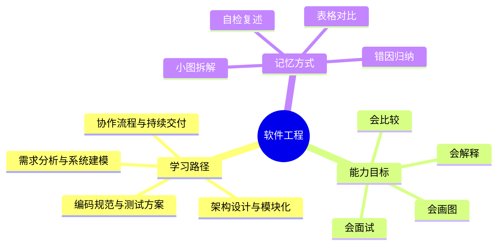
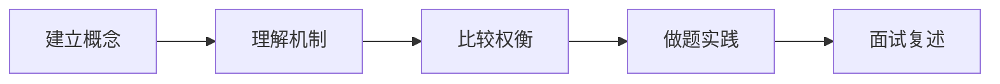
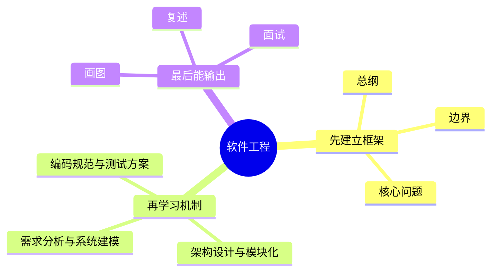
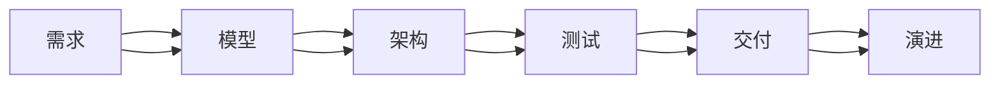
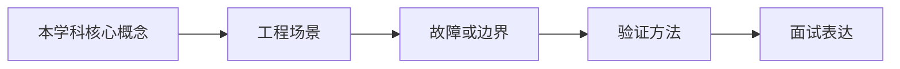

# 软件工程学习路线与知识地图

## 学习目标
- 建立 软件工程 的整体知识框架。
- 明确每个章节解决什么问题、需要记住什么、如何用于工程或面试。
- 用多张小图和表格降低记忆负担，避免单张巨大思维导图。

## 一句话总纲
软件工程关注如何在不确定需求、多人协作和长期演进中稳定交付高质量软件。

## 记忆口诀
> 需求定方向，架构定边界，测试保行为，流程保交付，重构保演进。

## 思维导图

## Mermaid 图解：学习路线

## 分文件章节安排
| 顺序 | 文件 | 学习重点 | 记忆抓手 |
|---|---|---|---|
| 第 1 章 | [[01-需求分析与系统建模]] | 学习把模糊需求转化为可验证的范围、场景和约束。 | 目标-角色-场景-验收 |
| 第 2 章 | [[02-架构设计与模块化]] | 理解分层、模块边界、依赖方向和架构权衡。 | 高内聚，低耦合，依赖向内 |
| 第 3 章 | [[03-编码规范与测试方案]] | 掌握可读代码、单元测试、集成测试和回归保护。 | 可读先行，测试锁行为 |
| 第 4 章 | [[04-协作流程与持续交付]] | 理解版本控制、代码评审、CI/CD 和发布方案。 | 小步提交，自动验证，渐进发布 |
| 第 5 章 | [[05-质量度量与演进重构]] | 学习技术债识别、重构原则、质量指标和长期演进。 | 度量发现问题，重构改善结构 |
| 面试 | [[20-软件工程面试20问]] | 高频问答、表达模板、易错点 | Q-A-图-口诀 |

## 推荐学习方法
1. 先读本路线，知道每章在全局中的位置。
2. 每章先看思维导图，再看概念解释，最后用自检题复述。
3. 面试题不要死背，按“定义 → 机制 → 适用场景 → 权衡 → 误区”回答。
4. 复杂图拆成小图，每次只记一个因果链或流程链。

## 自检题
- 你能用 1 分钟说清 软件工程 的核心问题吗？
- 你能指出每章最容易混淆的两个概念吗？
- 你能把章节图不看原文复画出来吗？

## 速记卡片
- 总纲：软件工程关注如何在不确定需求、多人协作和长期演进中稳定交付高质量软件。
- 口诀：需求定方向，架构定边界，测试保行为，流程保交付，重构保演进。
- 面试表达：先定义边界，再解释机制，最后讲权衡和误区。

## 深度扩展：如何把本学科学到可迁移

### 1. 学科主线
在多人协作和长期演进中，用需求、架构、测试、流程和反馈机制稳定交付软件。

这意味着学习时不要把章节看成离散文件，而要形成一条稳定链路：**问题从哪里来 → 需要哪些抽象 → 底层机制如何保证结果 → 代价和风险在哪里 → 如何验证理解是否正确**。

### 2. 小思维导图：三阶段学习法

### 3. 分阶段学习重点
| 阶段 | 目标 | 学习动作 | 产出物 |
|---|---|---|---|
| 入门 | 建立全局地图 | 先读路线，再快速浏览每章思维导图 | 能说清本学科解决什么问题 |
| 理解 | 掌握机制和边界 | 对每章画流程图、列前提条件 | 能解释为什么这样设计 |
| 应用 | 做题或工程迁移 | 用案例检查概念是否能落地 | 能选择方案并说出权衡 |
| 面试 | 形成表达模板 | 按 Q-A-图-误区复述 | 能稳定回答 20 个核心问题 |

### 4. 章节之间的关系
- **第 1 层：需求分析与系统建模** —— 学习时要问：它承接了前一章什么问题，又为后一章提供什么工具？
- **第 2 层：架构设计与模块化** —— 学习时要问：它承接了前一章什么问题，又为后一章提供什么工具？
- **第 3 层：编码规范与测试方案** —— 学习时要问：它承接了前一章什么问题，又为后一章提供什么工具？
- **第 4 层：协作流程与持续交付** —— 学习时要问：它承接了前一章什么问题，又为后一章提供什么工具？
- **第 5 层：质量度量与演进重构** —— 学习时要问：它承接了前一章什么问题，又为后一章提供什么工具？

### 5. 复习闭环
- **风险提醒：** 最大风险是只谈代码技巧，不谈需求边界、质量保障、发布风险和演进成本。
- **实践抓手：** 工程判断要围绕可验证、可维护、可回滚、可观测和可协作展开。
- **闭环方式：** 每学完一章，必须能完成“三件事”：复画图、讲反例、做迁移。

### 6. 总自检
1. 你能否不看目录，按依赖关系重新排列所有章节？
2. 你能否为每章说出一个工程场景或面试场景？
3. 你能否说明本学科与操作系统、网络、数据库、LLM 或后端工程的连接点？

## 综合深化：从需求不确定性到可演进系统

本学科的深层学习目标，是把抽象概念变成能解释、能验证、能迁移的工程判断：**把需求、架构、编码、测试、协作、交付和演进组织成可持续交付价值的工程系统。**

### 1. 学习闭环
1. **先定对象：** 明确本章讨论的是数据、结构、行为、约束还是风险。
2. **再拆机制：** 说清输入、内部状态、转换规则和输出。
3. **证明边界：** 用反例、极端值、失效条件说明什么时候不能套用。
4. **连接实践：** 把概念放入做题、面试、工程排障或系统设计场景。
5. **验证复盘：** 用样例、测试、指标、日志或审计证据证明结论可信。

### 2. 综合案例
一个支付功能不能只看代码实现，还要看需求边界、异常状态、审计日志、回滚策略和后续扩展点。

### 3. 记忆提示
- 不背孤立名词，背“问题 → 机制 → 边界 → 验证”。
- 每章至少准备一个正例、一个反例、一个工程应用和一个面试追问。

## 专题深化：与其他学科的连接

- **本学科核心连接点：** 例如一个支付需求不能只写“扣款接口”，还要定义幂等、状态机、失败补偿、审计日志、权限和回滚方案。
- **向上连接：** 可以支撑系统设计、工程实践、AI Agent 开发和面试表达。
- **向下连接：** 依赖数据结构、操作系统、计算机网络、数据库和数学基础中的概念。

### 学习产出标准
| 层次 | 能力表现 | 自检方式 |
|---|---|---|
| 记住 | 能说出核心名词 | 不看目录复述章节 |
| 理解 | 能画出机制图 | 给别人讲清流程 |
| 应用 | 能解决案例问题 | 用真实约束做方案选择 |
| 迁移 | 能跨学科解释 | 连接 OS/网络/数据库/LLM 场景 |

## 继续扩写：软件工程学习路线深化

### 路线主线
从需求、架构、编码测试、协作交付到质量演进，建立可持续交付软件的闭环。

### 四步学习法
- **1.** 先澄清问题和约束，再讨论方案
- **2.** 让模块边界对应变化原因，而不是团队偏好
- **3.** 用自动化测试和可观测性守住演进安全线
- **4.** 把技术债显性化、分级并持续偿还

### 典型应用场景
- 多人协作开发长期演进的业务系统
- 在不确定需求下做可逆架构决策
- 用 CI/CD、灰度和回滚降低发布风险

### 常见误区纠偏
- **误区：** 把文档、测试、评审当流程负担。**纠正：** 回到前提、机制、边界和验证证据重新判断。
- **误区：** 用过度抽象替代真实边界。**纠正：** 回到前提、机制、边界和验证证据重新判断。
- **误区：** 只看交付速度不看缺陷反馈和维护成本。**纠正：** 回到前提、机制、边界和验证证据重新判断。

### 阶段验收清单
| 阶段 | 必须能回答的问题 | 验收方式 |
|---|---|---|
| 入门 | 概念解决什么问题？ | 用一句话复述并画出最小流程图 |
| 深入 | 机制为什么成立？ | 手推一个正例和一个边界例 |
| 应用 | 什么场景适用/不适用？ | 写出选择理由和替代方案 |
| 面试 | 被追问时如何防守？ | 按“定义→机制→边界→案例→误区”回答 |
