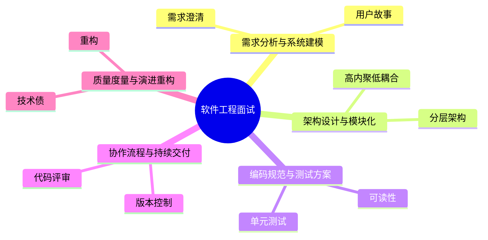

# 软件工程面试20问

## 学习目标
- 用 20 个高频问题串起 软件工程 的核心知识。
- 每个答案都按“定义 → 机制 → 场景 → 权衡 → 误区 → 记忆点”组织，便于面试复述。
- 通过小型 Mermaid 图辅助记忆，避免超大图难以阅读。

## 一句话总纲
软件工程关注如何在不确定需求、多人协作和长期演进中稳定交付高质量软件。

## 记忆口诀
> 需求定方向，架构定边界，测试保行为，流程保交付，重构保演进。

## 思维导图

## 答题总流程

## 第 1-5 问：小图记忆

## 深度面试答题框架

- **总主线：** 在多人协作和长期演进中，用需求、架构、测试、流程和反馈机制稳定交付软件。
- **风险提醒：** 最大风险是只谈代码技巧，不谈需求边界、质量保障、发布风险和演进成本。
- **实践抓手：** 工程判断要围绕可验证、可维护、可回滚、可观测和可协作展开。

## 面试答案强化版：逐题深答

> 回答每题都按：定义 → 机制 → 场景 → 权衡 → 误区 → 验证。

### Q1：请解释“需求澄清”的核心思想、适用场景和常见误区。

**答：**
1. **定义：** 需求澄清要识别业务目标、用户角色、关键流程、非目标和成功指标。
2. **机制：** 把“需求澄清”放入本学科主线：把需求、架构、编码、测试、协作、交付和演进组织成可持续交付价值的工程系统。回答时先说明输入或前提，再说明内部结构、状态变化或控制规则，最后说明输出结论为什么可信。
3. **适用场景：** 当问题需要围绕 需求澄清 判断正确性、效率、风险、边界或工程取舍时使用；如果前提不满足，应先换模型或补充约束。
4. **权衡：** 它能降低理解或实现复杂度，但可能引入计算成本、维护成本、误判风险或安全边界问题；面试中要主动比较相邻概念。
5. **常见误区：** 只背定义不讲前提；只讲优点不讲失败模式；不能给出反例、验证方法或工程落地证据。
6. **验证/记忆点：** 用“定义 → 机制 → 场景 → 权衡 → 误区 → 验证”复述；再准备一个正例、一个反例和一个边界条件。

**追问路径：**
- 如果输入规模、数据分布、权限边界或业务目标变化，需求澄清 是否仍成立？
- 它和相邻概念的边界在哪里，如何用反例区分？
- 如果落到工程实践，你会用什么测试、指标、日志、证明或审计证据验证？

### Q2：请解释“用户故事”的核心思想、适用场景和常见误区。

**答：**
1. **定义：** 用户故事用“作为某角色，我希望某能力，以便某价值”表达需求，并配合验收条件。
2. **机制：** 把“用户故事”放入本学科主线：把需求、架构、编码、测试、协作、交付和演进组织成可持续交付价值的工程系统。回答时先说明输入或前提，再说明内部结构、状态变化或控制规则，最后说明输出结论为什么可信。
3. **适用场景：** 当问题需要围绕 用户故事 判断正确性、效率、风险、边界或工程取舍时使用；如果前提不满足，应先换模型或补充约束。
4. **权衡：** 它能降低理解或实现复杂度，但可能引入计算成本、维护成本、误判风险或安全边界问题；面试中要主动比较相邻概念。
5. **常见误区：** 只背定义不讲前提；只讲优点不讲失败模式；不能给出反例、验证方法或工程落地证据。
6. **验证/记忆点：** 用“定义 → 机制 → 场景 → 权衡 → 误区 → 验证”复述；再准备一个正例、一个反例和一个边界条件。

**追问路径：**
- 如果输入规模、数据分布、权限边界或业务目标变化，用户故事 是否仍成立？
- 它和相邻概念的边界在哪里，如何用反例区分？
- 如果落到工程实践，你会用什么测试、指标、日志、证明或审计证据验证？

### Q3：请解释“领域建模”的核心思想、适用场景和常见误区。

**答：**
1. **定义：** 领域建模识别实体、值对象、聚合、事件和业务规则，帮助统一语言。
2. **机制：** 把“领域建模”放入本学科主线：把需求、架构、编码、测试、协作、交付和演进组织成可持续交付价值的工程系统。回答时先说明输入或前提，再说明内部结构、状态变化或控制规则，最后说明输出结论为什么可信。
3. **适用场景：** 当问题需要围绕 领域建模 判断正确性、效率、风险、边界或工程取舍时使用；如果前提不满足，应先换模型或补充约束。
4. **权衡：** 它能降低理解或实现复杂度，但可能引入计算成本、维护成本、误判风险或安全边界问题；面试中要主动比较相邻概念。
5. **常见误区：** 只背定义不讲前提；只讲优点不讲失败模式；不能给出反例、验证方法或工程落地证据。
6. **验证/记忆点：** 用“定义 → 机制 → 场景 → 权衡 → 误区 → 验证”复述；再准备一个正例、一个反例和一个边界条件。

**追问路径：**
- 如果输入规模、数据分布、权限边界或业务目标变化，领域建模 是否仍成立？
- 它和相邻概念的边界在哪里，如何用反例区分？
- 如果落到工程实践，你会用什么测试、指标、日志、证明或审计证据验证？

### Q4：请解释“非功能需求”的核心思想、适用场景和常见误区。

**答：**
1. **定义：** 性能、可用性、安全、合规、可维护性等非功能需求决定系统设计约束。
2. **机制：** 把“非功能需求”放入本学科主线：把需求、架构、编码、测试、协作、交付和演进组织成可持续交付价值的工程系统。回答时先说明输入或前提，再说明内部结构、状态变化或控制规则，最后说明输出结论为什么可信。
3. **适用场景：** 当问题需要围绕 非功能需求 判断正确性、效率、风险、边界或工程取舍时使用；如果前提不满足，应先换模型或补充约束。
4. **权衡：** 它能降低理解或实现复杂度，但可能引入计算成本、维护成本、误判风险或安全边界问题；面试中要主动比较相邻概念。
5. **常见误区：** 只背定义不讲前提；只讲优点不讲失败模式；不能给出反例、验证方法或工程落地证据。
6. **验证/记忆点：** 用“定义 → 机制 → 场景 → 权衡 → 误区 → 验证”复述；再准备一个正例、一个反例和一个边界条件。

**追问路径：**
- 如果输入规模、数据分布、权限边界或业务目标变化，非功能需求 是否仍成立？
- 它和相邻概念的边界在哪里，如何用反例区分？
- 如果落到工程实践，你会用什么测试、指标、日志、证明或审计证据验证？

### Q5：请解释“高内聚低耦合”的核心思想、适用场景和常见误区。

**答：**
1. **定义：** 高内聚让模块内部围绕单一职责，低耦合减少模块间变化传染。
2. **机制：** 把“高内聚低耦合”放入本学科主线：把需求、架构、编码、测试、协作、交付和演进组织成可持续交付价值的工程系统。回答时先说明输入或前提，再说明内部结构、状态变化或控制规则，最后说明输出结论为什么可信。
3. **适用场景：** 当问题需要围绕 高内聚低耦合 判断正确性、效率、风险、边界或工程取舍时使用；如果前提不满足，应先换模型或补充约束。
4. **权衡：** 它能降低理解或实现复杂度，但可能引入计算成本、维护成本、误判风险或安全边界问题；面试中要主动比较相邻概念。
5. **常见误区：** 只背定义不讲前提；只讲优点不讲失败模式；不能给出反例、验证方法或工程落地证据。
6. **验证/记忆点：** 用“定义 → 机制 → 场景 → 权衡 → 误区 → 验证”复述；再准备一个正例、一个反例和一个边界条件。

**追问路径：**
- 如果输入规模、数据分布、权限边界或业务目标变化，高内聚低耦合 是否仍成立？
- 它和相邻概念的边界在哪里，如何用反例区分？
- 如果落到工程实践，你会用什么测试、指标、日志、证明或审计证据验证？

### Q6：请解释“分层架构”的核心思想、适用场景和常见误区。

**答：**
1. **定义：** 分层架构按表现、应用、领域、基础设施组织依赖，便于替换和测试。
2. **机制：** 把“分层架构”放入本学科主线：把需求、架构、编码、测试、协作、交付和演进组织成可持续交付价值的工程系统。回答时先说明输入或前提，再说明内部结构、状态变化或控制规则，最后说明输出结论为什么可信。
3. **适用场景：** 当问题需要围绕 分层架构 判断正确性、效率、风险、边界或工程取舍时使用；如果前提不满足，应先换模型或补充约束。
4. **权衡：** 它能降低理解或实现复杂度，但可能引入计算成本、维护成本、误判风险或安全边界问题；面试中要主动比较相邻概念。
5. **常见误区：** 只背定义不讲前提；只讲优点不讲失败模式；不能给出反例、验证方法或工程落地证据。
6. **验证/记忆点：** 用“定义 → 机制 → 场景 → 权衡 → 误区 → 验证”复述；再准备一个正例、一个反例和一个边界条件。

**追问路径：**
- 如果输入规模、数据分布、权限边界或业务目标变化，分层架构 是否仍成立？
- 它和相邻概念的边界在哪里，如何用反例区分？
- 如果落到工程实践，你会用什么测试、指标、日志、证明或审计证据验证？

### Q7：请解释“接口与抽象”的核心思想、适用场景和常见误区。

**答：**
1. **定义：** 接口定义模块协作契约，抽象应来自稳定变化点而不是凭空设计。
2. **机制：** 把“接口与抽象”放入本学科主线：把需求、架构、编码、测试、协作、交付和演进组织成可持续交付价值的工程系统。回答时先说明输入或前提，再说明内部结构、状态变化或控制规则，最后说明输出结论为什么可信。
3. **适用场景：** 当问题需要围绕 接口与抽象 判断正确性、效率、风险、边界或工程取舍时使用；如果前提不满足，应先换模型或补充约束。
4. **权衡：** 它能降低理解或实现复杂度，但可能引入计算成本、维护成本、误判风险或安全边界问题；面试中要主动比较相邻概念。
5. **常见误区：** 只背定义不讲前提；只讲优点不讲失败模式；不能给出反例、验证方法或工程落地证据。
6. **验证/记忆点：** 用“定义 → 机制 → 场景 → 权衡 → 误区 → 验证”复述；再准备一个正例、一个反例和一个边界条件。

**追问路径：**
- 如果输入规模、数据分布、权限边界或业务目标变化，接口与抽象 是否仍成立？
- 它和相邻概念的边界在哪里，如何用反例区分？
- 如果落到工程实践，你会用什么测试、指标、日志、证明或审计证据验证？

### Q8：请解释“架构决策记录”的核心思想、适用场景和常见误区。

**答：**
1. **定义：** ADR 记录背景、决策、备选方案和后果，帮助团队理解为什么这样设计。
2. **机制：** 把“架构决策记录”放入本学科主线：把需求、架构、编码、测试、协作、交付和演进组织成可持续交付价值的工程系统。回答时先说明输入或前提，再说明内部结构、状态变化或控制规则，最后说明输出结论为什么可信。
3. **适用场景：** 当问题需要围绕 架构决策记录 判断正确性、效率、风险、边界或工程取舍时使用；如果前提不满足，应先换模型或补充约束。
4. **权衡：** 它能降低理解或实现复杂度，但可能引入计算成本、维护成本、误判风险或安全边界问题；面试中要主动比较相邻概念。
5. **常见误区：** 只背定义不讲前提；只讲优点不讲失败模式；不能给出反例、验证方法或工程落地证据。
6. **验证/记忆点：** 用“定义 → 机制 → 场景 → 权衡 → 误区 → 验证”复述；再准备一个正例、一个反例和一个边界条件。

**追问路径：**
- 如果输入规模、数据分布、权限边界或业务目标变化，架构决策记录 是否仍成立？
- 它和相邻概念的边界在哪里，如何用反例区分？
- 如果落到工程实践，你会用什么测试、指标、日志、证明或审计证据验证？

### Q9：请解释“可读性”的核心思想、适用场景和常见误区。

**答：**
1. **定义：** 可读代码使用清晰命名、短函数、明确控制流和局部化副作用。
2. **机制：** 把“可读性”放入本学科主线：把需求、架构、编码、测试、协作、交付和演进组织成可持续交付价值的工程系统。回答时先说明输入或前提，再说明内部结构、状态变化或控制规则，最后说明输出结论为什么可信。
3. **适用场景：** 当问题需要围绕 可读性 判断正确性、效率、风险、边界或工程取舍时使用；如果前提不满足，应先换模型或补充约束。
4. **权衡：** 它能降低理解或实现复杂度，但可能引入计算成本、维护成本、误判风险或安全边界问题；面试中要主动比较相邻概念。
5. **常见误区：** 只背定义不讲前提；只讲优点不讲失败模式；不能给出反例、验证方法或工程落地证据。
6. **验证/记忆点：** 用“定义 → 机制 → 场景 → 权衡 → 误区 → 验证”复述；再准备一个正例、一个反例和一个边界条件。

**追问路径：**
- 如果输入规模、数据分布、权限边界或业务目标变化，可读性 是否仍成立？
- 它和相邻概念的边界在哪里，如何用反例区分？
- 如果落到工程实践，你会用什么测试、指标、日志、证明或审计证据验证？

### Q10：请解释“单元测试”的核心思想、适用场景和常见误区。

**答：**
1. **定义：** 单元测试隔离验证小范围逻辑，适合快速反馈和边界条件验证。
2. **机制：** 把“单元测试”放入本学科主线：把需求、架构、编码、测试、协作、交付和演进组织成可持续交付价值的工程系统。回答时先说明输入或前提，再说明内部结构、状态变化或控制规则，最后说明输出结论为什么可信。
3. **适用场景：** 当问题需要围绕 单元测试 判断正确性、效率、风险、边界或工程取舍时使用；如果前提不满足，应先换模型或补充约束。
4. **权衡：** 它能降低理解或实现复杂度，但可能引入计算成本、维护成本、误判风险或安全边界问题；面试中要主动比较相邻概念。
5. **常见误区：** 只背定义不讲前提；只讲优点不讲失败模式；不能给出反例、验证方法或工程落地证据。
6. **验证/记忆点：** 用“定义 → 机制 → 场景 → 权衡 → 误区 → 验证”复述；再准备一个正例、一个反例和一个边界条件。

**追问路径：**
- 如果输入规模、数据分布、权限边界或业务目标变化，单元测试 是否仍成立？
- 它和相邻概念的边界在哪里，如何用反例区分？
- 如果落到工程实践，你会用什么测试、指标、日志、证明或审计证据验证？

### Q11：请解释“集成测试”的核心思想、适用场景和常见误区。

**答：**
1. **定义：** 集成测试验证模块协作、数据库、消息队列或外部接口的真实交互。
2. **机制：** 把“集成测试”放入本学科主线：把需求、架构、编码、测试、协作、交付和演进组织成可持续交付价值的工程系统。回答时先说明输入或前提，再说明内部结构、状态变化或控制规则，最后说明输出结论为什么可信。
3. **适用场景：** 当问题需要围绕 集成测试 判断正确性、效率、风险、边界或工程取舍时使用；如果前提不满足，应先换模型或补充约束。
4. **权衡：** 它能降低理解或实现复杂度，但可能引入计算成本、维护成本、误判风险或安全边界问题；面试中要主动比较相邻概念。
5. **常见误区：** 只背定义不讲前提；只讲优点不讲失败模式；不能给出反例、验证方法或工程落地证据。
6. **验证/记忆点：** 用“定义 → 机制 → 场景 → 权衡 → 误区 → 验证”复述；再准备一个正例、一个反例和一个边界条件。

**追问路径：**
- 如果输入规模、数据分布、权限边界或业务目标变化，集成测试 是否仍成立？
- 它和相邻概念的边界在哪里，如何用反例区分？
- 如果落到工程实践，你会用什么测试、指标、日志、证明或审计证据验证？

### Q12：请解释“测试金字塔”的核心思想、适用场景和常见误区。

**答：**
1. **定义：** 测试金字塔强调大量快速单元测试、适量集成测试、少量端到端测试。
2. **机制：** 把“测试金字塔”放入本学科主线：把需求、架构、编码、测试、协作、交付和演进组织成可持续交付价值的工程系统。回答时先说明输入或前提，再说明内部结构、状态变化或控制规则，最后说明输出结论为什么可信。
3. **适用场景：** 当问题需要围绕 测试金字塔 判断正确性、效率、风险、边界或工程取舍时使用；如果前提不满足，应先换模型或补充约束。
4. **权衡：** 它能降低理解或实现复杂度，但可能引入计算成本、维护成本、误判风险或安全边界问题；面试中要主动比较相邻概念。
5. **常见误区：** 只背定义不讲前提；只讲优点不讲失败模式；不能给出反例、验证方法或工程落地证据。
6. **验证/记忆点：** 用“定义 → 机制 → 场景 → 权衡 → 误区 → 验证”复述；再准备一个正例、一个反例和一个边界条件。

**追问路径：**
- 如果输入规模、数据分布、权限边界或业务目标变化，测试金字塔 是否仍成立？
- 它和相邻概念的边界在哪里，如何用反例区分？
- 如果落到工程实践，你会用什么测试、指标、日志、证明或审计证据验证？

### Q13：请解释“版本控制”的核心思想、适用场景和常见误区。

**答：**
1. **定义：** 版本控制记录代码演进历史，分支方案应匹配团队规模和发布节奏。
2. **机制：** 把“版本控制”放入本学科主线：把需求、架构、编码、测试、协作、交付和演进组织成可持续交付价值的工程系统。回答时先说明输入或前提，再说明内部结构、状态变化或控制规则，最后说明输出结论为什么可信。
3. **适用场景：** 当问题需要围绕 版本控制 判断正确性、效率、风险、边界或工程取舍时使用；如果前提不满足，应先换模型或补充约束。
4. **权衡：** 它能降低理解或实现复杂度，但可能引入计算成本、维护成本、误判风险或安全边界问题；面试中要主动比较相邻概念。
5. **常见误区：** 只背定义不讲前提；只讲优点不讲失败模式；不能给出反例、验证方法或工程落地证据。
6. **验证/记忆点：** 用“定义 → 机制 → 场景 → 权衡 → 误区 → 验证”复述；再准备一个正例、一个反例和一个边界条件。

**追问路径：**
- 如果输入规模、数据分布、权限边界或业务目标变化，版本控制 是否仍成立？
- 它和相邻概念的边界在哪里，如何用反例区分？
- 如果落到工程实践，你会用什么测试、指标、日志、证明或审计证据验证？

### Q14：请解释“代码评审”的核心思想、适用场景和常见误区。

**答：**
1. **定义：** 代码评审关注正确性、可维护性、安全性和测试充分性，也传播团队知识。
2. **机制：** 把“代码评审”放入本学科主线：把需求、架构、编码、测试、协作、交付和演进组织成可持续交付价值的工程系统。回答时先说明输入或前提，再说明内部结构、状态变化或控制规则，最后说明输出结论为什么可信。
3. **适用场景：** 当问题需要围绕 代码评审 判断正确性、效率、风险、边界或工程取舍时使用；如果前提不满足，应先换模型或补充约束。
4. **权衡：** 它能降低理解或实现复杂度，但可能引入计算成本、维护成本、误判风险或安全边界问题；面试中要主动比较相邻概念。
5. **常见误区：** 只背定义不讲前提；只讲优点不讲失败模式；不能给出反例、验证方法或工程落地证据。
6. **验证/记忆点：** 用“定义 → 机制 → 场景 → 权衡 → 误区 → 验证”复述；再准备一个正例、一个反例和一个边界条件。

**追问路径：**
- 如果输入规模、数据分布、权限边界或业务目标变化，代码评审 是否仍成立？
- 它和相邻概念的边界在哪里，如何用反例区分？
- 如果落到工程实践，你会用什么测试、指标、日志、证明或审计证据验证？

### Q15：请解释“持续集成”的核心思想、适用场景和常见误区。

**答：**
1. **定义：** CI 在每次变更后自动运行构建、测试和静态检查，尽早发现问题。
2. **机制：** 把“持续集成”放入本学科主线：把需求、架构、编码、测试、协作、交付和演进组织成可持续交付价值的工程系统。回答时先说明输入或前提，再说明内部结构、状态变化或控制规则，最后说明输出结论为什么可信。
3. **适用场景：** 当问题需要围绕 持续集成 判断正确性、效率、风险、边界或工程取舍时使用；如果前提不满足，应先换模型或补充约束。
4. **权衡：** 它能降低理解或实现复杂度，但可能引入计算成本、维护成本、误判风险或安全边界问题；面试中要主动比较相邻概念。
5. **常见误区：** 只背定义不讲前提；只讲优点不讲失败模式；不能给出反例、验证方法或工程落地证据。
6. **验证/记忆点：** 用“定义 → 机制 → 场景 → 权衡 → 误区 → 验证”复述；再准备一个正例、一个反例和一个边界条件。

**追问路径：**
- 如果输入规模、数据分布、权限边界或业务目标变化，持续集成 是否仍成立？
- 它和相邻概念的边界在哪里，如何用反例区分？
- 如果落到工程实践，你会用什么测试、指标、日志、证明或审计证据验证？

### Q16：请解释“发布与回滚”的核心思想、适用场景和常见误区。

**答：**
1. **定义：** 发布方案包括灰度、蓝绿、金丝雀和特性开关，目标是控制影响范围。
2. **机制：** 把“发布与回滚”放入本学科主线：把需求、架构、编码、测试、协作、交付和演进组织成可持续交付价值的工程系统。回答时先说明输入或前提，再说明内部结构、状态变化或控制规则，最后说明输出结论为什么可信。
3. **适用场景：** 当问题需要围绕 发布与回滚 判断正确性、效率、风险、边界或工程取舍时使用；如果前提不满足，应先换模型或补充约束。
4. **权衡：** 它能降低理解或实现复杂度，但可能引入计算成本、维护成本、误判风险或安全边界问题；面试中要主动比较相邻概念。
5. **常见误区：** 只背定义不讲前提；只讲优点不讲失败模式；不能给出反例、验证方法或工程落地证据。
6. **验证/记忆点：** 用“定义 → 机制 → 场景 → 权衡 → 误区 → 验证”复述；再准备一个正例、一个反例和一个边界条件。

**追问路径：**
- 如果输入规模、数据分布、权限边界或业务目标变化，发布与回滚 是否仍成立？
- 它和相邻概念的边界在哪里，如何用反例区分？
- 如果落到工程实践，你会用什么测试、指标、日志、证明或审计证据验证？

### Q17：请解释“技术债”的核心思想、适用场景和常见误区。

**答：**
1. **定义：** 技术债是为了短期收益引入的长期维护成本，应记录原因、影响和偿还方案。
2. **机制：** 把“技术债”放入本学科主线：把需求、架构、编码、测试、协作、交付和演进组织成可持续交付价值的工程系统。回答时先说明输入或前提，再说明内部结构、状态变化或控制规则，最后说明输出结论为什么可信。
3. **适用场景：** 当问题需要围绕 技术债 判断正确性、效率、风险、边界或工程取舍时使用；如果前提不满足，应先换模型或补充约束。
4. **权衡：** 它能降低理解或实现复杂度，但可能引入计算成本、维护成本、误判风险或安全边界问题；面试中要主动比较相邻概念。
5. **常见误区：** 只背定义不讲前提；只讲优点不讲失败模式；不能给出反例、验证方法或工程落地证据。
6. **验证/记忆点：** 用“定义 → 机制 → 场景 → 权衡 → 误区 → 验证”复述；再准备一个正例、一个反例和一个边界条件。

**追问路径：**
- 如果输入规模、数据分布、权限边界或业务目标变化，技术债 是否仍成立？
- 它和相邻概念的边界在哪里，如何用反例区分？
- 如果落到工程实践，你会用什么测试、指标、日志、证明或审计证据验证？

### Q18：请解释“重构”的核心思想、适用场景和常见误区。

**答：**
1. **定义：** 重构是在不改变外部行为的前提下改善内部结构，必须有测试或验证保护。
2. **机制：** 把“重构”放入本学科主线：把需求、架构、编码、测试、协作、交付和演进组织成可持续交付价值的工程系统。回答时先说明输入或前提，再说明内部结构、状态变化或控制规则，最后说明输出结论为什么可信。
3. **适用场景：** 当问题需要围绕 重构 判断正确性、效率、风险、边界或工程取舍时使用；如果前提不满足，应先换模型或补充约束。
4. **权衡：** 它能降低理解或实现复杂度，但可能引入计算成本、维护成本、误判风险或安全边界问题；面试中要主动比较相邻概念。
5. **常见误区：** 只背定义不讲前提；只讲优点不讲失败模式；不能给出反例、验证方法或工程落地证据。
6. **验证/记忆点：** 用“定义 → 机制 → 场景 → 权衡 → 误区 → 验证”复述；再准备一个正例、一个反例和一个边界条件。

**追问路径：**
- 如果输入规模、数据分布、权限边界或业务目标变化，重构 是否仍成立？
- 它和相邻概念的边界在哪里，如何用反例区分？
- 如果落到工程实践，你会用什么测试、指标、日志、证明或审计证据验证？

### Q19：请解释“质量指标”的核心思想、适用场景和常见误区。

**答：**
1. **定义：** 缺陷率、变更失败率、恢复时间、测试稳定性和代码复杂度可辅助判断质量。
2. **机制：** 把“质量指标”放入本学科主线：把需求、架构、编码、测试、协作、交付和演进组织成可持续交付价值的工程系统。回答时先说明输入或前提，再说明内部结构、状态变化或控制规则，最后说明输出结论为什么可信。
3. **适用场景：** 当问题需要围绕 质量指标 判断正确性、效率、风险、边界或工程取舍时使用；如果前提不满足，应先换模型或补充约束。
4. **权衡：** 它能降低理解或实现复杂度，但可能引入计算成本、维护成本、误判风险或安全边界问题；面试中要主动比较相邻概念。
5. **常见误区：** 只背定义不讲前提；只讲优点不讲失败模式；不能给出反例、验证方法或工程落地证据。
6. **验证/记忆点：** 用“定义 → 机制 → 场景 → 权衡 → 误区 → 验证”复述；再准备一个正例、一个反例和一个边界条件。

**追问路径：**
- 如果输入规模、数据分布、权限边界或业务目标变化，质量指标 是否仍成立？
- 它和相邻概念的边界在哪里，如何用反例区分？
- 如果落到工程实践，你会用什么测试、指标、日志、证明或审计证据验证？

### Q20：请解释“演进式架构”的核心思想、适用场景和常见误区。

**答：**
1. **定义：** 演进式架构通过适应度函数和持续验证，让系统随需求变化逐步调整。
2. **机制：** 把“演进式架构”放入本学科主线：把需求、架构、编码、测试、协作、交付和演进组织成可持续交付价值的工程系统。回答时先说明输入或前提，再说明内部结构、状态变化或控制规则，最后说明输出结论为什么可信。
3. **适用场景：** 当问题需要围绕 演进式架构 判断正确性、效率、风险、边界或工程取舍时使用；如果前提不满足，应先换模型或补充约束。
4. **权衡：** 它能降低理解或实现复杂度，但可能引入计算成本、维护成本、误判风险或安全边界问题；面试中要主动比较相邻概念。
5. **常见误区：** 只背定义不讲前提；只讲优点不讲失败模式；不能给出反例、验证方法或工程落地证据。
6. **验证/记忆点：** 用“定义 → 机制 → 场景 → 权衡 → 误区 → 验证”复述；再准备一个正例、一个反例和一个边界条件。

**追问路径：**
- 如果输入规模、数据分布、权限边界或业务目标变化，演进式架构 是否仍成立？
- 它和相邻概念的边界在哪里，如何用反例区分？
- 如果落到工程实践，你会用什么测试、指标、日志、证明或审计证据验证？

## 追问矩阵：把 20 问串成一条能力链

| 追问方向 | 应答抓手 | 常见扣分点 |
|---|---|---|
| 前提是否成立 | 先列输入、约束、信任边界或数学条件 | 直接套模板 |
| 机制如何运作 | 讲清状态、转换、不变量或控制点 | 只背定义 |
| 何时失效 | 给出反例、边界值或攻击/故障场景 | 只讲优点 |
| 如何验证 | 用测试、证明、指标、日志、审计或对拍 | 无法落地 |

## 面试终局复盘
| 能力 | 合格表现 | 优秀表现 |
|---|---|---|
| 概念 | 说清定义 | 还能说清边界和反例 |
| 机制 | 说清流程 | 能画图解释不变量或控制点 |
| 工程 | 能给场景 | 能给验证和回滚方式 |
| 表达 | 结构完整 | 能应对追问和对比 |

## 继续扩写：软件工程面试追问与作答校准

### 统一作答校准

面试中不要只背概念。每道 Q1-Q20 都应补足五个层次：
- **定义：** 一句话说清它解决的问题。
- **机制：** 说明输入、状态变化、输出和保持正确的关键不变量。
- **边界：** 主动说出不适用场景、失败条件或常见误用。
- **案例：** 给出一个小例子或工程落地场景。
- **验证：** 说明如何用测试、推导、演练、监控或反例证明回答可信。

### 高频追问矩阵
| 追问类型 | 回答抓手 | 推荐句式 |
|---|---|---|
| 为什么成立 | 不变量、证明、约束 | “它成立的前提是……，关键不变量是……” |
| 为什么不用别的方案 | 成本、边界、失败模式 | “替代方案在……场景更好，但这里受……约束” |
| 工程如何落地 | 测试、监控、回滚 | “我会先用……验证，再用……观测异常” |
| 误区如何纠正 | 反例、边界样例 | “最小反例是……，说明不能把……混为一谈” |

### 二十问复习动作
- 第一遍：只看题目，口头按“定义→机制→边界→案例→验证”复述。
- 第二遍：为每题补一个反例或失败条件。
- 第三遍：把相邻题串联，例如从基础概念追问到工程实践，再回到验证方法。
